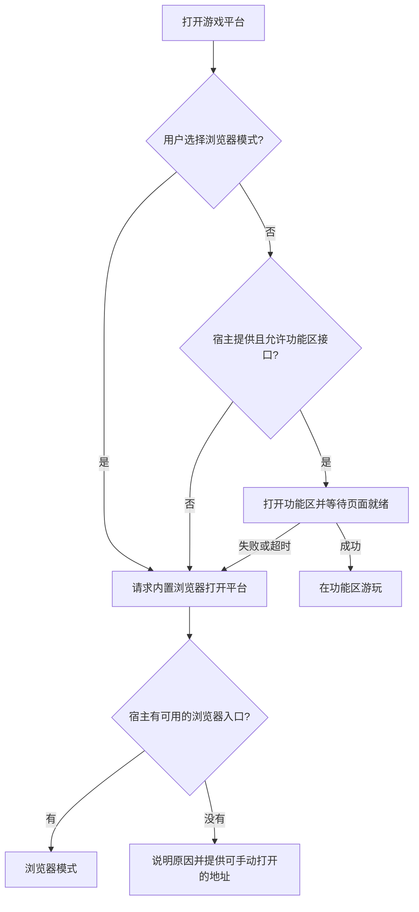

# 双入口方案

采用「功能区优先，内置浏览器兜底」。两种入口共用前端与业务服务；每种宿主单独实现打开入口的适配器。普通网页无法自行向宿主注册原生面板。

## 入口选择

这里处理的是展示入口的可用性。如果是内容、交易或账户被宿主政策禁止，切换展示方式不代表获得许可。

## 当前原型实现

| 文件 | 作用 |
| --- | --- |
| `poc/index.html` | 两种入口共用的游戏界面 |
| `shared/launcher.cjs` | 功能区优先、失败回退、浏览器偏好的入口选择逻辑 |
| `extensions/vscode/` | VS Code 开发扩展，注册游戏库 WebviewView 和打开命令 |
| `scripts/build-extension.mjs` | 将同一份界面和启动器复制到扩展包，避免维护两套源码 |
| `tests/launcher.test.cjs` | 入口选择及回退行为测试 |

功能区模式通过 VS Code 正式注入的 `acquireVsCodeApi` 识别，页面就绪后向扩展发出通知。启动命令等待最多 5 秒；无法就绪时请求浏览器入口。不会通过 URL 参数或伪造宿主名称显示一个不存在的功能区。

配置项 `lightArcade.displayMode` 支持 `auto`、`sidebar`、`browser`；前两项在功能区不可用时都会回退。功能区内有「在内置浏览器中打开」按钮。

VS Code 适配器检查当前可用命令，优先使用 `workbench.action.browser.open`，其次使用 `simpleBrowser.show`。命令成功仅记录为 queued，不等同于页面加载成功。若两个入口都不可用，则明确提示地址。命令选择与 Microsoft 的[内置 Simple Browser 实现](https://github.com/microsoft/vscode/blob/main/extensions/simple-browser/src/extension.ts)一致；Simple Browser 在部分版本使用 iframe，能力不应视为与完整浏览器相同。

扩展默认按公开贡献点注册在 Activity Bar，用户可将游戏库视图移到右侧 Secondary Sidebar。未调用私有接口强制改变用户布局。参见 [VS Code 贡献点](https://code.visualstudio.com/api/references/contribution-points#contributes.viewsContainers)和[界面布局](https://code.visualstudio.com/api/ux-guidelines/overview)。

## 在 VS Code 中验证

1. 运行 `npm run build:extension`。
2. 运行 `npm start`，使浏览器版地址可用；若现有本地服务仍在运行，无需重复启动。
3. 用 VS Code 打开 `E:\CODE\Right`，在运行和调试中选择 `Light Arcade: 验证功能区`，按 F5 启动扩展开发宿主。
4. 在开发宿主执行 `Light Arcade: 打开游戏平台`。可将游戏库视图拖到右侧副侧栏。
5. 点击功能区内的浏览器按钮，或执行 `Light Arcade: 在内置浏览器打开`。
6. 将 `lightArcade.displayMode` 设为 `browser`，验证默认选择浏览器。

这是本地开发扩展，还没有发布、安装到当前用户的编辑器配置，或完成 VS Code/Cursor 界面实测。Cursor 需要验证其实际版本暴露的扩展 API 与浏览器命令，不保证它的独立 Agents Window 支持这些入口。

## Codex 的当前处理

当前 Codex 会话没有可依赖的第三方原生侧栏注册接口，因此直接采用已验证的 IAB 页面入口。这里使用的是现有宿主工具打开 URL，不是把 VS Code 扩展安装进 Codex。

未来如果 Codex 提供正式的面板接口，可新增对应适配器，继续复用游戏界面。现在的共享启动器和 VS Code 开发扩展不代表已经交付一个可在任意 agent 中自动安装、自动回退的通用插件。

## 验证结果与边界

- 六项入口测试通过：不支持侧栏、侧栏就绪、侧栏报错、侧栏未就绪、手动浏览器选择、浏览器缺失或失败。
- 扩展构建与 JavaScript 语法检查通过。
- Codex IAB 回归通过：页面显示「浏览器模式」；旧存档恢复到 2；Enter 后计分为 3；保存刷新后恢复到 3。
- 侧栏的真实注册、拖到右侧、页面握手及从侧栏打开浏览器，仍需在实际 VS Code/Cursor 中验收。自动化入口测试使用模拟适配器，不替代宿主实测。
- 本地原型的浏览器存档和功能区存档分别保存，尚未互通。正式平台应通过同一账户与云端存档统一两种入口的状态；这里没有承诺无损切换。

本次范围为双入口技术原型，账号、作品上传、定价、支付、分账仍未实现。
