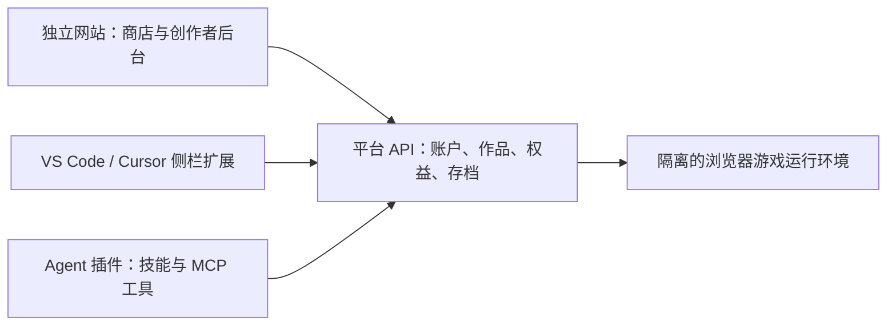

# AI 小游戏平台与 agent 侧栏接入：验证记录

验证日期：2026-09-20。结论基于本次读取的官方文档、本地插件清单规范，以及当前 Windows Codex 环境的浏览器实测。

后续已按「功能区优先，内置浏览器兜底」补充双入口原型，见 [双入口方案及最新验证状态](./DUAL-MODE.zh-CN.md)。下文的 2 分存档记录是第一轮实测记录；本次后续回归已验证保存并恢复到 3 分。

## 结论

可以建设独立的 AI 创作者游戏平台，并通过不同宿主的插件或扩展接入。Codex 内置浏览器承载轻量 HTML5 游戏已经实测通过。把第三方插件注册为 Codex 全局常驻的原生右侧功能区，尚未找到公开接口，不能作为已经验证的能力。

若必须具备独立图标、游戏库和可停靠侧栏，VS Code 的 WebviewView 扩展是有明确公开 API 的路线。Cursor 编辑器可作为兼容适配候选，但需要针对实际版本安装验证，不能据此承诺 Cursor 的独立 Agents Window 或任意其他 agent 都支持。

OpenAI 公开插件目录目前限制数字商品交易，这会影响付费游戏商店形态。网页可加载、插件可安装、插件可公开上架、插件可开展交易，是四个不同结论。

## 能力矩阵

### 2026-09-22：独立右侧功能区复核

本轮专门检查“安装后新增独立游戏库功能区”，而非右侧浏览器标签页。重新读取 OpenAI 插件打包、可选 UI、提交规范，以及本机插件 manifest 样例和验证器，仍未找到可依赖的 Codex 第三方常驻侧栏注册契约。`interface` 定义的是插件展示元数据；MCP UI 的公开说明描述兼容宿主的组件，不能推出可自行注册 Codex 右侧面板。[插件 UI](https://developers.openai.com/plugins/build/chatgpt-ui)、[manifest 展示字段](https://developers.openai.com/plugins/deploy/submission-errors)。

当前工程结论：**Codex 独立功能区暂不作为可交付能力，继续使用已实测的内置浏览器路径**。这不是游戏运行失败，也不是证明内部实现或未来版本绝不支持。没有正式入口时，创建空插件清单或把 URL 打开到右侧均不能算完成了功能区验证。

VS Code 的 WebviewView 属于另一套明确的扩展契约，视图可由用户移到 Secondary Side Bar；可以实现独立游戏库功能区，其内部仍可用 Web 技术渲染游戏，无须浏览器地址栏。这种功能区也不等于可直接容纳任意 Windows EXE。[VS Code API](https://code.visualstudio.com/api/references/vscode-api#WebviewViewProvider)、[右侧视图布局](https://code.visualstudio.com/docs/configure/custom-layout#_secondary-side-bar)。本仓库已有开发扩展，但尚未完成实际编辑器安装验证，不能把它算作 Codex 验证通过。

下表中的既有测试状态仍适用；桌猫样本的网页运行实测另见 [桌猫报告](./docs/10-deskcat-test.zh-CN.md)。

### 修改客户端代码的独立路线

2026-09-22 实际读取了本机安装目录与打包资源索引：Windows 包版本为 `26.915.4065.0`，运行入口为 `app/ChatGPT.exe`；`resources/app.asar` 的包名为 `openai-codex-electron`，其中包含 `webview/index.html`、前端资源以及右侧面板相关模块。这里只读取资源索引和包元数据，没有改动安装包或启动修改版。

这提供了“研究本机客户端修改版”的候选路线，**不能由此直接断言补丁可运行**。没有第三方侧栏 API，意味着普通插件接入缺少正式契约，并不证明客户端界面在技术上绝对无法修改。仅修改当前游戏平台仓库，不会让已安装的官方客户端自动新增视图。

若验证客户端修改，需要先在工作区的独立副本中定位布局、面板注册和状态保存逻辑，再增加“游戏库”视图及打开/关闭/宽度恢复行为。游戏必须放在与客户端可信界面隔离的内容容器中，不继承 Node、文件系统、agent 工具或私有 IPC 能力；不能简单把用户游戏脚本插入客户端主页面。随后验证修改版启动、独立测试配置、聊天基本功能、游戏交互、重启恢复和退出清理。打包、启动及版本更新兼容性仍是待验证项，当前没有可供安装的补丁。

这种本机改版不能视为对所有官方客户端可安装的插件。作为另一个独立产品方向，可自行开发客户端，用 Codex App Server 接入 agent，再把游戏库作为自有右侧视图；这是自有客户端，而非修改官方应用。官方文档明确将 app-server 用于在自有产品中集成认证、对话、审批和事件流。[Codex App Server](https://learn.chatgpt.com/docs/app-server)。

| 路线 | 证据级别 | 当前可得结论 |
| --- | --- | --- |
| Codex 内置浏览器运行 HTML5 游戏 | 本机实际测试 | 页面加载、鼠标、Enter 键、Canvas 渲染、保存并刷新恢复通过 |
| 把浏览器页面打开到 Codex 右侧面板 | 本机接口及浏览器测试 | `open_in_codex` 接受 `placement: right` 和浏览器 URL，本次返回 queued；随后通过 IAB 成功打开并操作。未独立截取整个宿主窗口验证面板停靠位置 |
| Codex 常驻原生侧栏模块 | 尚未证实 | 检查的公开文档、本地 manifest 规范和已暴露工具中，没有第三方注册自定义原生面板的公开契约；这不证明未来或内部版本绝对不支持 |
| MCP Apps 自定义 UI | 官方文档支持；未做宿主集成实测 | 支持兼容宿主中的交互组件；宿主决定展示方式，不能等同于常驻侧栏权限 |
| VS Code WebviewView | 官方 API 支持；未在本机安装测试 | 可注册自定义视图，用户可以将视图移到 Secondary Sidebar |
| DeepSeek Harness 右侧功能区 | 官方文档与源码核查；未安装实测 | 有右侧 tab 类型注册与自定义组件席位，可开发独立游戏大厅插件；预览期需维护版本兼容，见 [专项核查](./docs/11-deepseek-harness-feasibility.zh-CN.md) |
| Cursor 编辑器扩展 | 官方扩展文档与 VS Code 兼容路径 | 值得优先做原生侧栏 PoC；仍需安装、停靠、焦点和生命周期测试 |
| Claude Code CLI 插件 | 官方插件文档 | 可接入 skills、MCP 等工作流；CLI 插件清单不是图形侧栏扩展接口。在 VS Code 内使用时，可另外开发 VS Code 扩展 |

## 本机 PoC

文件：`poc/index.html`、`poc/server.mjs`。只使用 Node 内置模块，无依赖安装，无 OpenAI API 调用。

运行方式：

```powershell
cd E:\CODE\Right
node .\poc\server.mjs
```

访问：http://127.0.0.1:43187/ 。服务器仅监听本机回环地址，只提供这一份演示 HTML；没有访问工作区其他文件的路由。

本次为方便查看，启动了临时隐藏后台进程。PID 记录在 `poc/server.pid`，输出位于同目录的日志文件。没有设置开机自启。若端口仍被该进程占用，无需重复启动。

实际操作结果：

1. HTTP 返回 200；Codex IAB 显示游戏库和「开始试玩」。
2. 点击「开始试玩」，游戏场景出现。
3. 鼠标点击「收集星星」，分数 0 → 1。
4. 在星星按钮上按 Enter，分数 1 → 2。
5. 点击「保存试玩进度」，页面出现保存成功提示。
6. 刷新页面，再次开始试玩；本局与最高分均恢复为 2。
7. 浏览器截图确认窄面板内的 Canvas 星空、按钮和计分区已渲染。

这只是一个轻量游戏的承载验证，未测 WebGL、WASM、音频、手柄、多人连接、长时间后台帧率、重启 Codex 后的恢复，以及跨任务常驻。未创建或安装 Codex 插件；未验证 MCP 工具到组件的端到端流程。未实现登录、上传、真实支付、分账或云端部署。

## 原生侧栏和插件 UI 的区别

Codex 插件可以打包技能与 MCP 工具，MCP 也可提供可选 UI。本地 `plugin.json` 中的 `interface` 是插件名称、图标、截图等展示元数据，并不等于允许注册任意原生功能区的 API。当前内置 `open_in_codex` 工具可以打开浏览器、文件等既有面板，这个工具也不能视为第三方插件可普遍调用的面板 SDK。

OpenAI 的 UI 文档明确描述 ChatGPT 中的 iframe 组件，以及 inline、fullscreen、picture-in-picture 展示。PiP 与边聊边玩的需求接近，但不是系统侧栏注册机制。对 Codex 的具体 UI 支持应再做能力探测和插件安装实测，不能将 ChatGPT 的支持直接推定给 Codex。[插件架构](https://developers.openai.com/plugins/concepts/plugins)；[可选 UI](https://developers.openai.com/plugins/build/chatgpt-ui)。

MCP 主要负责让 agent 调用业务工具；MCP Apps 为兼容宿主补充交互界面。实现同一个 MCP 服务器不意味着所有宿主都提供相同的窗口位置、保持运行方式和展示权限。[MCP Apps](https://modelcontextprotocol.io/extensions/apps/overview)。

VS Code 则有具体的 `contributes.viewsContainers`、`contributes.views` 与 `registerWebviewViewProvider` 路径。WebviewView 可承载 HTML/CSS/JavaScript，视图可以移到右侧 Secondary Sidebar。这是最接近「安装后多出一个游戏功能区」的已文档化方案。[贡献点](https://code.visualstudio.com/api/references/contribution-points#contributes.views)；[界面结构](https://code.visualstudio.com/api/ux-guidelines/overview)。

Cursor 的扩展 API 还允许 VS Code 扩展注册 MCP 服务器和插件目录，可把界面和 agent 工具组合起来；本次仅核对文档。[Cursor Extension API](https://prod.cursor.com/docs/extension-api)。Claude Code 的插件组成则见[官方插件参考](https://code.claude.com/docs/en/plugins-reference)。

## 商业化边界

截至本次查询，OpenAI 公开插件目录的规则规定：插件仅可开展实物商品交易，不允许直接或间接销售数字产品或服务，也不能通过升级引导或直达交易页面规避。允许既有付费账户登录后访问订阅已包含的功能。这不保证游戏库用例一定通过审核。

因此，不能承诺「公开上架一个 Codex 付费游戏商店，插件中下单或跳转付款」。把商店嵌入 iframe 也不免除规则。独立网站的技术可行性与公开插件的上架规则需分别评估；这个结论不意味着用户在普通浏览器访问所有数字商品网站都被禁止。[Plugin guidelines：Commerce and monetization、Iframes and embedded pages](https://developers.openai.com/plugins/app-guidelines)。

## 建议的产品结构

以下是工程设计建议，不代表已经实现或通过任何平台审核。



平台持有创作者账户、作品版本、作者定价、购买权益和结算账本。插件负责接入，不应成为这些数据唯一存放位置。各宿主单独适配界面和政策。

第一版建议只支持 HTML5 浏览器作品，例如静态网页和前端游戏。创作者上传发布包，平台托管构建产物，用户在游戏运行页面游玩。用户提交的 JavaScript 应与商店、登录及 agent 工具隔离；真实模型密钥、发布令牌不能交给游戏页面。如果以后接受任意 Node/Python 后端，再独立设计多租户执行环境、资源限额与计费。

创作者接入可优先验证「agent 做完项目 → 平台检查包 → 创建预览 → 作者填写价格与说明 → 发布」流程。MCP 工具可以围绕作品与发布设计；不需要让每个创作者制作、上架自己的 agent 插件。

后续验收应优先完成：真实 VS Code/Cursor 侧栏安装；切换任务、隐藏面板和重启后的恢复；远程 HTML5 包及游戏隔离；作者发布到玩家启动的闭环；独立网站交易和权益校验。支付分账与可销售地区需要按经营主体和支付渠道另行确认，本次未验证。
