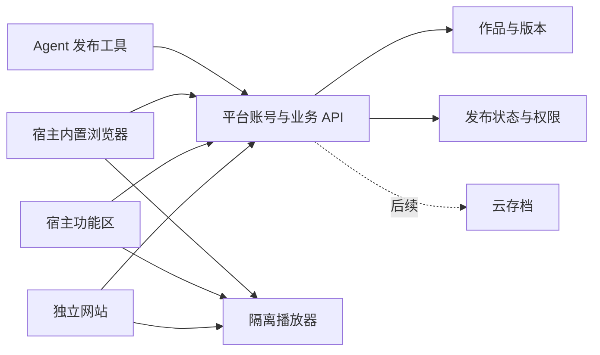

# 平台总体方案

版本：v1.1 · 2026-09-22 · [文档目录](./README.md)

本文为产品长期参考；当前按 [免费首版实施基线](./07-free-mvp.zh-CN.md)及 [18 多宿主客户端](./18-multi-host-client-spec.zh-CN.md)、[19 Windows 包](./19-windows-package-spec.zh-CN.md)实施。三宿主内上传、下载与网页游玩，EXE 安装包分发均纳入首版，原生侧栏运行独立实验，收费后置。

## 1. 产品定义与已确认需求

建设一个面向 AI 创作时代的轻量作品平台。创作者可以把自己制作的小游戏、网页 3D 场景、互动艺术、可视化实验和小型工具上传到平台；首版提供可运行的线上地址、作品展示、分享和版本管理。用户不需要取得源码或配置开发环境，即可打开作品体验。

平台经营者提供服务器与分发体系，创作者保有作品权利。首版全部免费，不设置价格、不接入支付或分账；作者定价与平台佣金是以后可能恢复的商业化方向。作品可以使用 AI 制作，也可以混合人工与 AI 制作。是否使用 AI 与作品运行时是否调用模型是两个独立属性。

已确认的要求：

| 要求 | 方案落点 |
| --- | --- |
| 用户可自行上传游戏和有意思的项目 | 创作者后台、自助上传、预览、提交、版本管理 |
| 支持网页 3D，整体是小游戏级别 | WebGL2、轻量 3D 资产、浏览器运行、资源预算 |
| 首版不做收费，上传即可体验 | 合格包自动发布、分享链接、玩家免登录运行；商业模块后置 |
| 平台承担服务器和托管 | 私有对象存储、分发网关、CDN、平台业务服务 |
| 两种 agent 入口 | 宿主功能区优先；技术不可用时回退内置浏览器 |
| 海外首发，大陆后续考虑 | 海外部署、按目标市场组织内容和体验 |
| 计划由中国大陆公司经营 | 按实际主体处理经营、隐私与作品权利；收费准入以后评估 |

本方案建议英文优先、桌面优先；当前没有计价币种或购买流程。首批用户地区尚未确定，海外首发不等于所有国家同时开放。手机网站可浏览和体验，只有经过触控及设备测试的作品展示“支持手机”。不把全部 Unity/Godot 导出或所有 WebGPU 项目笼统标为兼容。

## 2. 用户与价值

| 用户 | 核心需求 | 平台提供 |
| --- | --- | --- |
| 个人创作者、小团队 | 把 AI 做出来的项目变成别人能体验的产品 | 打包指导、自动检查、稳定运行地址、作品更新 |
| 玩家、项目体验者 | 快速找到有趣作品，打开即可玩 | 作品详情、免登录体验、可分享链接 |
| 在 agent 中工作的人 | 在当前工具里体验作品，也能辅助发布 | 宿主适配入口、共享账号、有限权限的发布工具 |
| 平台运营人员 | 控制内容质量、事故、投诉与支出 | 异常复核、发布开关、举报、成本和异常监控 |

首批定位为“几分钟就能开始体验的小作品”。作品质量主要看可用性、玩法或创意、原创表达和完整程度；不按代码行数或调用 AI 的次数排名，也不宣称所有上传内容经过 AI 生成真伪认证。

## 3. 作品分类与支持边界

### 3.1 对外分类

- **小游戏**：休闲、解谜、策略、动作和轻量叙事游戏。
- **3D 互动**：可交互场景、物理实验、轻量漫游、3D 玩具；包含游戏机制的作品仍需按实际性质分类。
- **创意项目**：生成艺术、音乐互动、视觉实验、教育演示。
- **小工具**：浏览器内运行的实用小应用，首版避免处理金融、医疗等高风险业务。

这些是发现标签。审核还需维护独立的业务分类与运营许可信息，不能通过改成“创意项目”标签改变作品实际属性。

### 3.2 首版和扩展阶段

| 能力 | 首版范围 | 后续扩展 |
| --- | --- | --- |
| HTML/CSS/JavaScript、Canvas、SVG | 支持打包后的静态构建产物 | 更多导出模板 |
| WebGL2、Three.js、Babylon.js | 正式支持，需通过设备和性能验收 | 资产优化工具、更多运行档位 |
| WebAssembly | 单线程导出，逐引擎验收 | 多线程隔离播放器 |
| Unity/Godot Web 导出 | 选择通过测试的引擎版本和导出配置 | 扩充兼容清单 |
| WebGPU | 实验能力，不作为基本可玩条件 | 在已验证宿主和硬件上开放 |
| 源码上传自动部署 | 首版上传 dist.zip；可提供本地打包助手 | 隔离云构建服务 |
| Node/Python 等作者后端 | 首版不运行；提供有限平台 SDK 服务 | 单独设计多租户后端及计费产品 |
| 运行时 AI 调用 | 首版不默认提供 | 代理网关、按量预算、内容治理与计费 |
| 多人实时联机 | 首版以单人和本地互动为主 | 房间、同步、反作弊及服务器预算 |
| Windows EXE/安装包/完整程序 ZIP | 首版检查与插件内下载管理，见 [19](./19-windows-package-spec.zh-CN.md) | 原生侧栏运行独立验证；安装管理、自动更新另行评估 |
| 源码市场、移动 APK | 不在首版交付范围 | 独立评估分发、安全和授权方式 |

“平台提供服务器”在首版中指存储、分发和业务后台。3D 由用户设备的 GPU 渲染；云端逐帧渲染再推流属于另一种成本和架构，不作为默认托管方式。

同一作品可以规划网页和 Windows 两个构建目标，分别发布与更新；下文“打开即可玩”指网页版本。Windows 版显示“下载 Windows 版”，由玩家下载后启动，不承诺在 agent 侧栏直接执行 EXE；下载扩展不阻塞网页最小试运行。

## 4. 三条完整用户流程

### 4.1 创作者发布

登录 → 上传浏览器发布包并填写名称 → 自动检查 → 合格包自动发布 → 获得体验链接。介绍、封面和分类可以后补；上传按钮明确告知发布行为，也提供仅保存草稿的选项。

作者后台显示上传、检查、就绪或失败。普通包不必等待人工试玩；异常文件、特殊权限或风险信号转人工复核。自动检查验证发布包契约，不保证所有游戏逻辑正确；平台仍保留作品隔离、权利声明、举报与禁用能力。

版本更新创建不可变版本，检查通过后切换当前版本；失败不影响旧版。作者可撤下作品，或回滚到仍被允许运行的版本；新增特殊权限触发复核。

### 4.2 用户体验

打开分享链接或作品列表 → 查看设备与权限要求 → 点击开始 → 直接体验。玩家无需注册、下单、免费领取或加入作品库。

不具备运行条件时显示检测结果和可用设备建议。首版优先保留作品本身的本地存档，不要求作品接云存档 SDK；跨入口、跨设备及更新后的存档互通以后实现。首轮封测建议招募成年用户与成年创作者；公开发布前仍需评估实际受众和儿童隐私义务。

首版无需分试玩包与付费正式包。免费体验不自动授予源码、版权或再分发权；作品页标明相应使用说明。

### 4.3 平台运营

查看上传与启动异常 → 处理举报和权利投诉 → 必要时禁用版本或下架 → 通知作者 → 处理申诉并复盘。首页精选独立挑选，不进入精选也能通过链接体验。

作者主动撤下与平台安全禁用分别记录原因；均可阻止新的线上访问，但无法追回用户已经下载的字节。说明作品更新、作者退出和服务终止的处理方式，不承诺永久托管。

## 5. 产品页面与首版功能

| 页面/区域 | 必须具备的功能 |
| --- | --- |
| 首页与发现 | 初期作品列表与链接分享；搜索和精选逐步增加 |
| 作品详情 | 作者、名称、可选简介/封面、兼容性、权限、举报、启动 |
| 我的作品 | 作者查看上传任务、已发布作品和版本；玩家作品库以后增加 |
| 播放器 | 加载进度、点击启用声音、输入焦点、暂停、退出、存档状态、故障反馈 |
| 创作者后台 | 作品列表、上传进度、检查结果、预览、更新与撤下 |
| 管理后台 | 最小管理员权限、异常复核、举报、禁用和操作日志 |

首版使用人工精选和透明分类排序。公开评论、私信、论坛、复杂个性化推荐、直播、广告和会员订阅后续再做，减少冷启动和内容治理负担。用户反馈先采用结构化评价与工单。

## 6. 两种入口共用一个平台

用户安装的是平台的宿主适配器。平台上的每件作品都是数据和运行包，不要求作者再制作一个独立 agent 插件。

### 6.1 入口决策

1. 宿主允许该产品形态，且存在公开、受支持的功能区接口时，尝试打开功能区。
2. 接收页面就绪信号；注册失败、能力缺失或超时则请求内置浏览器。
3. 用户可始终手动选择浏览器模式。需要较大画布的作品直接建议扩展面板宽度或打开浏览器。
4. 内置浏览器也不存在时，明确给出普通网站地址；这是保底入口，不算已实现宿主集成。
5. 首版切换入口相当于重新打开作品，不承诺本地存档或内存状态迁移；云存档以后补充。

技术能力回退不能绕过宿主的内容或商业政策。宿主不允许销售时，该适配器应关闭不被允许的交易能力，而不是把收银台换一个容器继续打开。

### 6.2 宿主策略与证据

| 宿主 | 当前策略 | 状态 |
| --- | --- | --- |
| Codex | 内置浏览器为现阶段入口；保留未来正式面板适配器 | 本地轻量页面实测；未找到可依赖的第三方常驻原生右侧栏注册契约 |
| VS Code | WebviewView 功能区，用户可移至右侧；浏览器兜底 | 官方 API 明确；开发扩展已有，真实安装与布局待验收 |
| Cursor 编辑器 | 按实际版本验证 VS Code 扩展与浏览器入口 | 候选适配；不推定独立 Agents Window 具有相同能力 |
| 支持 MCP Apps 的宿主 | 可选交互界面或打开平台地址 | 展示位置、生命周期由宿主决定，逐个验收 |
| CLI agent | 作品查询和发布工具、平台地址 | 命令行插件本身不产生图形右侧栏 |

依据：[VS Code 视图贡献点](https://code.visualstudio.com/api/references/contribution-points#contributes.viewsContainers)、[Cursor 扩展 API](https://prod.cursor.com/docs/extension-api)、[MCP Apps](https://modelcontextprotocol.io/extensions/apps/overview)。

OpenAI 文档描述的可选 UI 与本机会话提供的面板工具，都不能直接推导为第三方 Codex 原生侧栏 SDK。当前公开插件目录对数字商品交易有限制，付费游戏商店形态必须单独确认可接受性；不能承诺通过目录上架。独立网站与公开插件分别验收。[OpenAI 插件概念](https://developers.openai.com/plugins/concepts/plugins)、[UI 文档](https://developers.openai.com/plugins/build/chatgpt-ui)、[目录商业规则](https://developers.openai.com/plugins/app-guidelines)。

## 7. 免费试运行与后续商业化

首版全部免费，先验证上传、体验与传播。不开发价格、订单、支付沙箱、购买权益或作者结算。原 [交易方案](./03-commerce-and-launch.zh-CN.md) 及佣金算例仅供以后商业化参考。

首轮建议先邀请 5—10 位创作者、发布 10—20 件作品，再逐步扩大。这是试验规模，不是承载上限。提供 HTML、WebGL2 与已验证引擎的打包说明和错误报告，让现有 AI 开发流程容易接入。

获客先围绕作者作品分享、创作挑战、主题合集和 agent 辅助发布。平台链接可独立传播，不要求收件人先安装插件。待作品质量与复访得到验证，再增加扩展市场分发与付费推广。

核心指标是上传成功率、处理耗时、启动成功率、分享后的体验人数、回访、作者再次发布和资源成本。首版不追踪成交额或退款率；短游戏不以停留越长越好作为唯一指标。

## 8. 本轮应确定的方向

采用“独立平台 + 隔离浏览器运行 + 多宿主适配”的结构，在首版支持网页 3D；按海外首发准备英文产品和最小基础设施，完成真实多作者上传后即可体验的闭环。收费与新宿主原生侧栏均不作为本轮前置依赖。

接下来工程落地以 [免费首版实施基线](./07-free-mvp.zh-CN.md) 为准；[技术架构](./02-architecture.zh-CN.md) 和 [接口草案](./04-data-and-api.zh-CN.md) 按其中明确的子集实施，商业模块不预建空表或占位 UI。
