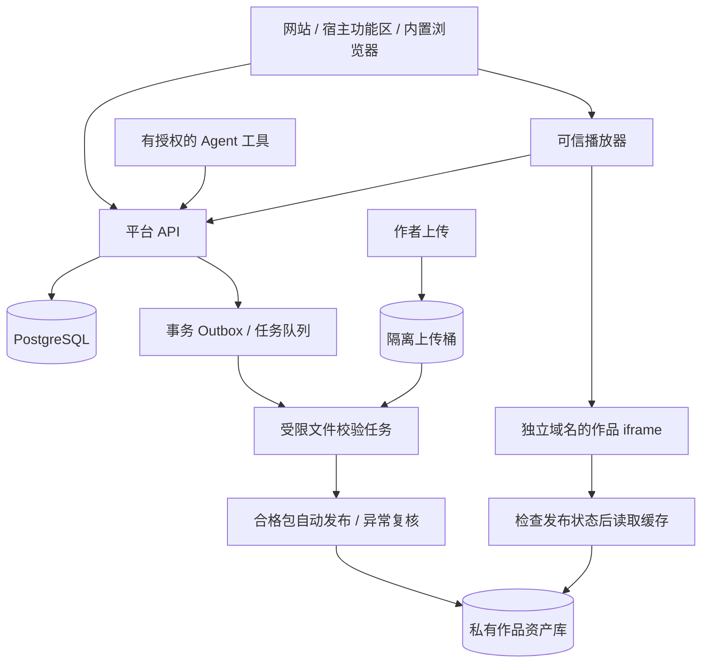

# 技术架构与作品运行方案

版本：v1.0 · 海外首发 · [目录](./README.md)

**技术规范已细化**：当前开发以 [13 技术设计总纲](./13-technical-design.zh-CN.md)和 14—19 为准，其中 [18](./18-multi-host-client-spec.zh-CN.md)、[19](./19-windows-package-spec.zh-CN.md)要求三宿主内完整业务闭环及 Windows 安装包分发。本篇作为长期架构参考；旧网页预算不包含新增扫描和下载成本。

本文中的架构、限制与服务目标为设计建议。当前仓库只有入口原型，尚未实现以下生产链路。

**2026-09-22 调整：当前执行 [免费首版](./07-free-mvp.zh-CN.md)，不实现支付、订单、购买权益、结算或支付沙箱。** 使用 [S 档服务器](./06-server-sizing.zh-CN.md)：单台 2 vCPU/4 GB，网站/API/PostgreSQL 同机，轻量文件检查通过后自动发布，异常包复核；沿用此前约 30—40 USD/月低用量预算。下文托管数据库、云存档、独立动态检测服务及商业资产鉴权均为后续增强设计。

## 1. 架构选择

免费首版采用单体业务服务、受限的异步文件处理进程、对象存储和分发网关。数据库只承载作者、作品、上传/版本和最小管理数据。自动处理只解析文件，不执行上传代码；需要执行代码的浏览器测试留在独立隔离环境。暂不引入微服务拆分和 Kubernetes。

### 推荐技术栈

| 层 | 建议 | 目的 |
| --- | --- | --- |
| 网站、创作者后台、可信播放器 | TypeScript + React，网站可用 Next.js | 一套组件与账户逻辑，多种入口复用 |
| 平台 API | Node.js 当前 LTS + Fastify，固定依赖版本 | 模块化、JSON Schema 校验、明确认证边界 |
| 主数据库 | 首版同机 PostgreSQL，后续可托管 | 作者、作品、上传/发布状态事务一致 |
| 异步任务 | PostgreSQL Outbox 起步，独立 worker | 重试与幂等；增长后再迁移专用队列 |
| 资产存储与边缘 | Cloudflare R2 私有桶 + Workers/缓存，作为优先验证组合 | 降低静态大文件分发成本，统一资产鉴权 |
| API 与数据库部署 | 首版同一台海外云主机；后续按需要拆分 | 控制初期支出，避免过早引入集群 |
| 观测 | 结构化日志、错误追踪、指标与告警 | 按作品版本定位运行失败与异常支出 |
| 交易（后置） | 以后决定收费时再选择渠道并建设适配层 | 当前不接 SDK、不开支付沙箱、不建订单表 |

供应商选择是待实测的工程建议。API 首个区域建议按首批用户分布选择美国区域；如果首批转为其他地区，应在上线前调整。账号、数据库、对象存储和备份的数据驻留分别核对，不把全球 CDN 缓存等同于数据只存某个国家。大陆开发团队使用隔离的测试环境和脱敏样本，生产访问采用受控授权；跨境部署与管理访问纳入数据处理评估。

R2 当前对外传出流量不另收 egress 费，但存储和请求等仍计费，Workers、其他云服务及日志也有成本，不能据此宣称平台托管免费。[R2 定价说明](https://developers.cloudflare.com/r2/pricing/)。

## 2. 作品包契约

以下契约针对网页构建。Windows EXE/完整 ZIP 的首版分发分支使用独立包检测、附件下载与按目标划分的发布指针，不要求 `index.html`，不送入 iframe；当前契约见 [19](./19-windows-package-spec.zh-CN.md)。

首版上传 ZIP 内的浏览器构建产物：根目录包含 `index.html`、可选 `platform.json` 和相对路径资产。没有 manifest 时采用默认权限。所有者、发布结论和作品权限最终以平台数据库为准，首版无价格字段。

建议初始限制：ZIP 100 MiB、展开后 300 MiB、最多 5,000 个文件、单文件 100 MiB；超限走人工评估，不隐式无限扩容。每个新作者默认 5 个草稿作品、每件作品保留 3 个常规发布版本，付费访问所需的受保护版本不因配额自动删除。

作品应使用相对路径，例如 Vite 的相对 base；首版不支持硬编码根路径与任意域名重写。引擎生成文件需保持相互引用，不能为了平台命名统一而重命名二进制或数据文件。依赖优先打包随作品发布，外链依赖属于额外网络权限。

`application/wasm`、字体、模型、声音等返回正确 MIME；预压缩 gzip/Brotli 文件需正确设置 `Content-Encoding`，防止重复压缩。发布检测同时检查路径大小写、资源引用、Range 请求和 404。Source map 默认不公开；许可证文件与必要署名保留。

## 3. 上传到发布的流水线

1. **申请上传**：校验作者与配额，生成限定对象键、大小和有效期的上传授权；不发整个桶的凭据。
2. **隔离存放**：上传桶不公开，作品尚不能通过公开地址执行。完成上传后核对真实大小和哈希。
3. **解包检测**：在限制 CPU、内存、磁盘和时间的隔离任务中进行。拒绝路径穿越、绝对路径、Windows 盘符/UNC、符号链接、硬链接、重复规范路径及压缩炸弹；同时限制实际展开字节，不能只信 ZIP 头。
4. **静态检查**：入口、资源引用、manifest、允许文件类型、秘密信息提示、恶意行为特征和依赖元数据检查。恶意代码扫描不是安全证明。
5. **按规则分流**：标准包检查通过后自动发布；特殊联网权限、异常文件或风险信号进入复核队列。静态检查不等于完整内容或行为审查。
6. **可选草稿预览**：作者选择私有草稿时，经身份验证预览；默认“上传并发布”流程不需要等待人工试玩。
7. **异常复核与抽测**：需要动态检查时用独立隔离浏览器，不挂载业务密钥，不访问内网、云元数据或工作区；不得在生产业务机试跑上传脚本。
8. **不可变发布**：生成资产哈希清单与 release ID，校验/复核通过后原子切换当前版本指针；不原地覆盖已发布资产。
9. **回滚/禁用**：普通回滚切换指针；安全禁用同时阻止旧版本新启动并通知分发网关。

上传防护依据 [OWASP 文件上传指南](https://cheatsheetseries.owasp.org/cheatsheets/File_Upload_Cheat_Sheet.html)；具体配额和流水线属于本方案设计。

## 4. 网页 3D 与运行档位

| 档位 | 内容 | 首版要求 | 失败时处理 |
| --- | --- | --- | --- |
| A：轻量网页 | DOM、Canvas、SVG、轻量音频 | 无特殊 GPU 依赖、响应式布局 | 给出错误与重试入口 |
| B：网页 3D | WebGL2、Three.js/Babylon.js、glTF 等 | 核显可运行、降低画质、处理 context lost | 降画质或提示换浏览器/设备 |
| C：引擎导出 | Unity/Godot Web、WASM 单线程 | 指定引擎版本和导出配置逐项认证 | 未认证组合不标“兼容” |
| D：实验能力 | WebGPU、WASM 多线程、特殊设备 | 后续开放或独立灰度 | 回退至作者提供的 WebGL2 版本，否则购买前提示不支持 |

WebGPU 的可用性与安全上下文、浏览器和设备有关，不能因为 Chromium 页面能打开就保证可用。[MDN WebGPU](https://developer.mozilla.org/en-US/docs/Web/API/WebGPU_API)。Godot Web 导出与 Unity Web 平台也有各自的版本、渲染器和浏览器限制，使用官方导出说明建立认证清单。[Godot Web 导出](https://docs.godotengine.org/en/stable/tutorials/export/exporting_for_web.html)、[Unity Web 兼容说明](https://docs.unity3d.com/6000.0/Documentation/Manual/webgl-browsercompatibility.html)。

WASM 多线程涉及 SharedArrayBuffer 与跨源隔离。COOP、COEP、资源响应和整个嵌入链都会影响可用性；只修改最里面 iframe 的响应头通常不足以保证成功。首版选择单线程，后续单独验证顶层高性能播放器及第三方资源条件。[MDN crossOriginIsolated](https://developer.mozilla.org/en-US/docs/Web/API/Window/crossOriginIsolated)。

### 体验预算与输入

建议标准档首次可互动前的下载量不超过 10 MiB；超过 20 MiB 显示重量提示和加载进度。不是限制作品总容量，可通过渐进加载控制首屏。首版基准机器暂定 8 GB 内存的近年核显笔记本、20 Mbps 网络、100 ms RTT，记录实际型号和宿主版本。

标准档冷启动 p95 目标 10 秒内就绪，网页 3D 常见场景目标 30 FPS；引擎档单独公布性能结果。每个作品至少测试 360 px、480 px 和 960 px 宽度。无法在窄侧栏完成操作的作品可要求宽画布，这不妨碍它在平台发布。

声音需在用户点击后启用；全屏和指针锁按用户动作申请。隐藏页面发出暂停信号，恢复后重建音频/渲染状态。浏览器可能节流或停止背景页，不能承诺后台持续游戏。WebGL 丢失上下文、切标签、输入法、Esc 退出和焦点恢复纳入验收。

## 5. 域名和信任边界

示意域名仅用于说明：

| 域 | 职责 | 可获得的数据 |
| --- | --- | --- |
| `app.example.com` | 商店、账户、后台和可信播放器 | 平台登录状态与业务 API |
| `api.example.com` | 受控业务服务 | 校验后的用户与服务凭据 |
| `r-<release>.exampleusercontent.net` | 单一作品版本的不可信代码 | 当前版本的有限资产授权、经桥接的 SDK 能力 |

业务域与用户代码使用不同可注册域名，而不只是同一域名的两个路径。业务登录 Cookie 使用 host-only、Secure、HttpOnly 等约束；用户作品不得收到账号访问令牌、支付密钥、agent 凭据或本机文件权限。不同发布版本使用不同 origin，降低 Service Worker 和持久存储互相污染的影响；首版不提供 Service Worker 离线包功能。

作品 iframe 默认只有执行脚本等必要能力，采用按发布版本审核的 CSP 和 Permissions Policy。嵌套在宿主 webview 时，还需验证整个祖先链的嵌入策略与实际 origin，不能把普通网站 iframe 的结果直接推定给扩展。外部连接、摄像头、麦克风、剪贴板、弹窗、顶层导航和下载默认不开启。需要本地文件输入或导出结果的创意工具，通过平台受控交互申请特定能力，不能因此取得工作区任意文件访问权。

若需要 `allow-scripts` 与 `allow-same-origin` 同时存在，前提是作品 origin 与可信父页面完全不同；禁止把不可信作品以内联 HTML 放入同源父页。当前原型是自有页面，直接设置 webview HTML 的做法不能照搬到用户上传内容。[MDN iframe 安全说明](https://developer.mozilla.org/en-US/docs/Web/HTML/Reference/Elements/iframe)。

CSP 约束资源和常见外连，但不是完整网络防火墙；iframe 也不能提供可强制兑现的独立 CPU/GPU/内存配额。扫描、隔离、权限限制、速率控制和熔断共同降低风险；异常消耗的作品须能快速禁用。

## 6. 购买权益与私有资产分发（后续收费版参考）

**免费首版不实现本节的付费访问链路。** 草稿和原始包私有；已发布运行资产允许游客读取，网关先校验发布/禁用状态再返回缓存，无须购买权益、免费领取或付费资产会话。详细规则见 [免费首版第 6 节](./07-free-mvp.zh-CN.md)。下面保留的是未来商业化设计。

仅隐藏“开始”按钮或保护 `index.html` 无法保护付费作品。HTML、JavaScript、WASM、贴图、模型、声音等所有正式包资产必须经过同一授权链路。

设计流程：账户请求启动 → 服务端检查市场可用性、作品状态和购买权益 → 创建 launch session → 可信播放器取得限时资产授权 → 隔离 iframe 加载指定 release。

不把第三方 Cookie 作为唯一鉴权方式。首轮验证可采用当前版本专用的高熵资产能力路径，例如 `https://r-123.exampleusercontent.net/s/<opaque-capability>/index.html`，所有相对资源沿相同前缀加载。该能力只能读取一个发布版本，不能操作账号、下单或云存档。

资产网关必须满足以下条件：

- **先校验再返回缓存**：命中缓存也不能跳过会话有效期、版本和禁用状态；源存储保持私有。
- 缓存键可在成功授权后映射到不可变资产哈希，提升复用率；拒绝响应和个性化会话页面不能混入共享缓存。
- 路径能力不进分析日志、错误上报或来源 URL；设置合适的 Referrer Policy，入口文档不持久缓存。
- 支持 Range、模块导入、WASM、流式音频和延迟加载。播放期间由可信父页面续期当前会话；作品自身不能无限续期。
- 登出、退款或禁用后停止续期；建议授权缓存上限 5 分钟，紧急禁用另走快速失效机制，并实测生效时间。
- 能力 URL 仍可能被已购用户复制，过期前存在有限分享风险。已传送的前端代码和资源无法真正防复制，也无法追回本地缓存；本方案是访问控制，不是不可破解 DRM。

通配版本域名、边缘鉴权、缓存行为和第三方存储限制需做实际 PoC。验证未通过前，付费作品不能用公开桶或只鉴权入口页代替。

## 7. SDK、登录与存档

当前只要求作者登录，公开作品的玩家免登录；通用云存档和 SDK 以后增加。下面是增强版契约，未接 SDK 的作品可直接发布运行，不保证跨入口存档互通。

作品通过受控 MessageChannel 与可信播放器通信。初始化校验 iframe 的 `source`、精确 origin、会话 nonce、协议版本及消息 schema；不对敏感消息使用通配目标。SDK 仅提供 `ready`、`loadSave`、`save`、`pause`、`resume`、有限事件与用户主动请求的能力。

iframe 的 `load` 事件不等于作品可玩。集成 SDK 的作品在资源和输入就绪后发送 `ready`；未集成作品可运行，但只能显示“页面已加载”，性能质量由测试确认，不能伪造准确的可玩就绪信号。

云存档按 `user_id + work_id + slot + schema_version` 管理，不按 release 隔离。建议每个作品每位用户 5 MiB 存档配额，按实际产品调整；ETag/版本号实现并发更新，冲突返回 409，由用户选择恢复或保留副本。保存只向当前用户自己的作品空间写入。

版本升级的存档迁移保留旧快照，回滚作品时不能直接把新格式塞回旧程序。自动保存采用节流与检查点，不能仅依赖卸载事件。未接 SDK 的作品没有平台云存档保证；访客 localStorage 数据可在登录后经用户确认迁移。

网站登录可采用邮箱验证与 OAuth。功能区无法共享网站 Cookie 时，使用一次性授权码和 PKCE 等受支持流程在可信页面完成登录；回调地址白名单及 state 必须校验。支付和认证遇到嵌入限制时，由用户动作打开可信顶层窗口，再从服务端查询结果，不能把账号口令交给游戏或 agent 对话文本。

## 8. Agent 与宿主适配

宿主适配器只负责入口、布局、生命周期和可信授权。能力表区分“宿主提供”“政策允许”“页面已打开”“页面已就绪”；不通过 URL 参数假装获得侧栏能力。

MCP 可提供搜索、查询作品、创建草稿、取得上传地址、获取检测报告和提交发布等工具。读权限、草稿写权限与发布权限分开；明确授权的自动发布流程可以自动执行，没有授权时停在可审阅草稿。工具无权绕过内容检查、设置卖方结算账户或代用户购买。

作品标题、描述、日志与上传文件都是不可信数据。它们不能指示 agent 执行 shell、读取密钥或发起付款。游戏 iframe 不接入 MCP 工具桥，也不继承插件权限。

## 9. 运维、数据保护和扩展

环境分为开发、测试和生产；各自独立数据库、桶、支付凭据与回调。后台使用最小角色权限，结算配置和紧急下架保留审计记录。管理员启用强认证，密钥存密钥管理服务，不写入游戏包或客户端配置。

监控上传失败率、队列积压、启动耗时、WebGL 错误、资产 403/404、数据库延迟、支付异常、退款、存档失败与每作品资源支出。对下载滥用、盗链、撞库和 webhook 重放设置限流与告警；免费作品同样有分发成本和滥用配额。

初期服务可用性内部目标 99.5%，稳定后评估 99.9%；核心 API p95 目标 300 ms 内，不含支付渠道耗时和跨洲网络。付费开放前要求数据库具备持续备份，目标 RPO 15 分钟、RTO 4 小时，并以恢复演练验证，不能只看控制台“备份已开启”。

账号删除、个人数据导出和存档清理提供用户入口；订单、财务和安全记录按适用义务保留并限制访问。日志不保存支付卡数据、完整授权路径和作品内用户私人输入；非必要分析与 Cookie 按目标市场规则启用。

后续源码构建必须使用临时强隔离环境、严格依赖/网络策略和资源上限，不把 Docker 单独视为充分安全边界。作者后端、模型调用和多人房间各自有配额、密钥代理、计量、付费方及硬性预算开关，不能默认为买断价格包含无限服务。
