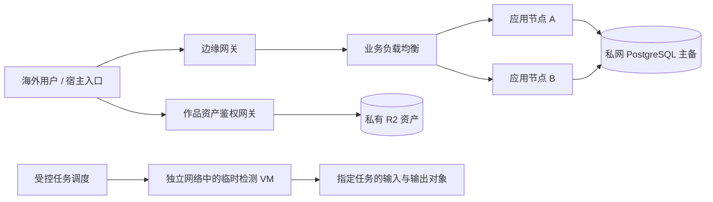

# 服务器配置、部署与扩容

编写与价格核查日期：2026-09-20 · [目录](./README.md)

范围更新：2026-09-22，当前按 [免费首版](./07-free-mvp.zh-CN.md) 实施；下列价格保留此前核查口径。S 档取消收费与支付沙箱，普通包自动文件检查后发布，异常包复核。

## 1. 直接建议

本平台首版采用海外 Linux 云主机、同机 PostgreSQL、私有对象存储与边缘分发。**不采购 GPU 服务器**：HTML/Canvas/WebGL2 游戏在用户浏览器运行，服务器提供作者账号、上传、作品发布和资源。每增加一个正在玩单机小游戏的用户，并不需要给他开一个服务器进程。

**当前采用 S 档最小试运行：一台 2 vCPU / 4 GB / 80 GB 云主机，网站、API 和数据库同机，沿用总预算约 30—40 USD/月**。先邀请少量作者，上传包做受限的自动文件检查，合格即发布，异常才复核。A 档约 110—150 USD/月、B 档约 250—350 USD/月，保留为后续拆分与增强方案，不作为本次起步采购要求。

以下均为配置建议和预算，实际账单受地区、用量、税费与选用服务影响，不是已采购资源或性能承诺。

首个部署区域按当前海外方案建议美国西部，业务服务与数据库同区域。若首批用户实际集中在东南亚，部署前改选新加坡并重新核价。面向欧美用户不需要仅为方便大陆团队管理而将全部业务放在香港。

## 2. 配置清单

**Windows 下载扩展的预算边界**：分发 EXE 不需要让服务器替玩家运行游戏，业务服务仍可沿用 S 档；但大包存储/下载、恶意文件检测和隔离 Windows 抽测需要另算，未包含在原网页低用量预算中。不能将网页解析任务的内存和超时直接用作 EXE 扫描容量承诺。先验证扫描器和包体积限制再核价，见 [Windows 分发方案](./08-native-distribution.zh-CN.md)。

### S：最小试运行——当前选择

目标是跑通“作者上传 → 自动检查发布 → 生成分享链接 → 玩家免登录体验”。建议首批 5—10 位作者、10—20 件作品、20—50 位体验用户；这些是试验规模建议，不是并发承载承诺。网页 3D 仍在范围内，云存档后置。

| 资源 | 最小配置 | 月费用预算 |
| --- | --- | ---: |
| 一台海外 Linux 云主机 | **2 vCPU / 4 GB RAM / 80 GB SSD**，例如 Lightsail 含 IPv4 档 | **24 USD** |
| 网站、API、PostgreSQL | 同一台机器，用进程或容器隔离；数据库不对公网开放 | 包含在主机内 |
| 游戏资源与备份 | R2 私有桶，先按 10—20 GB 实际占用估算 | 与请求、备份合计预留 1—6 USD |
| 资产网关 | Workers 基础付费计划预算；保留预览权限和作品隔离 | 5 USD 起 |
| 独立数据库、负载均衡、Redis、GPU | 不购买 | 0 |
| 常驻动态检测服务器 | 不购买；同机受限文件检查不执行上传代码，异常动态检查另用隔离环境 | 0 云资源固定费 |
| **预算合计** | 基准 24 + 5 + 1—6 = 30—35，向上留余量 | **30—40 USD/月** |

主机价格依据 [AWS 套餐表](https://docs.aws.amazon.com/lightsail/latest/userguide/amazon-lightsail-bundles.html)，网关与对象存储依据 [Workers 定价](https://developers.cloudflare.com/workers/platform/pricing/) 和 [R2 定价](https://developers.cloudflare.com/r2/pricing/)。这里只估低流量试运行，不包含域名按年费用、人工、支付费和税费；超额请求按实计费。对象存储不预购大容量，100 GB 也不是开通门槛。

若只追求最低固定支出，也可用 2 vCPU / 2 GB / 60 GB 的 12 USD/月实例：加 5 USD 网关及 1—6 USD 用量预留，约 18—23 USD/月，准备 20—25 USD 预算。该档仅适合很轻的验证，需要限制进程内存、连接池与后台任务，不能在服务器上编译或启动浏览器检测。**当前推荐仍是 4 GB 档**，同机数据库和 Node 服务的余量更合理。

#### 部署方式与保留能力

- 使用一台机器部署反向代理、网站/API 和 PostgreSQL，数据目录持久化；先不拆微服务，也不增加常驻搜索、缓存或监控集群。
- 网站构建在开发环境或 CI 完成，再部署产物；线上不执行作者提交的 npm 安装、源码构建或后端程序。
- 作者自行上传发布包、填写名称；服务器在受限文件处理任务中做安全解包与入口检查，通过即自动发布。一次处理一个包，建议先限制处理进程 512 MiB 内存、60 秒处理时间以及既定展开上限，按样本测试调整；不执行作者的 JS/WASM 或安装脚本。
- 异常包的动态复核放在一次性本地虚拟机或临时隔离环境，不持有生产数据库密码，不复用办公浏览器会话；没有本地隔离环境时按需开临时 VM，费用另计。自动检查不能替代作品运行隔离。
- 已发布的作品继续使用独立 origin、受限 iframe 和权限策略。游戏资产通过对象存储与网关加载，不与登录页面共源执行。
- 支持作者账号、作品展示、自助上传、自动发布、网页 3D、分享和免登录启动；双入口继续共用网站与 API。先不做任意作者后端、实时多人、运行时模型服务或通用云存档。
- 当前不开发价格、订单、支付、退款、分账，连支付沙箱也后置；不需要开通支付渠道来完成本轮试运行。

#### 最低运维要求

PostgreSQL 与应用使用各自受限账号，连接池从约 5—10 条起步；资源不足先观察进程内存和慢查询。作品包和日志不能无限堆积在 80 GB 系统盘。

免费邀请测试每天做一次数据库一致性备份并加密存到独立存储，建议保留 7—14 天，至少演练一次从备份恢复。单靠每日备份意味着最坏可能损失约一天测试数据；真实交易时需补足更短恢复点和渠道事件重放能力，不能沿用这个恢复目标。

设置服务可用性、磁盘、内存和账单告警；先以 40 USD 月预算为提醒线，不因预算自动关闭备份和安全任务。单机故障时允许人工恢复并通知测试用户，不承诺高可用。

#### 什么时候升级

同机数据库影响响应、内存持续紧张时先升至 8 GB 或迁出数据库；上传审核积压或准备开放陌生人投稿时增加独立自动检测环境；用户开始依赖服务连续运行时再加第二业务节点与数据库高可用。根据实际瓶颈逐项增加，不要求一次性购买 A/B 整套资源。

### A：技术验证与邀请测试

| 资源 | 建议规格 | 数量 | 作用 |
| --- | --- | ---: | --- |
| 业务云主机 | 2 vCPU、4 GB RAM、80 GB SSD | 1 | 网站、API、受信任后台任务调度 |
| 托管 PostgreSQL | 2 GB RAM、80 GB SSD、加密、标准单节点档 | 1 | 账号、作品、测试订单与存档 |
| 不可信作品检测环境 | 2 vCPU、8 GB RAM、160 GB SSD 的临时 VM；同时最多 1 个 | 按任务创建 | 解包、扫描和隔离浏览器检查 |
| 私有对象存储 | 初期按实际使用 100 GB 预算 | 逻辑桶分离 | 发布包、资源、预览与受控备份 |
| 边缘网关 | Workers 付费基础计划起步 | 1 套 | 资产鉴权、缓存和路由 |
| 负载均衡 / Redis / GPU | 暂不配置 | 0 | 单业务节点用反向代理；任务队列先用 PostgreSQL |

业务云主机采用受支持的 Linux LTS、x86-64，方便复用浏览器测试依赖。项目构建在 CI 或独立构建环境完成，生产节点部署构建好的镜像，避免编译占满 4 GB 内存。

这档允许业务节点故障时短时停机，适合希望减少数据库维护并自动化检测的验证和封测。B 档用于进一步增强连续服务能力；真实收费前须完成恢复与交易验收，但双机不是支付功能本身的强制前提。数据库不与不可信检测程序共机。

### B：首批付费用户，建议的正式起步配置

| 资源 | 建议规格 | 数量 | 作用 |
| --- | --- | ---: | --- |
| 业务云主机 | **每台 2 vCPU、4 GB RAM、80 GB SSD** | **2** | 网站与 API，无状态部署在不同可用区 |
| 托管 PostgreSQL | **2 核、4 GB RAM、120 GB SSD，高可用档** | **1 组主备** | 订单、权益、账本、作品、存档；备用节点不是读扩展节点 |
| 负载均衡 | HTTPS、健康检查 | 1 | 故障摘除、滚动发布 |
| 不可信作品检测环境 | **每个 2 vCPU、8 GB RAM、160 GB SSD** | 初期并发 1 | 独立临时 VM，队列调度；可按需求增加 |
| 对象存储 | **100 GB 起步预算，按量扩展** | 1 套分离桶 | 作品实际资产，不存业务机硬盘 |
| 边缘网关与缓存 | 先鉴权再读缓存 | 1 套 | 全球分发，隔离业务 API 与资产下载压力 |
| 备份与观测 | 持续备份、独立快照、日志与告警 | 1 套 | 数据恢复、成本控制和事故定位 |

可用 AWS Lightsail 对应规格作为低运维、易核价的采购基线；也可用其他供应商同档资源替代。本文将此前“托管容器或云主机”的范围收敛为初期云主机部署容器；容器编排可用简单部署脚本，暂不建设 Kubernetes 集群。

如果只能先买一台业务机，可把 A 档业务节点升级到 2 vCPU/8 GB，增加内存余量；这仍然不能替代第二节点提供的故障冗余，也不能把不可信上传检测合并进去。

## 3. 核价依据与月预算

### 核查到的公开标价

| 产品 | 规格 | 公开价格，USD/月 |
| --- | --- | ---: |
| Lightsail Linux，含公网 IPv4 | 2 vCPU / 4 GB / 80 GB SSD | 24 |
| Lightsail Linux，含公网 IPv4 | 2 vCPU / 8 GB / 160 GB SSD | 44 |
| Lightsail 托管数据库标准档 | 2 GB / 80 GB SSD，加密 | 30 |
| Lightsail 托管数据库高可用档 | 2 核 / 4 GB / 120 GB SSD，加密 | 120 |
| Lightsail 负载均衡 | 标准服务 | 18 |

以上取自 [AWS 实例套餐表](https://docs.aws.amazon.com/lightsail/latest/userguide/amazon-lightsail-bundles.html) 和 [Lightsail 定价页](https://aws.amazon.com/lightsail/pricing/)。购买时在目标区域核对套餐与可用性，不计临时免费活动。最便宜的 1 GB 数据库方案在定价页标为不提供数据加密，因此不选作用户及交易数据库。

Cloudflare Workers 付费基础订阅从 5 USD/月起，另计超额请求与 CPU 等用量；R2 Standard 存储为 0.015 USD/GB-month，另有请求费，对互联网传出流量当前不收 egress 费。100 GB 恒定存储的存储费量级约 1.50 USD/月，未扣免费量且未含请求、备份与网关等费用。[Workers 定价](https://developers.cloudflare.com/workers/platform/pricing/)、[R2 定价](https://developers.cloudflare.com/r2/pricing/)。

付费资产每次请求仍需执行鉴权，不能为了利用缓存的免费或低价特性跳过检查。R2/Workers 之外的数据库流量、云主机传输、日志服务和付费 WAF 功能分别核算。

### 两档预算展开

| 费用 | A：验证 | B：付费试运营 |
| --- | ---: | ---: |
| 业务云主机 | 24 | 48 |
| 托管数据库 | 30 | 120 |
| 检测环境预留，约一个 8 GB 实例月的量级 | 44 | 44 |
| 负载均衡 | 0 | 18 |
| Workers 基础订阅 | 5 | 5 |
| **上述基准合计** | **103** | **235** |
| 对象存储、请求、快照、日志及用量缓冲 | 约 7—47 | 约 15—115 |
| **建议准备的月预算** | **110—150** | **250—350** |

检测 VM 按任务创建、完成后销毁，实际费用受单次最小计费单位、创建次数和并发影响；44 USD 是预算参考，不是检测费用上限。不能把“关机但保留实例”当作自动停止计费。多个 VM 并行、频繁重建或保留快照需额外预算。上表不包含人工审核、域名、企业付费支持、付费测试环境常驻、支付费用、税费和模型调用费用。若增加 24 小时常驻 staging，需要另加应用与测试数据库资源。

当前商业方案以 **300 USD/月** 作为 B 档成本算例，保留余量。需要更复杂网络隔离、专用 WAF 或更强可用性时，应重新报价，不承诺仍落在此范围内。

## 4. 为什么配置不由“同时在线人数”直接决定

同样 1,000 人在线，三种情况的压力完全不同：

- 已加载的单人小游戏主要占玩家的 CPU/GPU；平台只接收登录、存档等 API 请求。
- 1,000 人同时首次加载 3D 资源，压力集中在边缘分发和对象读取。
- 1,000 人进行实时多人对战或每轮调用 AI，则需要独立的房间/模型服务，不能套用本配置。

例如 1,000 位玩家每 30 秒保存一次，平均约 33.3 次保存请求/秒，尚需叠加其他 API 和同步峰值。建议限制保存频率并加入随机抖动。100 人在 10 秒内各下载 20 MB，平均分发带宽约 1.6 Gbps；这些作品字节应走边缘服务，而不是挤在一台业务机上。

因此不能承诺“2 核 4 GB 固定支持多少在线”。首批压测使用实际作品和数据库数据量，分别测 API、突发启动与检测队列。月活 1 万、月启动 4 万可作为规划样本，但不能替代峰值指标。

## 5. 网络、进程与隔离配置

- 业务入口只开放所需 HTTPS；SSH 限定维护入口和强认证。PostgreSQL 不公开到互联网。
- 两个应用节点不依赖本机用户会话或上传文件；发布使用健康检查和滚动切换。应用副本内的定时任务通过数据库锁/队列避免重复结算。
- 每应用节点先运行一套网站/API 容器，配置连接池上限，例如每实例 10—20 条数据库连接，给后台任务和维护预留连接；此值在压测后调整。
- ZIP 上传直达隔离桶；API 只处理元数据和授权。应用磁盘主要用于系统、部署与短期日志，不存永久游戏资产。
- 检测 VM 与业务服务、数据库不存在可访问的内网路由，必要时放在单独云账户/网络。只允许获取当前任务输入和提交结果，不发数据库密码、云管理凭据或全桶令牌。
- 初期每检测任务最多 1 个浏览器实例，建议运行内存上限 4 GB、处理超时 5 分钟，预留系统和扫描空间；超限标为需人工复核或更高测试档，不直接认定作品有害。
- 每个不可信任务从干净系统镜像启动，完成后销毁环境。普通 Docker 进程隔离不能单独作为上传恶意代码的安全边界；任何检测方案都需专项验证。
- Headless 浏览器可做加载/错误检测，服务器软件渲染结果不能证明真实玩家设备的 3D 帧率；性能认证仍在代表性终端执行。

## 6. 备份与运行目标

付费开放前完成恢复演练：数据库目标 RPO 15 分钟、RTO 4 小时。主备高可用主要应对节点故障，不替代备份，也不会自动撤销错误删除和错误发布。

Lightsail 数据库提供时间点恢复，自动备份保留窗口及删除实例后的行为有限制；需要单独保留手动快照和必要的逻辑导出。建议每日备份并按数据保留政策保留 30 天以上的必要恢复点，异地或独立账户副本按数据驻留要求决定。[Lightsail 数据库备份与高可用说明](https://docs.aws.amazon.com/lightsail/latest/userguide/amazon-lightsail-faq-databases.html)。

运行指标建议：业务 API p95 服务时间 ≤300 ms；业务节点持续 CPU 使用率不超过 60%—70%，内存留 25% 以上余量；磁盘用量 70% 告警；备份失败立即告警。这些是初始阈值，数据库缓存内存应结合可用内存和缓存命中率判断，不能看到 RAM 占用高就盲目扩容。

## 7. 扩容顺序与触发条件

| 观测到的问题 | 优先处理 | 仍不足时升级 |
| --- | --- | --- |
| 页面资源加载慢、对象请求很多 | 资源压缩、按需加载、缓存与鉴权链路优化 | 提高边缘计划/配额，不先加业务 CPU |
| API p95 持续超标且业务 CPU 高 | 排查慢代码、外部调用与缓存 | 业务节点提升至 4 vCPU/8 GB，或增加无状态副本 |
| SQL 慢、连接排队、IO 等待高 | 查询索引、连接池、分页与事务优化 | 数据库提升至 8 GB RAM 或更高 IO 档；按供应商流程安排迁移 |
| 上传检测排队超过 10 分钟 | 优化任务、清除失败重试堆积 | 检测并发从 1 提升到 2—4；不共享生产数据库凭据 |
| 数据量持续接近空间上限 | 清理无引用草稿/日志，保留应履约资产 | 提前增加存储或迁移数据库，避免满盘后处理 |
| 云存档写入过密 | SDK 节流、批量和检查点 | 独立存档数据层，先验证事务与恢复语义 |
| 开始提供实时 AI 或多人后端 | 独立容量和单位经济模型 | 单列服务预算与伸缩，不混入静态作品托管 |

增长档可暂按业务 2—3 台 4 vCPU/8 GB、数据库 4 vCPU/8—16 GB、检测并发 2—4 规划，整体云成本按约 500—1,000 USD/月准备后再询价。该范围是规划预算，不是某一供应商的固定套餐，最终以压测和业务量决定是否升级。

当前购买顺序：先采用 S 档的一台 4 GB 主机、分离桶与网关，邀请测试并实测上传、运行和恢复；按实际瓶颈逐项迁移到 A/B 的组件。增加冗余时进行故障切换、备份恢复、突发下载和账本压力测试。本次仅更新方案，没有购买或部署云资源。
