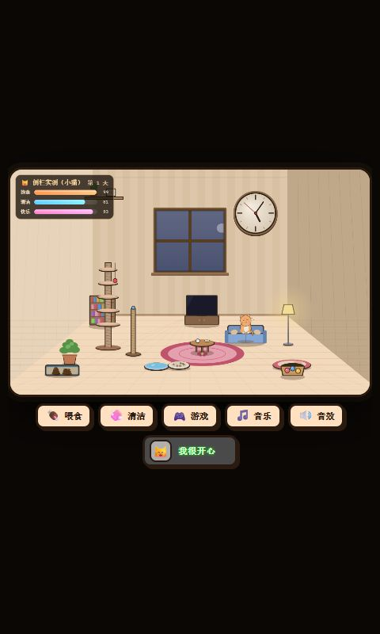

# 桌猫 EXE 实测：内部网页可在 Codex 内置浏览器游玩

日期：2026-09-22 · [目录](./README.md) · [EXE 验证计划](./09-exe-sidebar-validation.zh-CN.md)

## 结论

用户提供的 `E:\GAME\桌猫.exe` 已实际启动并检查。它是 Electron 封装的网页游戏：主进程创建窗口并加载 `resources/app.asar/index.html`，preload 只打印一条启动日志，没有向游戏暴露桌面能力。内部 HTML 可独立运行。

本次从运行包提取原始 HTML，**不修改游戏代码**，通过仅监听本机的 HTTP 服务在 Codex 内置浏览器中实测了画面、鼠标交互、小游戏计分、键盘命名和刷新恢复。独立 EXE 关闭后，网页继续可玩。

因此这款作品有直接的网页发布路线，无需云游戏服务器或本地视频串流。本结果不是“把 Windows EXE 进程嵌入 Codex”，也不能推广为“任意 EXE 都能在侧栏运行”。原生窗口嵌入、WebRTC 串流和后台原生输入仍未验证。

## 样本与身份校验

| 项目 | 结果 |
| --- | --- |
| 输入文件 | `E:\GAME\桌猫.exe` |
| EXE 大小 | 61,151,835 字节，约 58.3 MiB |
| EXE SHA-256 | `4967F9E183A311193F8B2F0FD33F5A40B8B2A1FF7A575C2D412B2E4640C69912` |
| 包内应用 | `deskcat`，版本 `1.0.0`；启动进程名 GalaxyBee |
| 包内文件 | `index.html`、`main.js`、`preload.js`、`package.json` |
| 游戏 HTML 大小 | 172,569 字节 |
| HTML SHA-256 | `cad5cdbf845c457544ce5df0f5757545e788db63a2d26782e8a00bd6d0ca75a4` |

EXE 测试前后哈希一致；HTTP 返回的 HTML 与提取文件逐字节一致。`main.js` 负责窗口和 F11/Esc 全屏快捷键；实际游戏使用 Canvas 2D、浏览器事件、Web Audio 和 localStorage。本次没有修改 EXE，没有重置桌面版存档，也没有上传游戏到外部服务。

## 已完成的实际操作

| 操作 | 实际结果 | 结论边界 |
| --- | --- | --- |
| 启动指定 EXE | 出现“猫咪养成 · 客厅”窗口；可读取实际加载的 app.asar 页面 | 启动器会拉起 GalaxyBee 子进程，不能只按入口 EXE 名查窗口 |
| 内置浏览器打开原始 HTML | 房间、猫咪、状态栏、五个操作按钮可见 | Canvas 2D 样本，不代表 WebGL 或所有引擎 |
| 点击喂食并选择小鱼干 | 打开食物菜单，鱼出现在食盆；之后饱食度从初始 85 到 100 | 验证菜单、画布点击及游戏逻辑 |
| 打开“数学小测” | 展示 `9 - 8 = ?` 和四个答案 | 原游戏实际小游戏，无替代演示 |
| 点击答案 1 | 答对数从 0 到 1，答案高亮为绿色 | 验证 Canvas 内点击与计分；未完成全部 8 题 |
| 点击头像，输入“侧栏实测”，按 Enter | 猫名显示为“侧栏实测” | 验证侧栏键盘输入和回车提交 |
| 刷新页面 | 猫名及喂食后的数值保留；可关闭游戏自己的离线报告回到客厅 | 浏览器本地存档恢复，不代表与桌面 EXE 存档互通 |
| 关闭独立 EXE 后再次刷新、操作 | 浏览器仍运行；Windows 窗口列表及进程检查中不再有该游戏 | 不依赖 EXE 在后台运行 |
| 360 × 720 CSS 像素 | 游戏和按钮可见，点击喂食按钮打开菜单 | 画布内小字偏小，需要窄屏排版优化 |
| 480 × 800 CSS 像素 | Canvas 宽约 460.8、高约 290.2，操作按钮全部在视口范围内 | 只验证这两个尺寸及过程中宿主的默认尺寸 |
| 浏览器控制台检查 | 本次读取的 error/warn 记录为空 | 不等于覆盖所有游戏状态 |

关闭独立窗口时，自动化点击返回了一次前台进程状态错误；随后重新枚举确认窗口已经关闭，进程检查亦无 GalaxyBee/桌猫。因此以实际关闭后的状态为准，没有重复启动或强杀其他进程。

声音按钮和音频实现存在，但本次未取得实际音频输出证据，不把“有声音”列为已验证。未做 30 分钟稳定性、FPS、端到端延迟、移动端或全屏快捷键验收。

## 复现与保留文件

已保留本机演示地址：[打开桌猫](http://127.0.0.1:43188/)。该地址只在运行本地服务的这台电脑上可用。

- [本机测试服务](../poc/deskcat-server.mjs)：只提供游戏 HTML，不暴露任意文件或目录，不接收上传；其他文件路径返回 404。
- `poc/deskcat-fixture/`：从本次用户样本提取的四个文件及来源/哈希记录，已加入 `.gitignore`，不作为平台公开素材。
- `poc/deskcat-server.pid` 与日志：本次隐藏后台服务的运行记录，无开机自启。

服务停止后，可在项目目录运行以下命令；端口已有服务时不重复启动：

```powershell
node .\poc\deskcat-server.mjs
```

测试服务限制外部资源与网络连接，游戏在新的浏览器 origin 下使用独立存档。本次新建的测试猫名只用于这份浏览器存档，不代表已经实现平台账户或跨入口云存档。

已调用宿主工具请求将演示打开到右侧，调用返回 queued；随后内置浏览器页面加载和游戏交互实测通过，并将标签页保留为交付。**未以整个宿主窗口的截图独立证明停靠位置，也未注册新的原生功能区**。页面可运行与宿主原生侧栏注册仍是两项能力。

## 截图证据

480 像素宽度下，独立 EXE 关闭后，恢复的测试猫名和游戏场景：



360 像素宽度下，点击喂食后实际打开的菜单：


## 对平台方案的影响

Windows 上传应先识别运行类型。对于这类不依赖桌面 API 的 Electron 游戏，建议作者同时提交网页构建，平台按网页作品托管，EXE 作为可选下载版。网页运行只需分发 HTML/资源，不需要把 58 MiB 的桌面运行时送进侧栏。

本次人工提取用于验证，不代表已经实现或适合向所有作者提供“任意 EXE 自动转网页”。涉及文件系统、原生模块、IPC、系统能力或不同游戏引擎的程序，仍需作者适配或继续执行独立的原生/串流验证计划。
