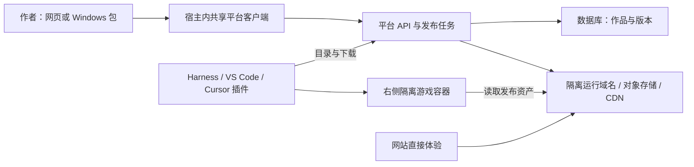

# DeepSeek Harness 游戏平台：产品形式与实施方案

更新：2026-09-24 · 状态：M0 插件已初步实现，完整平台待开发 · [目录](./README.md)

本产品方案要求作者与玩家都在宿主内完成业务流程，首批兼容 Harness、VS Code 和 Cursor 编辑器，并分发 EXE 安装包。实施以 [18 多宿主完整客户端](./18-multi-host-client-spec.zh-CN.md)、[19 Windows 发布包](./19-windows-package-spec.zh-CN.md)及 [13—17 技术契约](./13-technical-design.zh-CN.md)为准；已完成部分见 [20 实测记录](./20-execution-status.zh-CN.md)。

## 1. 建议采用的形式

**我们托管平台服务，用户安装界面插件，在功能区内登录、上传发布、浏览、下载和游玩。**Harness 采用组合包（bundle），VS Code 与 Cursor 编辑器采用 VSIX 适配，共享客户端界面和 API。作者上传网页或 Windows 发布包，每个作品不需要成为一个宿主插件。

这条路线使用现有宿主的扩展接口，用户继续通过 Harness 自己的渠道更新客户端。我们维护平台、插件和宿主兼容性，不接管整个编程客户端的维护。

首批验收覆盖 Harness、VS Code 与 Cursor 编辑器。网站和浏览器保留可选分享及回退入口；VS Code 视图放到右侧需首次移动，Cursor Agents Window 单独验证，不能据编辑器结果宣布全部兼容。业务范围沿用 [07 免费首版](./07-free-mvp.zh-CN.md)：海外首发、中国大陆公司经营、合格包自动发布、游客免费体验或下载，没有支付开发。

**界面上是 Harness 内注册的专用游戏功能区；技术上，大厅由插件组件绘制，游戏在里面的隔离网页容器运行。**网页游戏仍由浏览器引擎渲染，这与“具有自己的功能区”并不冲突。普通 Windows EXE 的侧栏运行另行验证，不包含在本方案的可行性结论中。

## 2. 目前证据支持到哪一步

本机检查对象为 `E:\DEEPSEEKHARNESS`，版本 `0.1.7-alpha.1`，提交 `c36a83ff6bb95e3f82cf79f9be7c724270a8aa61`。

| 项目 | 当前状态 |
| --- | --- |
| 官方源码依赖安装、构建、Web 界面启动 | 已在本机完成，可见“插件”等入口；测试服务已停止 |
| 注册右侧 tab 与自定义内容组件 | 已核查接口和内置文件树插件的实际用法 |
| 面板隐藏、切换会话时保留组件 | 源码提供 `keepMounted`；游戏暂停、恢复尚未实测 |
| 安装我们自己的预构建插件 | 0.0.2 测试包已在独立 profile 安装，右栏入口与样本初步实测通过 |
| WebGL2 样本 | 随包自有样本已绘制并响应暂停；完整兼容性仍待测 |
| 远程游戏、第二位用户安装 | 尚未实测 |
| 所有 Harness 桌面发行版均兼容 | 没有此结论；当前启动验证的是源码版 Web 界面 |

可复核的固定版本依据：

- [右栏类型注册与组件席位](https://github.com/deepseek-ai/deepseek-harness/blob/c36a83ff6bb95e3f82cf79f9be7c724270a8aa61/packages/client/ui-sidebar-right/src/client/index.ts)：提供 `sidebarRightTabs`、`sidebarRight` 与 `sidebar.right.pane.tab`。
- [文件树插件的接入实例](https://github.com/deepseek-ai/deepseek-harness/blob/c36a83ff6bb95e3f82cf79f9be7c724270a8aa61/packages/client/ui-sidebar-files/src/client/index.ts)：独立插件使用这些接口挂载界面。
- [tab 定义](https://github.com/deepseek-ai/deepseek-harness/blob/c36a83ff6bb95e3f82cf79f9be7c724270a8aa61/packages/client/ui-sidebar-right/src/client/tab-registry.ts)：包含 `kind`、`guide`、`multiple`、`keepMounted`。
- [组合包的打包与安装](https://github.com/deepseek-ai/deepseek-harness/blob/c36a83ff6bb95e3f82cf79f9be7c724270a8aa61/docs/user/develop/basic/publish.zh.md)：声明 `dsh.bundle.patch`，安装到用户 profile。

这些证据足以选择插件路线；正式对外说“安装即可玩”之前，还要完成第 10 节的实测。

## 3. 玩家和作者怎样使用

### 玩家

1. 使用兼容版本的 Harness，在“插件 → 添加插件”安装我们的包并启用。
2. 进入一个会话，在右栏入口列表打开“游戏大厅”。现有右栏按会话组织，首次使用说明必须讲清这一点。
3. 大厅展示平台已发布作品：封面、名称、简短介绍、2D/3D/互动项目标签。
4. 点击作品，再点“开始”，游戏直接出现在同一功能区。
5. 可以返回大厅、重新开始、展开显示、举报或复制网站体验链接。暂停按钮仅在作品具备相应能力时展示。
6. Windows 版本可在同一插件内下载，查看进度、校验和保存文件；安装包不会自动安装。原生侧栏游玩通过独立实验后才开放对应入口。

插件安装一次即可发现后续发布的游戏。游戏平台自身无需调用模型；玩游戏不会产生模型推理调用。用户使用 Harness 编程功能时的模型配置仍由宿主负责。

首版大厅只做分页作品列表和详情，不引入复杂推荐、社交、排行榜与全站搜索。浏览器直接链接作为分享和兼容性回退路径。

### 作者

**在功能区账号页登录 → 上传页选择网页或 Windows 包 → 自动检查 → 发布成功 → 在“我的作品”管理更新与撤下。**界面明确“上传并发布”，也保留私有草稿。初期邀请作者，正常合格包无需人工逐件批准；Windows 走独立扫描分支。

上传不经过外部作者网站。共享客户端通过受限 HostAdapter 选择文件、流式传输和保存凭据；游戏容器不能调用这些能力。以后可增加 Agent 辅助打包工具，但它不替代首版可直接操作的上传页面。

### 右栏外观

```text
┌────────────────── Harness ──────────────────┐
│ 代码 / 会话区             │ 游戏大厅         │
│                           │ 大厅 / 上传      │
│                           │ 封面、名称、开始 │
│                           ├──────────────────┤
│                           │ 开始后显示游戏   │
│                           │                  │
│                           │ 我的作品 / 下载  │
└───────────────────────────┴──────────────────┘
```

大厅适配窄面板，建议在 360、480、800 像素宽度验证。横屏游戏保持比例并允许展开；不能保证所有桌面网页布局都适合窄栏。复用宿主现有的调整宽度、折叠和展开机制。

## 4. 为什么选界面插件

| 形式 | 用途与评价 |
| --- | --- |
| **界面插件：Harness bundle / 编辑器 VSIX** | 完整平台页面、受限文件传输服务与隔离游戏容器；主要交付形式 |
| Skill / MCP 工具 | 适合以后让 Agent 查找作品、打包与发布；单靠它们不能完成本项目的专用右栏体验 |
| 大厅网站放进通用浏览器 | 可快速预览与回退；主要体验采用上面的专用大厅 |
| 修改 Harness 源码、分发自定义客户端 | 增加宿主更新、打包与分发维护，本阶段没有必要 |

“组合包”是安装封装，“界面插件”是包里的主要功能，并非两个互斥方案。

## 5. 平台和插件如何分工



| 部分 | 我们负责的内容 |
| --- | --- |
| 平台服务 | 作者账号、作品与版本、上传检查、公开目录、撤下、举报、管理和日志 |
| 托管服务 | 原始包和草稿私有；已发布资源经运行网关与 CDN 提供 |
| 三宿主插件与共享客户端 | 功能区、大厅、账号、上传、我的作品、下载管理、隔离播放器和受限宿主服务 |
| 作品发布包 | 网页构建产物或 Windows 便携 ZIP、单文件 EXE、EXE 安装包；独立目标版本 |
| 可选作品 SDK | 声明就绪、处理暂停/恢复、尺寸适配、未来的存档接口 |

游戏的 JS/WebGL 主要消耗玩家设备的 CPU/GPU，平台服务器处理目录与资源分发。首版不为每位玩家开虚拟机、Windows 进程或云 GPU，也不在业务服务器执行作者上传的脚本。

网页基础服务沿用 [06 的 S 档](./06-server-sizing.zh-CN.md)。插件不会让平台承担每位玩家的网页渲染，但邮件、Windows 扫描和大包分发增加部署与成本，具体见 17、19，不能套用原网页预算总价。

## 6. 插件的具体实现与分发

### 界面接入

- 注册独有的 tab `kind`，例如 `gamehub`，避免覆盖宿主已有类型。
- 用 `ctx.sidebarRightTabs.register(...)` 注册类型和大厅入口，用 `sidebar.right.pane.tab` 的 keyed slot 注册组件，需要时调用 `ctx.sidebarRight.openTab('gamehub')` 打开。
- 发布包声明浏览器客户端入口及所需服务依赖，参照官方文件树插件的 `dsh.client` 与 `./client` 导出结构；宿主入口不承担游戏执行。
- 把 Harness 接口集中在一个适配模块，大厅与平台通信单独实现，减少宿主变动影响。
- 大厅代码随插件发布，作品只在隔离容器执行。目录响应是数据，不作为具有宿主权限的远程代码加载。

第一版可在一个包中包含宿主入口、客户端代码与 bundle patch，对玩家仍只有一次安装。应独立构建，不要求用户把包放进我们的 Harness 源码目录。

### 分发路径

先交付已经构建好的 `.tgz` 测试包，通过 Harness 插件管理器安装和启用。验证后再发布到 npm，玩家输入包名及版本安装。用户无需克隆我们的代码或编译插件。具体支持安装源、启用及重启行为，以通过测试的宿主版本为准。[官方插件管理器说明](https://github.com/deepseek-ai/deepseek-harness/blob/c36a83ff6bb95e3f82cf79f9be7c724270a8aa61/packages/client/ui-plugin-manager/README.zh.md)

包需声明 `dsh.bundle.patch`，由 patch 增加自己的插件行；不要覆盖用户整个配置或替换宿主程序。发布前检查所有产物和外部依赖，不能残留只在开发仓库中可用的 `workspace:` 引用或相邻目录依赖。仅预构建本包还不够，依赖链也应避免要求用户运行安装构建脚本。

安装位置是用户正在运行的受管 profile。不要误装进一个只有 base、缺少 Web 界面的新 profile，再把界面缺失当作插件故障。需要先在临时、含 Web 应用配置的干净 profile 验证安装和卸载。

本方案没有发布真实包名，也没有声称已经进入官方插件目录。正式提供安装说明时再填写已发布、实测过的包和版本。

## 7. 平台对插件提供什么

以下为拟定能力，当前尚未实现。具体路由、数据结构、认证和状态以 [14 数据模型与 HTTP API](./14-data-api-spec.zh-CN.md)为准；04 保留为长期参考。

插件内登录、上传 grant 与设备授权由 18 补充，Windows 目标与下载契约由 19 补充；它们都是首版必需模块。

| 接口能力 | 首版需要返回或处理的内容 |
| --- | --- |
| 作者业务 | 插件内认证、上传任务与进度、发布结果、自己的作品、按目标更新与撤下 |
| 下载管理 | 元信息、版本/哈希、附件字节流、续传和目标文件保存；本地路径不上报游戏 |
| 公开目录 | 分页作品摘要：稳定 ID、名称、封面、类型、发布时间 |
| 作品详情 | 简介、作者展示名、当前发布版本、适合的画面比例和能力标记 |
| 启动信息 | 确定的版本 ID、可信运行域名下的入口、最小播放器协议版本 |
| 资源读取 | 校验发布/禁用状态，正确返回 HTML、JS、WASM、模型等类型 |
| 举报 | 限流、受理记录和最少必要信息 |

平台目录可以匿名读取，公开只读接口不携带凭证；作者修改与上传必须鉴权。实际使用的宿主来源、CORS、CSP、iframe 嵌入及 HTTPS 需要联调，不能只在独立浏览器访问成功后就判定插件可用。

启动后绑定不可变版本，不在用户玩到一半时切换作者新版本。稳定作品链接用于寻找当前版本；撤下阻止新的请求，已经送达玩家设备的文件无法追回。

## 8. 作品兼容、安全与生命周期

### 作品格式

根目录 `index.html` 的静态网页发布包即可进入基础兼容流程，SDK 和 `platform.json` 不强制。大小、文件数、自动检查与发布规则沿用 07。首批验证 Canvas 2D、Three.js/WebGL2 与一个互动创意项目；WASM 按具体导出配置验收。

任意源码构建、任意后端、多线程/跨源隔离要求、WebGPU 和原生 EXE 侧栏运行不作普遍兼容承诺。Windows 下载分发属于首版，不能与原生运行混为一谈。[桌猫实测](./10-deskcat-test.zh-CN.md)只证明该 Electron 样本提取的网页可以运行。

### 隔离边界

插件是我们维护的可信代码；作者上传的游戏是不可信网页。运行资产使用与平台账户站点不同的可注册域名，并按作品版本分配 origin，放进受限 iframe。游戏不得接触 Harness 的文件、命令执行、模型 API Key 或平台作者凭证。

允许脚本执行的同时保留容器限制；全屏、指针锁等按作品能力与用户操作授予。避免默认允许任意弹窗、顶层跳转和原生桥接。若为本地存档使用 `allow-same-origin`，必须维持游戏与宿主、平台及其他版本的来源隔离，不能把不可信游戏部署到父页面同源。[iframe 权限和沙箱语义](https://developer.mozilla.org/en-US/docs/Web/HTML/Reference/Elements/iframe)

SDK 按 15、18 使用精确游戏来源的 INIT 和独立 MessageChannel，核对窗口、launchId、消息类型及长度；只接受游戏生命周期消息，不转发为 Agent 命令或作者业务调用。上传解包、外连控制、禁用和举报继续执行技术规范，首次开放投稿前验证隔离效果。

### 收起、切换会话、关闭

`keepMounted: true` 可保留已访问组件，减少收起或切换时重建页面；它不等于暂停引擎、停止声音或保存进度。CSS 隐藏 iframe 不会自动触发其页面可见性变化，不能只依赖游戏的 `visibilitychange` 监听。[MDN Page Visibility API](https://developer.mozilla.org/en-US/docs/Web/API/Page_Visibility_API)

首版建议每个 Harness 窗口最多一个活跃游戏。插件根据面板实际显示状态协调生命周期，分两档处理：

| 作品能力 | 处理方案 |
| --- | --- |
| 基础兼容：没有接入 SDK | 可以游玩；隐藏或切换时释放游戏 iframe，重新打开重新加载；明确未保存进度可能丢失 |
| 侧栏优化：通过 SDK 兼容检查 | 可请求暂停、停止音频、保持页面并恢复；保留数量和时间设置上限，未响应时按基础模式释放 |

不要为了“免刷新”无限保留隐藏游戏。SDK 协议依赖作品正确实现；仅收到暂停确认不能证明后台没有消耗资源。关闭、插件停用和到达保留上限均应释放容器、事件订阅和连接。

当前右栏属于会话，切到另一个会话不会自动把同一个游戏画面搬过去。首版接受此边界，提供重新打开入口；跨会话一直显示同一游戏不是已经具备的能力，后续单独评估。

### 存档

本地存档取决于作品实现、运行 origin 及宿主存储策略。刷新同一版本可能恢复，但切换宿主、浏览器或作品版本不承诺继承。按版本隔离会让原生 localStorage 跨版本迁移成为显式设计事项；以后由可选 SDK 和用户授权的存档服务解决，不通过取消隔离解决。首版不做通用云存档，也不承诺把任意游戏内存自动保存。

## 9. 更新与维护成本

| 变化 | 我们的动作 | 玩家感知 |
| --- | --- | --- |
| 新作品、封面、目录变化 | 更新平台数据与托管资源 | 刷新大厅即可看到 |
| 作者发布新游戏版本 | 发布不可变资源并切换作品当前版本 | 下次开始使用新版；当前游玩保持原版本 |
| 大厅交互、播放器逻辑变化 | 发布插件版本 | 通过受支持的安装/升级路径更新插件，必要时重启 |
| Harness 更新 | 跑兼容回归，接口变化时发布适配版 | 继续使用宿主自身升级渠道，参考插件兼容列表 |
| 平台 API 演进 | 保持旧插件协议兼容，必要时明确最低插件版本 | 有可解释的升级提示，避免直接白屏 |

接口仍处于开发者预览阶段，不能承诺每次 Harness 升级都零适配。首批只支持一个实测版本，记录具体提交/发行版本；在新的目标版本验证后再扩展支持列表。宿主适配代码与业务代码分离，并保留旧插件包用于回退。[官方项目状态](https://github.com/deepseek-ai/deepseek-harness#developer-preview)

主要工程难点是第三方作品兼容、生命周期、上传隔离及插件版本适配。单个右栏入口的工作量相对小，不能把“入口可以注册”等同于整个平台已经完成。

## 10. 按什么顺序验证和交付

| 阶段 | 具体交付 | 通过条件 |
| --- | --- | --- |
| A：真正可安装的三宿主插件 | `.tgz`、`.vsix`、完整页面骨架、受限 HostAdapter | 干净环境安装与停用清理；文件选择/保存、右侧位置按宿主验收；不改宿主源码 |
| B：我们服务的远程作品 | HTTPS 目录和资产，2D、WebGL2、互动项目样本 | 右栏能从平台加载；尺寸、键鼠、音频启动、展开和加载错误均验收 |
| C：作者到另一位玩家 | 插件内登录、网页/Windows 上传发布、下载管理、更新撤下 | 三宿主内分别完成完整流程；A 上传后 B 可在另一宿主发现、游玩或下载，不跳转作者网站 |
| D：小规模试运行 | 版本矩阵、运维记录、备份与恢复 | 完成资源与安全检查，并在下一个目标 Harness 版本完成回归 |

同机新 profile 可以验证安装隔离，但不能替代另一台设备和真实网络的验收。如果最终交付面向桌面安装包，还要在那个具体发行版重复 A、B 和生命周期检查；本机 Web 源码启动结果不替代桌面验收。

关键检查：

- 面板折叠、切换会话、切到设置、关闭、插件停用后，游戏声音与资源按约定停止；回到游戏时结果可解释。
- 游戏获得焦点时键鼠可用，离开后宿主快捷键可继续使用；拖动面板与全屏不导致游戏失控。
- 记录首次加载时间、运行帧率、CPU/GPU/内存和隐藏后的资源表现。结论注明游戏、设备、宿主版本，不宣称所有 3D 游戏流畅。
- 平台离线、超时、作品撤下、CORS/CSP 拒绝、版本不兼容时有明确提示和重试/回退路径。
- 游戏读不到平台登录态或宿主能力；草稿不可访问，越权修改和恶意 ZIP 被拒绝，失败更新不覆盖可用版本。
- 新玩家安装的是同一个发布包，不依赖开发机目录、构建缓存或本地演示服务器。

**当前进入阶段 A：Harness 原型部分通过，继续三宿主能力验证，并尽早进行独立原生 EXE 实验。**随后按 17—19 补齐插件内上传、Windows 分发和跨宿主闭环。原生实验需另交成功或阻断证据，不能以网页运行或下载成功代替；具体进度见 20。
