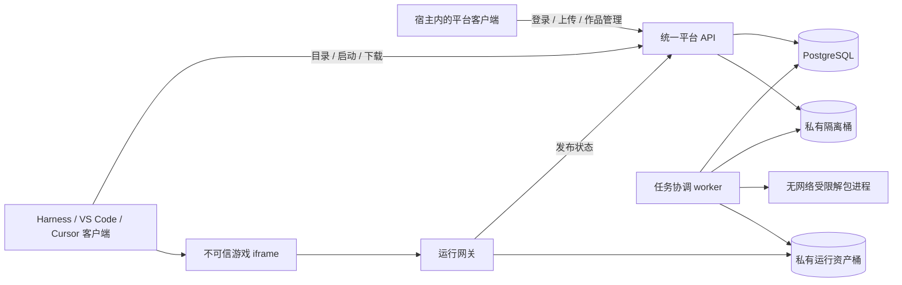
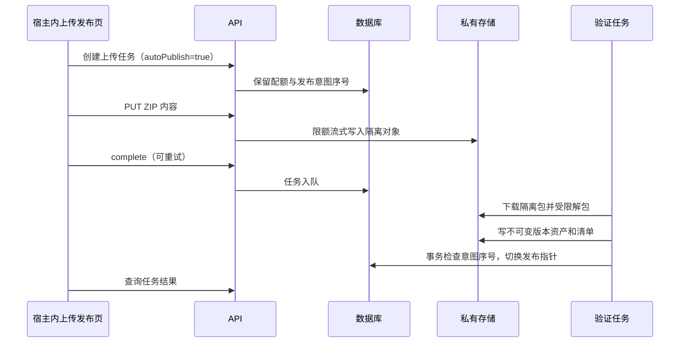

# 技术设计总纲：多宿主游戏平台免费首版

版本：TD-1.1 · 日期：2026-09-22 · 状态：实施前技术规范，尚未实现 · [文档目录](./README.md)

实施状态更新（2026-09-24）：已启动 M0，Harness 插件部分能力通过实测，见 [20](./20-execution-status.zh-CN.md)。本文仍描述完整目标，阶段结果不代表平台业务已实现。

## 1. 文档用途与优先级

本文及 14—19 是开发、联调和验收使用的技术基线。最新范围为 Harness、VS Code、Cursor 内完成上传、下载与游玩，Windows EXE 安装包分发纳入首版，原生侧栏运行单独验证。本文中的“必须”是拟实现系统的要求，不表示功能已存在。

同一问题有不同描述时，当前执行顺序为：用户后续决定 → 18/19 的多宿主与 Windows 增量 → 13—17 的通用技术契约 → 07/12 的产品范围 → 01—06 的长期参考。收费、领取权益、云存档、源码云构建和 Agent 自动发布仍后置；原生 EXE 的上传下载已纳入，侧栏运行能力待实验，不能混为已支持。

| 文档 | 负责的契约 |
| --- | --- |
| [14 数据模型与 HTTP API](./14-data-api-spec.zh-CN.md) | 作者认证、表结构、权限、状态机、请求响应、并发和幂等 |
| [15 Harness 插件与播放器协议](./15-harness-player-spec.zh-CN.md) | 包结构、真实宿主接口、页面生命周期、游戏消息和兼容处理 |
| [16 上传发布与运行隔离](./16-publishing-runtime-spec.zh-CN.md) | 字节接收、受限解包、发布事务、资源网关、缓存及安全头 |
| [17 部署运维与验收](./17-deployment-acceptance.zh-CN.md) | 环境配置、服务部署、备份、监控、交付清单和测试矩阵 |
| [18 多宿主完整客户端](./18-multi-host-client-spec.zh-CN.md) | Harness/VS Code/Cursor 内登录、上传、作品管理、下载、统一宿主协议 |
| [19 Windows 分发与运行验证](./19-windows-package-spec.zh-CN.md) | EXE/完整 ZIP/安装器、多目标版本、扫描、续传及侧栏实验门槛 |

本文原始交付为技术规范；2026-09-24 已开始 20 记录的本地原型。没有修改 Harness 源码或启动线上服务；未实现模块的目录、域名及 API 示例仍为待开发设计。

## 2. 必须完成的业务闭环

作者在 Harness、VS Code 或 Cursor 的平台功能区登录，选择网页 ZIP 或 Windows 发布包，查看检查和发布结果。另一位玩家可在任一兼容宿主发现同一作品，网页直接在功能区游玩，Windows 包在插件内下载和管理。无需另开作者网站，不调用模型；玩家公开浏览/下载/在线玩无需注册。

正常包不进入必经的人工审批；异常权限请求进入复核。失败更新保留原可用版本。作者可以创建私有草稿、发布已就绪的草稿、更新、撤下；管理员可以禁用作品或单个版本。

首版支持 HTML/Canvas、WebGL2 和经样本验证的单线程 WASM，并支持经过专门检查的 Windows ZIP/EXE 下载。基本网页运行不要求 SDK；暂停恢复增强需要作品配合。原生 EXE 能否在功能区游玩另验；网站仅保留可选分享和直接访问入口。

## 3. 技术选择

| 层 | 当前选择 | 原因与约束 |
| --- | --- | --- |
| 语言与工作区 | TypeScript、pnpm workspace | 插件、API 和播放器共享契约；实施时提交锁文件 |
| Node 运行时 | Node 22，最低满足 Harness 的 22.19 要求；选定受支持的安全补丁版 | 本机已验证 22.23.2；不把这一补丁永久写死在生产镜像 |
| 平台 API | Fastify 5，模块化单体 | Schema 验证、流式接收上传、明确错误格式 |
| 共享平台客户端 | React 18 + 分宿主构建 | 大厅、账号、上传、我的作品、下载管理；网站复用界面作为可选入口 |
| Harness 前端 | 使用被测试宿主的 React/界面服务 | 不打包第二份 React 或 Cordis 实例；依赖处理见 15 |
| VS Code / Cursor 前端 | VSIX + WebviewView，可信扩展 host | 共用业务源码，分别记录编辑器版本、界面与 API 兼容结果 |
| 数据库 | PostgreSQL 16 的受支持补丁版，SQL migration + `pg` | 作品发布、权限、配额和任务租约由事务保证 |
| 后台任务 | PostgreSQL 任务表，单 worker 起步 | 不引入 Redis、Kafka 或 Kubernetes |
| 存储与分发 | R2 私有桶 + Cloudflare Worker 运行网关 | 所有游戏资源读取先检查发布状态，再读边缘缓存或对象存储 |
| 入口代理 | Caddy，HTTPS，同源网站与业务 API | 首版上传经过 API 的硬字节限制；避免代理整包缓冲 |
| 验证 | 契约/集成测试 + Playwright + 三宿主真实安装 | 自动验证协议和隔离，人工补文件传输、键鼠、音频、3D 与宿主操作 |

这些是本项目的工程选择，不是宿主要求。Fastify 5 的 Node 基线与本选择相容。[Fastify v5 迁移说明](https://fastify.dev/docs/latest/Guides/Migration-Guide-V5/)

依赖锁定时选择当时仍受支持的补丁并记录制品哈希；不使用未锁定的 `latest` 镜像。Harness 首个核查基线为 `0.1.7-alpha.1`、提交 `c36a83ff6bb95e3f82cf79f9be7c724270a8aa61`，不能仅凭版本字符串宣称不同构建等价。

## 4. 组件与信任边界



1. **宿主平面**：各宿主与我们发布的可信客户端。增加用户选择文件、受控传输/保存和凭据管理权限，不提供任意 shell 或模型调用；这些能力不暴露给游戏。
2. **业务平面**：作者身份、作品、发布任务、下载和管理。插件采用自己的有限设备授权，网站 Cookie 保持独立，两者都不传给游戏。
3. **运行平面**：作者 JavaScript/WASM 所在独立来源。只得到自己的公开资产和受限播放器消息。
4. **处理平面**：协调进程持有最小存储凭据；实际解析 ZIP 的子进程无凭据、无网络、只接触本任务目录。

游戏在玩家设备运行。后台检查不执行作品脚本；也不提供每玩家云进程、原生桥、实时多人服务器或代付的 AI 接口。

## 5. 域名与请求路线

以下 `.example` 域名均为占位符，部署时整体替换并验证证书。

| 地址 | 内容与认证 |
| --- | --- |
| `https://app.gamehub.example` | `/v1` 业务 API、可选网站与分享页；网站 Cookie 仅限此 host |
| `https://media.gamehub.example` | 平台生成或重编码的封面；不承载作者 HTML/JS |
| `https://r-<releaseId去横线>.gamehubusercontent.example` | 一版作品一个 origin；匿名运行资产，无平台认证 Cookie |
| `https://download.gamehubusercontent.example` | 经状态门禁的 Windows 附件下载；不承载业务凭据或内联网页 |
| `/internal/v1/...` | 同一业务服务的网关状态接口，独立服务凭据；不对浏览器开放 CORS |

业务域和运行域使用不同可注册域名。隔离包和草稿无公共访问地址；已批准 Windows 下载包只通过下载网关分发。R2 直出域关闭。业务公开读可无凭证跨源；写路由支持可信客户端 Bearer 授权或网站同源 Cookie+CSRF，二者规则见 18。

首版通过 API 流式上传到私有存储，网页 100 MiB、Windows 上限按 19 单独配置，不把大小控制完全交给客户端。代价是业务机承担上传转发带宽；试运行限制并发。浏览器文件使用单任务 upload grant，宿主服务使用作者授权。将来改对象存储直传须保持任务/完成契约并重验限制。

## 6. 计划中的代码组织

```text
apps/
  api/                 # auth、creator、catalog、admin、internal-state
  web/                 # 共享客户端的可选网站入口与分享
  validator-worker/    # 任务租约、解包子进程、发布与清理
  runtime-edge/        # 运行状态门禁、资源读取、响应头与缓存
packages/
  contracts/           # HTTP/manifest/消息 Schema 与类型
  platform-client/     # 多宿主共同的账号、作者、玩家和下载界面
  host-contract/       # 有限文件/账号/传输/可见性能力
  transfer-core/       # 上传下载任务、进度、取消与校验
  platform-api-client/ # 公开/作者 API、超时、取消与错误；替代旧 catalog-client 的单一读接口职责
  player-core/         # 生命周期状态机、iframe 和消息校验
  game-sdk/            # 作者可选的就绪/暂停/恢复适配
extensions/
  harness/             # bundle、客户端入口与宿主适配
  vscode/              # VS Code/Cursor VSIX，分别验收
deploy/                # 镜像、Compose、代理与环境模板
tests/                 # 契约、集成、隔离、发布和端到端样本
```

以上是待创建目录，不表示当前已有实现。现有 `poc`、VS Code 原型和桌猫 fixture 继续作为历史验证样本，不作为生产运行网关或上传服务。

依赖方向为：客户端/服务端依赖 contracts；各宿主适配共享 platform-client、transfer-core 和 player-core；业务模块不导入具体宿主。业务服务不依赖插件包，game-sdk 不包含平台或宿主授权。

## 7. 三个关键流程

### 上传并发布



### 插件启动作品

大厅取目录和详情 → 玩家点击开始 → 取得当前发布描述 → 校验协议、域名与必要能力 → 创建隔离 iframe → 基础模式或 SDK 握手 → 记录本窗口运行状态。目录加载不预先启动所有游戏。

### 更新与撤下

新版本完成检查前不改变当前版本；切换指针后，已启动的游戏仍绑定原版本。撤下或管理员禁用修改数据库，网关在限定缓存时效内拒绝新网络读取；已经加载在设备上的代码不能远程追回。播放器主动启动时必须重新查询状态。

## 8. 固定的首版取舍

- 作者默认在插件内使用邮箱验证码登录和设备授权，GitHub OAuth 改为可选；初期发布权限由邀请开通。玩家匿名使用。
- 私有草稿可以保存、检查并以后发布；私有在线预览和云存档后置，避免把临时授权引入当前运行链路。
- 每窗口至多一个游戏 iframe；SDK 游戏隐藏后最多保留 5 分钟，普通游戏隐藏时释放。
- 网页展开 300 MiB、ZIP 100 MiB、5,000 文件、每作者 5 件作品；每目标保留 3 版。Windows 独立限制和检测见 19。
- 未集成 SDK 的 `iframe.load` 只代表文档加载事件，不能计为游戏逻辑成功。SDK `READY` 也不是安全审核结论。
- 启动描述、API 协议、消息协议、插件版本和作品版本各自独立，不用一个版本号兼任。

## 9. 实施开始前需要填入的配置

域名、海外区域、R2/Worker 账号、邮件发送服务、独立 Windows 包扫描资源、管理员身份与邀请名单是部署参数。GitHub OAuth 应用只在启用该可选方式时配置。实施先用隔离测试环境，不在文档放真实凭据。

尚需实测的技术门槛包括：外部插件对宿主共享依赖的解析、`useTabInfo` 的生命周期回调、运行域名完整嵌入链、WebGL 与声音、安装到另一台机器、升级与卸载。详见 17；未通过时回退或缩小支持矩阵，不把未知能力写成已支持。
