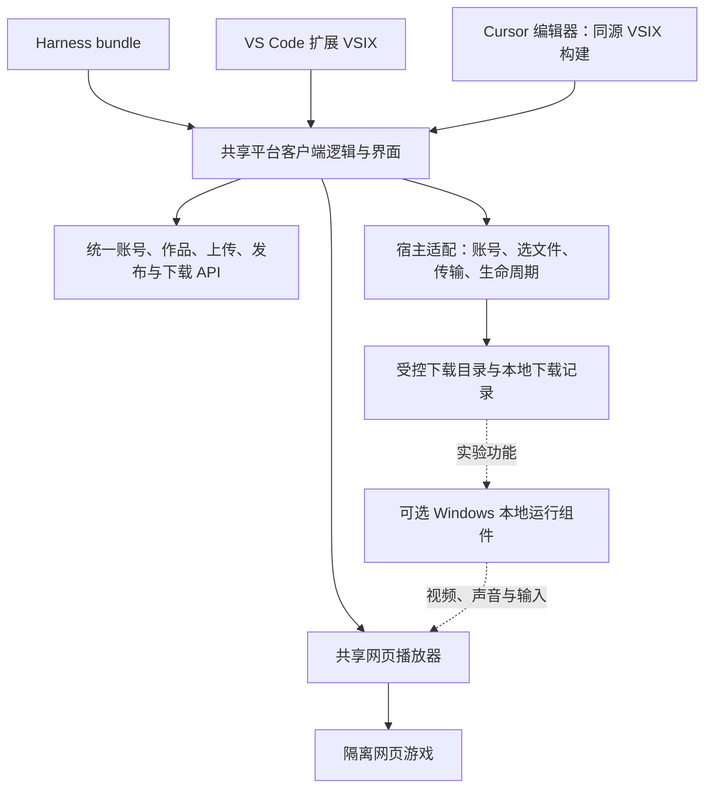

# 多宿主完整客户端：上传、下载与游玩技术规范

版本：TD-1.1 · 日期：2026-09-22 · 状态：需求修订后的待实现规范 · [技术总纲](./13-technical-design.zh-CN.md)

## 1. 本次确认的范围

**Harness、VS Code、Cursor 是平台的主要客户端入口。作者在软件内登录、上传、发布、更新和撤下；玩家在软件内浏览、下载、管理已下载作品并游玩。**作者网站作为可选入口，不再是发布作品的必经步骤。

用户已明确：下载包含 Windows EXE 安装包，并继续验证能否在功能区中运行。由此划分两个并行交付目标：

- 产品闭环：网页与 Windows 包在插件内上传、检查、发布、下载；网页在功能区运行。
- 实验目标：原生 EXE 的画面、声音和操作都在功能区内完成，按 09/19 的门槛验证；下载成功或打开独立窗口不算通过。

首批正式兼容目标是 **Harness 本地 Web 宿主、VS Code 桌面版、Cursor 的编辑器界面**。Cursor Agents Window、浏览器版 VS Code、远程/云端 Agent 另列能力行，不自动继承兼容结论。收费、源码云构建和云存档仍后置；自动执行作者 EXE 不属于下载功能。

本文与 [19 Windows 分发规范](./19-windows-package-spec.zh-CN.md)补充并修订 13—17。当前只是文档，没有实现或安装本次客户端。

## 2. 一个平台，共用界面，分别打包



共享账号、作品 ID、发布版本和平台 API；不做三个互不相通的游戏库。Harness 使用独立 bundle，VS Code/Cursor 共用扩展源码并分别验收，不能把 `.tgz` 当 `.vsix` 安装。

计划新增或调整的模块：

```text
packages/platform-client/       # 大厅、账号、上传、我的作品、下载管理
packages/platform-api-client/   # 公开与作者接口、Schema、重试和幂等
packages/host-contract/         # 本文定义的宿主能力与受限操作
packages/transfer-core/         # 上传/下载任务、进度、校验和取消
packages/player-core/           # 网页生命周期与游戏消息
extensions/harness/            # UI bundle + 受限 Host 服务
extensions/vscode/             # VS Code/Cursor VSIX，替换现有 PoC 实现
apps/web/                      # 共用客户端的可选网站入口
```

Harness 构建使用宿主 React/服务实例；VS Code Webview 自带客户端界面构建，与扩展主进程分开。共享的是业务模块和视图，不共享宿主全局对象或文件路径。

## 3. 软件内的页面与流程

| 页面 | 首版内容 |
| --- | --- |
| 大厅 | 公开作品、平台类型、详情、在线玩/下载 Windows 版 |
| 上传发布 | 选择作品、网页 ZIP/Windows ZIP/EXE、版本信息、上传进度、检查结果、发布或草稿 |
| 我的作品 | 自己的作品及各目标版本、更新、撤下、失败原因 |
| 下载管理 | 下载中、校验中、已完成、失败/已取消；文件大小、版本、目标设备、保存位置 |
| 账号 | 插件内登录、当前作者、退出和撤销本设备授权 |

**作者流程**：软件内打开平台 → 登录 → 选择已构建文件 → 选择“上传并发布”或“草稿” → 查看检查进度 → 在“我的作品”看到结果。发布成功后可直接点击网页版本开始玩。基本上传不要求调用模型或手动进入网页后台。

**玩家流程**：软件内打开大厅 → 查看详情 → 网页版点“在线玩”；Windows 版点“下载” → 选择位置/使用平台下载目录 → 校验完成 → 在下载管理查看。原生侧栏能力未通过前，按钮不能写成“在右栏开始”；展示“已下载，原生侧栏运行待支持”。

浏览器窗口、操作系统文件选择/保存对话框属于宿主能力，不算跳转作者网站。正常业务闭环不得要求复制 token、粘贴 curl 或执行终端命令。外部网站分享和不兼容回退是可选路径，不能据此通过“全部在宿主内”的验收。

## 4. 宿主能力与兼容矩阵

| 宿主形态 | 界面接入 | 文件与下载路线 | 当前证据/待验收 |
| --- | --- | --- | --- |
| Harness，本机服务+Web UI | `sidebarRightTabs`、正文 slot、`useTabInfo` | 用户选文件；新增平台 Host 服务处理授权、传输与受控下载目录 | 右栏/凭据接口已核查；完整客户端尚未实现 |
| Harness，远程 Host | 相同 UI，Host 在其他设备 | 上传浏览器所选文件；下载到浏览器设备与远程 Host 分别标示 | 不能把 Host 磁盘称为玩家本机；完整下载进度按实际能力分级 |
| VS Code 桌面 | WebviewView + View Container | `showOpenDialog/showSaveDialog`、本地 UI 扩展、受控文件读写、SecretStorage | 官方 API 已核查；现有 PoC 未验收这些新功能 |
| Cursor 编辑器 | 优先复用 VS Code 扩展 | 对同一 VSIX 分别测文件、凭据、网络与 Webview | 按具体 Cursor 版本验收，不承诺全部 VS Code API 可用 |
| Cursor Agents Window | 单独核查该界面的公开扩展面 | 不能推定可加载编辑器 WebviewView | 未验证，不能标为完整兼容 |
| VS Code Web/其他 Agent | 按能力检测选功能区或内置浏览器 | 浏览器选文件/下载；缺少本地服务则不提供原生运行 | 后续矩阵，不能以同一 MCP 接口代替 UI 验收 |

VS Code 支持扩展贡献 WebviewView。右侧 Secondary Sidebar 的官方约定是用户可移动已有 View；首次安装提供移动引导，不能承诺扩展默认强制占据右侧，或调用未公开命令改用户布局。[Webview API](https://code.visualstudio.com/api/extension-guides/webview)、[Sidebars](https://code.visualstudio.com/api/ux-guidelines/sidebars)

Cursor 官方将 Agents Window 与保留 VS Code 扩展工作流的编辑器界面区分描述。因此支持矩阵以“产品+界面+版本”为单位。[Cursor Agents Window](https://cursor.com/docs/agent/agents-window)

VS Code 初始桌面扩展优先 `extensionKind: ["ui"]`，使文件缓存和可选本地运行组件处于 UI 设备；远程工作区 URI 通过支持的文件系统能力处理，不直接当成本地 fs 路径。`globalStorageUri` 用于扩展管理数据；存储 URI 的实际位置仍要验收。[VS Code 远程扩展指南](https://code.visualstudio.com/api/advanced-topics/remote-extensions)

## 5. 我们定义的 HostAdapter 契约

以下方法是本平台内部接口，不声称为现成的 Harness/VS Code API。实现必须映射到已验证的宿主能力。

```typescript
interface HostCapabilities {
  host: 'harness' | 'vscode' | 'cursor' | 'browser';
  hostVersion: string;
  surface: 'sidebar' | 'editor-panel' | 'embedded-browser';
  storageLocation: 'ui-device' | 'host-device' | 'browser-managed';
  canSelectFile: boolean;
  canManageDownloads: boolean;
  canPersistCredential: boolean;
  canPlayWeb: boolean;
  canPlayNativeInPanel: boolean; // 仅实测运行组件握手通过后为 true
}
```

| 内部操作 | 输入/结果边界 |
| --- | --- |
| `getCapabilities()` | 返回真实能力和失败原因，不只靠宿主名称判断 |
| `account.requestCode/verifyCode/logout/getProfile` | 插件内认证；返回资料和授权状态，不向游戏提供凭据 |
| `files.chooseUploadFile(types)` | 由用户选择，返回不透明 fileHandle、名称、大小、所在设备 |
| `uploads.start(fileHandle, workId, target, intent)` | 对已选择句柄读流，创建任务并上传；支持进度和取消 |
| `works.create/update/publish/withdraw` | 固定 Schema、对象归属和权限，不能携带任意 URL/SQL |
| `downloads.start(releaseId, destinationHandle?)` | URL 从平台描述生成；写入选定位置或受控目录，校验哈希 |
| `downloads.list/cancel/remove/reveal` | 仅访问自己的下载任务；删除用户导出的文件需明确操作 |
| `player.visibility/dispose` | 将宿主可见性和生命周期转换为 PlayerCore 事件 |

禁止设计 `fetchAnyUrl`、`readAnyPath`、`runShell` 或把游戏消息直接转发到宿主。选文件句柄绑定当前可信 UI 会话和操作，有短有效期，不能由网页游戏伪造路径。上传整个源码工作区和自动运行构建脚本仍后置。

## 6. 插件内认证与账号同步

为避免把第三方 OAuth 网页嵌入功能区作为必经步骤，首版插件登录采用**邮箱验证码**：用户在账号页输入邮箱、获取验证码并在同一页完成登录。取验证码需要用户访问自己的邮箱；上传、发布和管理不离开宿主。GitHub OAuth 保留为可选网站登录/后续绑定，不再阻塞首版。

验证码 6 位随机数字、10 分钟有效、每 challenge 最多 5 次验证；同邮箱 60 秒内不能重发，并限制 IP/邮箱每日发送量。服务端保存带服务密钥的 HMAC 而非可离线枚举的明文/普通 hash；不存在与存在账号的申请响应一致。验证码验证后才创建身份，初期发布资格仍按邀请名单控制。邮件供应商、发信域配置是新增部署依赖；开发环境用测试收件箱，不能向真实地址发测试垃圾邮件。

插件使用平台签发的可撤销设备授权：access token 15 分钟，refresh token 最长 30 天、单次轮换，绑定 user/device/scopes。作者 scope 为自己对象的 read/write/publish/upload；游戏永远没有这些 token。服务器每次校验账号状态和权限，不能仅因 token 未过期就允许被暂停作者继续发布。

VS Code/Cursor 的长期 token 放 SecretStorage；Harness 通过 `credentials` 记录接口或已验证的安全存储提供方保存本插件记录。Harness 默认文件型凭据存储不隔离同 OS 用户的 Agent 工具进程，不能将其宣传为系统钥匙串同等保护。没有合适持久存储时使用内存会话，重启后重新登录。[Harness 凭据接口](https://github.com/deepseek-ai/deepseek-harness/blob/c36a83ff6bb95e3f82cf79f9be7c724270a8aa61/packages/credentials/credentials/README.zh.md)、[默认存储边界](https://github.com/deepseek-ai/deepseek-harness/blob/c36a83ff6bb95e3f82cf79f9be7c724270a8aa61/packages/credentials/credentials-local/README.zh.md)

令牌优先由可信宿主服务持有，UI 只调用受限业务方法；不放 webview 全局变量、localStorage、项目文件或游戏启动 URL。多窗口刷新使用宿主级互斥；丢失 refresh 响应时可重新登录，不能无限重放旧 refresh。重用已轮换 token 撤销对应授权族。退出清空本设备授权并停止未提交写操作；下载完成文件不因退出自动删除。

可选网站 Cookie 会话仍按 14 防 CSRF；插件 Bearer 请求不使用 Cookie。浏览器只直接上传单任务短期 upload grant 时，该 grant 只能写指定 uploadId、大小、哈希和期限，不能发布、修改其他作品或读取私有资料。

## 7. 上传怎样始终留在宿主内

优先复用 14/16 的上传任务与流式校验，但 UI 改为共享客户端，新增 Windows 类型和 19 的扫描分支。

- Harness 的本机文件选择可以使用浏览器 File 接口。大包用流/XHR 传输，不把数百 MiB 文件 base64 塞进普通 Remote JSON。
- 官方 `fileUpload` 服务用于向 Harness Session 的 prompt 附件系统暂存文件，并非游戏平台发布服务。不得把“已上传给聊天附件”视为“已发布作品”。[Harness file-upload](https://github.com/deepseek-ai/deepseek-harness/blob/c36a83ff6bb95e3f82cf79f9be7c724270a8aa61/packages/client/file-upload/README.zh.md)
- 本地宿主可由平台 Host 服务读取选定文件并传输；远程 Harness 需要浏览器直传时，可信服务申请单任务 upload grant，前端流式 PUT 到平台。服务端继续硬计数，不因采用 grant 跳过配额。
- VS Code/Cursor 通过文件选择和 URI 读取实现。显示“来自本机/远程工作区”，不把 `vscode-remote:` URI 改成 Windows 路径；首批先验收本机文件，远程文件必须单列测试。
- 隐藏游戏面板不取消已提交的服务器检查任务；传输由 Host 执行时可以继续显示后台任务，浏览器直传失去页面时不能承诺继续。重开后凭 uploadId 查询状态，不重复发布。

可信界面在提交前展示文件名、目标类型、大小、作品和发布/草稿意图；不上传 `.env`、整个工作目录或未被用户选中的文件。EXE 选择是允许上传内容，不授权插件立即执行它。

## 8. 下载管理与“在里面玩”的边界

用户确认的首版下载对象是 Windows 包，含实际 EXE 安装器和完整便携 ZIP，规则见 19。网页仍支持直接在线玩；网页离线缓存不是本次必需功能，不以下载名义偷偷扩大为离线运行系统。

本地完整适配器将文件写到用户选定位置或扩展管理目录，显示下载/校验进度，完成后保留下载记录。中断可按包 hash 和 Range 续传，校验失败不显示已完成。平台不会静默运行安装器、申请管理员权限或安装驱动。

远程 Host 的下载目录不等于玩家设备。UI 先显示实际目标；要保存到玩家设备必须使用浏览器设备的保存能力。若当前浏览器只能交给浏览器下载器，显示“已交给浏览器保存，完成状态由浏览器提供”，不伪造完成率；这种形态标为受限兼容，不能通过完整下载管理验收。

原生侧栏未通过时，保留下载、显示文件、校验与删除等管理能力，不自动弹出游戏窗口作为替代成功。原生侧栏通过后才增加“在功能区运行”入口，必要时明确要求安装可选本地运行组件；不要求用户安装我们改造的 IDE。

## 9. 新增 API 和数据契约

基于 14 增加以下接口，完整 Windows 字段见 19：

| 方法与路径 | 契约 |
| --- | --- |
| POST `/v1/auth/email/challenges` | `{email,clientKind}` → `{challengeId,expiresAt,resendAfter}`；发送节流 |
| POST `/v1/auth/email/verify` | `{challengeId,code,deviceLabel}` → 设备授权；响应 no-store，由可信宿主保存 |
| POST `/v1/auth/refresh` | `{refreshToken}` → 新 access/refresh；轮换事务与重放检测 |
| POST `/v1/auth/device/logout` | 当前设备授权撤销；幂等清理 |
| POST `/v1/creator/uploads/{id}/grant` | 已认证作者为自己任务申请短期 body 上传授权，scope 仅该任务 |
| GET `/v1/works/{id}/releases/{releaseId}/download-info` | 当前允许分发包的 URL、格式、大小、SHA-256、目标、扫描摘要，无秘密 |
| GET `/v1/works/{id}/releases/{releaseId}/download` | 附件读取/Range；每请求先过状态门禁；可在独立下载域承载 |

新增 `email_challenges`、`device_grants`、`access_tokens`、`refresh_tokens`、`upload_grants`：所有 bearer 随机值只存哈希，OTP 存 HMAC；设备授权只绑定当前玩家/作者，不使用宿主模型提供方 token。用户身份表支持 `provider=email`，不能仅凭未验证的同邮箱自动合并 GitHub 身份。

| 表 | 必需字段与约束 |
| --- | --- |
| `email_challenges` | `id/email_normalized/code_hmac/expires_at/attempts/consumed_at/resend_after`；验证、计次与单次消费在事务中完成 |
| `device_grants` | `id/user_id/device_label/client_kind/scopes/authenticated_at/expires_at/revoked_at`；每次登录独立创建，不把设备名称当可信身份 |
| `access_tokens` | `token_hash UNIQUE/grant_id/expires_at/revoked_at`；每次请求检查 grant 与账号状态 |
| `refresh_tokens` | `token_hash UNIQUE/grant_id/family_id/generation/expires_at/used_at/revoked_at/replaced_by`；`(family_id,generation)` 唯一；行锁轮换，已用 token 的再次使用撤销整族 |
| `upload_grants` | `token_hash UNIQUE/owner_user_id/upload_id/declared_bytes/sha256/expires_at/consumed_at/revoked_at`；只能 PUT 该任务内容 |

上传 grant 在开始传输前申请，有效期 35 分钟；取得 grant 不延长任务的“创建后 30 分钟内开始上传”期限。进入 receiving 后执行相应包类型的接收总时限，同时不得超过 grant 到期时间；只允许一次成功接收，失败按任务重建规则处理，不能换文件或改目标。作者注销/禁用或任务过期使 grant 失效。首次换取的响应返回 token 与 expiresAt，不写日志；不得复用普通幂等响应表保存明文秘密。

认证成功响应包含 `accessToken/accessExpiresAt/refreshToken/refreshExpiresAt/grantId/profile`，统一 `Cache-Control: no-store`；敏感值只由可信宿主接收。refresh 的族级绝对到期为首次登录后 30 天，轮换不无限延长；需要继续使用时重新登录。认证路由采用自己的单次消费规则，不重放含秘密的通用幂等结果。

新增本地 `downloads` 记录：`downloadId/workId/releaseId/target/packageSha256/totalBytes/receivedBytes/state/destinationHandle/storageLocation`。没有支付权益或云端购买库；服务器不存玩家完整保存路径。

Bearer 作者路由按身份、scope、归属、幂等和 ETag 检查；不要求没有意义的浏览器 CSRF token。Cookie 路由继续要求 Origin+CSRF，不能混合身份优先级。带 Cookie 与 Bearer 的歧义请求拒绝。公开读与无凭证验证邮件路由的 CORS 分开配置，CORS 不能替代认证或限流。

## 10. 两条消息通道必须分开

**可信客户端 ↔ 宿主服务**有选文件、上传、发布和下载能力；**游戏 iframe ↔ PlayerCore**只含就绪、尺寸、暂停恢复。两者用不同 channel、不同 Schema 和不同分发器，不建立“通用消息转发”。游戏不能借平台界面的新能力读文件或发布作品。

VS Code 的 `acquireVsCodeApi()` 只在可信 webview 根脚本的闭包中持有，不挂到 window 或传给游戏 frame。处理游戏消息必须核对对应 frame/window；不要把来自所有 `message` 事件的 payload 直接交给扩展 host。

为兼容 Webview 的来源形态，SDK 握手修订为：父播放器创建 MessageChannel，向精确的游戏 runtimeOrigin 发送 INIT 并转移一个 port；游戏只接受 `event.source === parent` 且符合 Schema 的初始消息。之后 READY/ACK/ERROR 使用该专属 port，并校验 launchId、方向和大小；无须用 `targetOrigin='*'` 向不透明父来源回传。端口只提供游戏协议能力，不携带作者/宿主授权。[MessageChannel](https://developer.mozilla.org/en-US/docs/Web/API/MessageChannel)

每轮握手使用新的端口对，重试前关闭上一对；重复 INIT 只替换同一有效父窗口和当前 launchId 的通道。释放 frame 关闭两侧可控端口并失效 launchId。原 15 中拒绝一切 MessagePort 的设计由此替换，其他 payload 仍为严格 JSON 字符串。当前没有已发布 SDK，因此此调整纳入首版协议实现，不假称兼容既有版本。

公开免费游戏的运行响应不设置限制父来源的 `frame-ancestors` 或 X-Frame-Options，允许实际桌面 webview 的祖先链。业务账户页面仍禁止不受信嵌入；游戏仍维持独立域、sandbox、CSP 子资源限制与窄 SDK。允许嵌入不授予任何账户或本机权限。该策略替换 16 先前仅允许 HTTPS/localhost 祖先的模板。

## 11. 必须新增的验收

| 编号 | 验收 |
| --- | --- |
| MH01 | Harness、VS Code、Cursor 编辑器分别在功能区完成登录、选文件、上传、看结果、更新与撤下；无作者网站必经步骤 |
| MH02 | A 在 Harness 发布，B 在 VS Code 发现并玩；A 在 Cursor 更新，其他宿主看到同一目标新版 |
| MH03 | 三宿主分别下载 Windows ZIP/EXE，完成 SHA-256 校验；失败不自动运行、不标成功 |
| MH04 | VS Code/Cursor 首次右侧布局引导、隐藏/移动/关闭及恢复；宿主版本与界面分别记录 |
| MH05 | 游戏伪造上传、读文件、删除和发布消息均无效；游戏无法取得作者 token 或宿主 API 对象 |
| MH06 | 设备退出/撤销、refresh 并发与重放、验证码限流、同账号跨宿主设备隔离 |
| MH07 | 远程 Host 与本机 UI 的文件来源/保存目标显示真实；未验证环境不标完整兼容 |
| MH08 | 精确来源的 INIT+MessagePort 在三宿主握手；旧 frame/旧 port 消息不影响新局 |
| MH09 | 下载取消、磁盘不足、hash 不符、续传时版本撤销均可恢复或明确失败；不覆盖用户文件 |

支持一个宿主的完整闭环需要其所有必要项通过。只显示大厅、只装上 VSIX 或只能跳到外部网站，均不算该宿主已经完成兼容。
