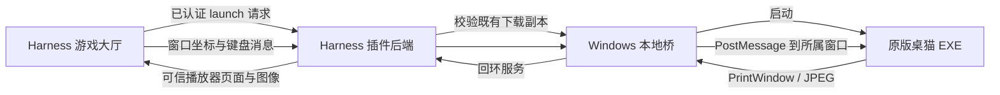

# 下载后的 EXE 在 Harness 右栏运行：本机实测

日期：2026-09-24 · 实验插件：0.0.9 · [方案目录](./README.md)

## 结论与适用范围

**现有原型不满足用户“游戏只在右侧功能区出现”的要求，产品验收不通过。**它启动了独立 EXE 窗口，再将画面和部分鼠标操作接入右栏；这些是局部技术证据，不能记为已实现目标体验。

后续已转入[23 作者适配离屏路线](./23-offscreen-sidebar-runtime.zh-CN.md)：新原型的自有样本短时离屏测试已通过，但尚未接入右栏，不改变本文对原始 EXE 的失败结论。

用户要求从启动到退出都没有独立可见的游戏窗口，不允许先弹出再隐藏，不需要玩家最小化、还原或切换窗口。后台进程与离屏绘图目标可以作为实现细节，游戏呈现和交互只能在功能区内。现有探针仅保留为研究代码，桌面实测暂停；涉及启动可见程序、切换窗口和模拟键鼠的后续测试需另行明确征得用户同意。

这次真正启动了 Windows EXE 及其 GalaxyBee 子进程，捕获该进程的窗口，再把鼠标/键盘消息回传。没有使用此前提取的桌猫 HTML，也没有将 EXE 窗口改挂到 Harness 私有窗口上。

| 项目 | 实测结果 |
| --- | --- |
| 全程只在右栏呈现，无独立可见游戏窗口 | **未通过；现有实现会启动独立 Windows 窗口，不满足产品要求** |
| 运行下载后的原始 EXE 字节 | 通过；启动前在 Node 和原生组件分别校验 SHA-256 |
| 专用 Harness 右侧“游戏大厅”显示原生画面 | 通过；最终播放器使用宿主已认证接口 |
| 背景窗口画面与鼠标回传 | 部分通过；独立播放器完成喂食，饱食值 85→100，画面同时标记游戏在后台；Harness 右栏打开喂食菜单 |
| 键盘字符输入 | 初测未通过；字符没有进入原生改名框，不能用“消息已发出”代替实际输入成功 |
| 最小化、遮挡和持续运行 | 未通过稳定性门槛；最小化会停帧，恢复及持续运行过程中也观察到停帧 |
| 声音送入侧栏 | 未实现；当前没有音频捕获/编码/播放链路 |
| 720p / 30 FPS、p95 操作延迟 <100 ms | 未通过；当前是 JPEG 轮询探针，并未完成 WebRTC 或端到端延迟测试 |
| 30 分钟稳定性、20 次焦点切换 | 未完成；不能据此宣布可正式发布 |
| 任意 EXE / Unity / Godot / 3D / Raw Input | 未验证；仅允许指定 SHA-256 的桌猫样本 |
| VS Code / Cursor 同等原生运行 | 未实测；不从 Harness 结果推断其他宿主通过 |

产品状态应保持 **实验功能、兼容性未认证**，不要给普通 EXE 添加“在功能区运行”入口。本地进程可以在侧栏呈现，并不意味着所有游戏已经获得稳定的后台输入和渲染能力。

## 样本与环境

- 用户提供的 `E:\GAME\桌猫.exe`，61,151,835 bytes，Electron 包装的桌猫 1.0.0。
- 实际运行的是此前通过平台已认证下载接口保存的 `.runtime/m0/download-check-1790224988286.exe`；本轮重新核对其字节哈希。
- SHA-256：`4967f9e183a311193f8b2f0fd33f5a40b8b2a1ff7a575c2d412b2e4640c69912`。
- 本机 Windows x64、Node 22；原生桥使用机器已有的 .NET Framework C# 编译器，无需购买服务器或安装云 GPU。
- DeepSeek Harness `0.1.7-alpha.1`，独立验收 profile `gamehub-transfer-check`，3082 端口。用户原有 3081 服务未停止。
- 自动化通过 Codex 内置浏览器访问 Harness Web UI，操作的是 **Harness 插件注册的右侧标签页**。这不证明 Codex 自身拥有第三方原生侧栏接口。
- 每次 Harness 原生会话使用独立 `--user-data-dir`，目录位于 `.runtime/native-probe/<会话 ID>/profile`；未修改桌猫安装包或原有桌面游戏存档。

## 这次实现的链路

当前是 **Windows 消息与窗口捕获的工程探针**，不是正式低延迟串流方案。探针每约 120 ms 请求一张 JPEG；没有 WebRTC、H.264/AV1、音频轨、手柄或鼠标相对位移。

Harness 后端、组件和游戏必须运行在玩家这台电脑。如果以后把 Harness 后端放到远程服务器，本实现会在那里启动进程，不能自动变成“玩家电脑本地运行”。正式多宿主产品还需要安装、配对和更新本地运行组件。

### 接口与信任边界

- 未设置 `GAMEHUB_NATIVE_PROBE_PROJECT` 时，原生实验默认关闭。
- 只有 EXE 类型且 SHA-256 完全匹配的卡片出现“桌猫 EXE 原生实验”。它使用固定的已验证下载副本，不执行任意上传路径。
- Harness 继承宿主认证、Host/Origin 检查；控制请求另外要求客户端标记，输入体最多 2 KiB。
- 内部回环服务绑定 `127.0.0.2` 随机端口，使用随机会话令牌、Host/Origin 检查及输入类型白名单。最终 Harness 客户端不接收该内部令牌。
- 原生播放器是插件自己的可信 HTML/JS，通过同源已认证接口取 JPEG；不会载入 EXE 内的网页代码。它允许同源访问，与上传 ZIP 的不透明源沙箱分开。
- Windows 组件仅控制它启动的进程树，检查进程创建时间，采用 Job Object 辅助退出清理；没有桌面全屏采集、全局键盘注入、任意 shell、宿主窗口改挂或进程注入接口。
- Job Object 用于进程生命周期管理，**不是陌生 EXE 的安全沙箱**。本原型不具备面向未知作者程序的隔离执行能力。
- 侧栏隐藏/退出会请求停止；失去播放器请求约 20 秒后回收。初次未连接给 120 秒，单次原生桥最多运行 30 分钟。这些是回收上限，不是稳定性验收结果。

## 已取得的证据

初轮在受限命令环境中运行启动器，退出码为 1，没有游戏窗口。切换到正常 Windows 桌面会话后，出现“猫咪养成 · 客厅”及实际 GalaxyBee 进程。因此 EXE 验收需要普通桌面会话，不能用受限任务环境的失败直接判断游戏不兼容。

独立播放器的一次记录有 4,170 帧，首尾跨度 580.126 秒；其中 3,955 帧标记游戏不在系统前台。捕获和 JPEG 生成耗时 p50 为 18 ms、p95 为 24 ms。**这些数字不是鼠标操作到屏幕反馈的端到端延迟**，也不证明期间每一帧都连续更新。浏览器接收约 8 FPS，Harness 试验中约 5–7 FPS，均未达到 30 FPS 目标。

鼠标测试明确看到了原生菜单打开、选择食物后状态值改变。键盘测试使用改名框，观察输入框实际内容；初版字符消息没有产生输入。最小化和持续测试出现过停帧，因此加入“画面停止更新”的提示，避免把反复传输同一张旧图显示成正常刷新。

最初跨回环地址的 iframe 首次载入出现空白/超时；改用 Harness `connection.fetch` 提供可信播放器和帧转发后，右栏正常加载。此修正不改变上传 ZIP 的独立资源域策略。

原始运行记录保存在 `.runtime/native-probe/report.json` 及各原生会话目录下的 `report.json`，包含启动/退出、帧编号、捕获耗时和前台状态，不保存其他应用画面或键盘文本。

## 历史探针复现（会出现独立窗口，非目标体验）

本节仅记录研究原型的复现方法，不能作为“只在右栏游玩”的使用教程。当前暂停桌面实测，不应据此自动启动程序或操作用户桌面。

1. 保留本项目 `.runtime/m0` 的上传记录和上述已验证下载副本。
2. 在旧 Harness 启动窗口按 Ctrl+C 结束旧实例。不要同时启动两个使用相同 profile 和存储目录的实例。
3. 双击项目根目录 [start-gamehub-native-test.bat](../start-gamehub-native-test.bat)。它编译本地桥、打包插件、启用实验配置，再使用原有 Harness 启动流程。无需模型 Key。
4. 打开启动窗口打印的本机地址，在会话右栏进入“游戏大厅”，确认版本为 **0.0.9**。
5. 在对应桌猫卡片点“桌猫 EXE 原生实验”。启动时可能出现独立 Windows 游戏窗口；画面和操作入口位于右栏。
6. 画面需要游戏窗口保持还原状态；当前可测试喂食等鼠标操作。若停帧，尝试“还原游戏窗口”，仍未恢复则结束并重新开始。
7. 点击“结束游戏”或关闭功能区。不要把桌猫启动器短暂出现、HTTP 200 或输入已排队作为成功游玩的证据。

这是**本项目现有样本的实验启动器**，还不是可交给所有玩家安装的通用下载管理器。将来需要把固定下载副本替换为作品版本、下载完成记录、哈希验证及兼容性记录驱动的本地缓存。

普通 [start-gamehub-m0.bat](../start-gamehub-m0.bat) 仍用于网页上传/试玩/下载，不主动开启原生实验。

## 代码与验证

| 文件 | 职责 |
| --- | --- |
| [WindowBridge.cs](../poc/native/WindowBridge.cs) | 固定样本校验、所属进程窗口捕获、定向输入、进程树回收 |
| [native-probe.mjs](../poc/native/native-probe.mjs) | 回环会话、帧缓存、请求限制、超时清理和实测记录 |
| [player.html](../poc/native/player.html) | 可信画面接收端、等比例坐标、焦点释放、停帧提示 |
| [native-probe-adapter.mjs](../extensions/harness/src/native-probe-adapter.mjs) | Harness 认证接口转发、卡片允许范围、会话更换与撤销 |
| [build-native-probe.ps1](../scripts/build-native-probe.ps1) | 使用本机 .NET Framework 编译 x64 桥接程序 |
| [native-probe.test.cjs](../tests/native-probe.test.cjs) | 默认关闭、篡改拒绝、会话认证、重启清理先后顺序 |

24 项自动测试已通过，包括原有 20 项上传/下载/网页运行测试与新增 4 项原生边界测试。自动测试不会启动桌猫；真实窗口和交互另外通过本次桌面及 Harness 界面实测。

## 下一步技术决策

下一关首先是 **不创建独立可见桌面游戏窗口仍能渲染并接受输入**，随后才验收声音、性能和多引擎兼容。现有可见窗口捕获方案不能直接作为目标产品路线；平台商城和支付不影响这一限制。

- 通用 Windows 路线：用可控测试程序加入真实输入编号与帧号，再评估 Windows Graphics Capture、独立进程音频和 WebRTC。WGC 本身不会解决后台输入。
- 作者适配路线：要求游戏支持后台运行和明确的输入接口；对于 Electron 可研究官方 offscreen rendering / `webContents.sendInputEvent`，但必须写清需要作者配合，不能给任意下载 EXE 强行套用。
- 若只能抢回前台才能正常操作，仍按 [09 验证计划](./09-exe-sidebar-validation.zh-CN.md) 判定通用本地路线不通过，再决定是否限定适配引擎或另测独立远程会话。

参考：[Microsoft PrintWindow](https://learn.microsoft.com/en-us/windows/win32/api/winuser/nf-winuser-printwindow) 说明它是同步调用且由目标程序处理；[Windows 键盘输入模型](https://learn.microsoft.com/en-us/windows/win32/inputdev/about-keyboard-input) 说明焦点与键盘消息的关系。[Electron BrowserWindow 选项](https://www.electronjs.org/docs/latest/api/structures/browser-window-options) 提供后台节流和离屏渲染选项，但这些文档不是本样本兼容性的实测证明。
