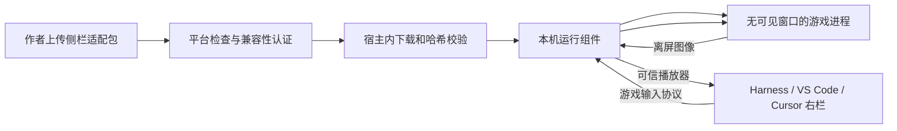

# 仅在右栏呈现：离屏运行路线与首轮实测

日期：2026-09-24 · 状态：自有样本短时离屏验证通过，尚未接入右栏 · [目录](./README.md)

后续进展：**Harness 0.0.10 已完成自有样本的右栏接入与正常交互实测**，见 [24 接入与验收记录](./24-harness-offscreen-integration.zh-CN.md)。本文保留首轮独立短测的历史范围与原始证据；下文“尚未接入”指该次短测阶段。

## 本轮结论

下一条优先验证路线是 **作者提供侧栏适配构建，游戏进程在本机离屏绘制，右栏接收画面并发送游戏输入**。继续使用 Harness 官方插件，不改造或维护 Harness 自身客户端；VS Code/Cursor 后续通过各自扩展连接同一运行组件，仍需逐宿主验收。

这条路线有 Electron 官方离屏 API 作为依据，但当前未证明“从启动到退出没有独立窗口、能够持续游玩”。原始 `E:\GAME\桌猫.exe` 没有因此变成可用：它创建可见窗口的代码仍在原包中。平台不能假设给任意 EXE 添加一个启动参数，就能让它支持离屏输出和输入。

最初完成代码与无图形自动测试；之后用户明确同意约 10 秒的自有离屏样本测试。已运行独立 Electron 样本，没有启动原始桌猫，没有切换窗口或模拟桌面键鼠。新的原型没有接入正在运行的 Harness，也没有替换已安装插件。

## 2026-09-24 首轮实机结果

**技术通路通过，产品验收仍未完成。**Windows `10.0.26200.0`、Electron `44.4.5`、640×360 自有 Canvas 样本。运行时来自 [官方固定版本](https://github.com/electron/electron/releases/tag/v44.4.5)，压缩包 SHA-256 与发布 API 摘要及官方校验清单一致；记录见 [runtime-provenance.json](./evidence/offscreen-20260924/runtime-provenance.json)。

| 检查 | 实际结果 |
| --- | --- |
| 连续离屏输出 | 321 帧，首尾跨度 10.618 秒，约 30 FPS；最大相邻收帧间隔 50 ms |
| 点击 | 样本得分从 0 变为 1，输出图像可见变化 |
| 文字 | 样本名称从 GameHub 变为“侧栏测试 🐱”，图像与回报一致 |
| 方向键与释放 | 光点右移，释放后位置保持；这是游戏内部协议，不是系统按键注入 |
| 隐藏与焦点状态 | 321 次绘制前 API 检查均为 `isVisible() === false`、`isFocused() === false`；未报告 show/focus 违规事件 |
| 正常退出 | 控制器发送 stop，退出码 0，未强制终止；测试后该运行时可执行文件的进程数为 0 |
| 原始 EXE、右栏与音频 | 本轮未覆盖；不能将结果当作桌猫原包或 Harness 侧栏验收通过 |

50 ms 是相邻帧接收间隔上界，不是输入到屏幕的端到端延迟。约 30 FPS 只适用于这次 640×360、10 秒样本，不能推导 720p、3D 或长期性能。

证据：[原始报告](./evidence/offscreen-20260924/report.json)、[生命周期日志](./evidence/offscreen-20260924/probe-lifecycle.jsonl)、[进程检查](./evidence/offscreen-20260924/process-observation.json)、[初始帧](./evidence/offscreen-20260924/first.jpg)、[结束帧](./evidence/offscreen-20260924/last.jpg)。图像来自样本离屏输出，没有采集用户桌面或其他应用。

**证据限制：**没有独立 Windows 窗口事件观察器，也没有记录用户视觉观察，因此仍保留 `desktopWindowObservation: not-collected`。Electron 自身的状态和事件提供了支持证据，不能单凭它们认证“从启动到退出绝无瞬间弹窗”。进程检查按该运行时的精确 EXE 路径过滤，不等同于枚举所有可能的其他子程序。

### 启动中发现并修正的问题

前 3 次尝试在有效帧输出前结束；每次退出后该运行时进程数均为 0。第 1 次被 stdout 空行触发 JSON 解析失败；第 2、3 次提前退出，第 3 次日志明确记录 `entry-loaded → stdin-closed`，尚未进入 `app-ready`。原始记录保留在 `.runtime/offscreen-probe/run-NMdFpM`、`run-uwULBl`、`run-GYlH2U`。

Electron 的 Windows 启动源码默认可重绑控制台，官方提供 `ELECTRON_NO_ATTACH_CONSOLE`。设置该变量后，本机 stdin 仍立即关闭，所以最终不再使用 GUI 进程的标准输入输出承载协议，改为随机名称、256 位认证令牌的 Windows 命名管道。令牌只在父子进程环境中传递，不写入报告，也不开放 TCP 端口。[固定版本源码](https://github.com/electron/electron/blob/v44.4.5/shell/app/electron_main_win.cc)、[官方环境变量](https://www.electronjs.org/docs/latest/api/environment-variables#electron_no_attach_console-windows)

最终成功会话为 `run-2HEgbM`。新增空行容错、真实命名管道认证和断开清理的回归测试；完整 `npm test` **38/38 通过**。没有为排查此问题启用可见窗口、系统键鼠或桌面录屏。

## 验收要求

1. 从进程启动到退出，全程没有独立可见游戏窗口；“先弹出再隐藏”失败。
2. 不抢宿主焦点，不要求玩家最小化、恢复、切换游戏窗口。
3. 画面、游戏输入和声音最终都在右栏；正常使用仅需在右栏操作。
4. 右栏隐藏、失去输入焦点时释放按键；结束会话后回收运行资源。
5. 后台进程和离屏绘图对象允许存在；“没有独立窗口”不等于“没有本地进程”。

[22 中的可见窗口捕获实验](./22-native-exe-local-test.zh-CN.md) 已不符合第 1 项，不能用其局部成功证据通过产品验收。

## 官方资料与设计选择

Electron 提供离屏渲染，可通过 `paint` 事件取得图像；默认图像路径存在 GPU 到 CPU 的复制开销，另有共享 GPU 纹理模式。官方描述涵盖 WebGL，但本轮仅测试 Canvas 2D 样本，没有验证实际 GPU 加速状态或 WebGL。[Electron Offscreen Rendering](https://www.electronjs.org/docs/latest/tutorial/offscreen-rendering)

`show: false` 控制窗口创建时不显示，`focusable: false` 控制窗口可聚焦性；Windows 下后者还影响任务栏显示。我们同时显式设置 `skipTaskbar: true`。这些配置表达运行意图，不能替代 Windows 实机观察。[Electron BaseWindow](https://www.electronjs.org/docs/latest/api/base-window)

官方 `sendInputEvent()` 文档要求承载内容的 BrowserWindow 获得焦点。因此，本轮不将常规事件注入当作无需焦点的可靠能力，也不通过 `win.focus()` 补救。某些版本或离屏路径是否存在例外，尚未验证。[Electron webContents 源文档](https://github.com/electron/electron/blob/main/docs/api/web-contents.md#contentssendinputeventinputevent)

当前选择由作者接入明确的游戏输入接口：侧栏坐标、方向键状态、编辑完成的文字，经受限 IPC 进入游戏逻辑。该接口不冒充 Windows 键鼠，也不是可自动适配所有 DOM、Raw Input、手柄或原生引擎的通用转换层。文字测试是修改样本中的名称，不代表输入法、原生文本框或富文本编辑通过。

窗口采用 `offscreen: true`、`backgroundThrottling: false`、`focusOnNavigation: false`，保留默认 GPU 路径；禁用弹窗、WebView 和 DevTools。页面权限与新窗口请求被拒绝。`contextIsolation`、`sandbox` 与 preload 的窄接口用于限定自有样本的能力。[BrowserWindow 选项](https://www.electronjs.org/docs/latest/api/structures/browser-window-options)、[Context Isolation](https://www.electronjs.org/docs/latest/tutorial/context-isolation)、[IPC](https://www.electronjs.org/docs/latest/tutorial/ipc)

以上是本项目的设计选择，不是 Electron 对任意游戏“无窗口运行”的保证。

## 作品类型与支持边界

| 作者提交内容 | 当前能力 | 后续右栏路线 |
| --- | --- | --- |
| 符合现有约束的网页 ZIP | 本机上传、下载和右栏试玩已实测 | 继续完善共享网页播放器 |
| 原始桌猫 EXE | 可以分发；旧窗口捕获路线不满足要求 | 作者提供网页构建或改造后的侧栏构建，再单独验收 |
| 适配后的 Electron Windows 构建 | 尚未生成、下载或运行过该构建 | 本文优先验证对象 |
| 未适配的任意 EXE / 安装包 | 下载分发；无右栏兼容承诺 | 作者适配或另立隔离运行/远程串流实验 |
| Unity / Godot 等原生构建 | 未验证 | 分引擎验证渲染、输入、音频与生命周期 |

面向作者应区分“Windows 下载包”和“已认证的侧栏构建”。认证须绑定作品版本、构建哈希、运行组件版本和宿主测试结果；作者自己填写一个能力字段不能自动获得运行资格。

## 目标链路与本轮覆盖



本轮代码只覆盖 **自有游戏的离屏入口、输入协议、帧输出和独立测试控制器**。它通过认证 Windows 命名管道传递消息，不监听 TCP 网络端口。上传下载后的适配包解析、真正的 Windows EXE 打包、已下载包启动以及右栏播放器接线，均尚未实现。

调试时使用独立 Electron 运行时加载自有样本；这与“启动下载后的原始桌猫 EXE”不同。最终需要作者重新构建并提交侧栏版本，平台对新字节重新检查和验收。用户游戏提取物没有复制进这套样本，也不会随插件分发。

主进程具有本机程序能力，因此这些界面和协议限制不构成对陌生 EXE 的操作系统安全沙箱。原型只运行项目自有样本；开放作者 Windows 投稿执行前仍需完成 19 中的检查与运行边界。

## 本轮代码

| 文件 | 职责 |
| --- | --- |
| [main.cjs](../poc/offscreen/main.cjs) | 需显式实验开关、独立绝对路径 profile 与认证管道；创建 Electron 会话，控制器断开/超时退出 |
| [session.cjs](../poc/offscreen/session.cjs) | 隐藏窗口配置、离屏帧、固定 IPC、发送方校验、会话清理；发现可见/聚焦事件即失败退出 |
| [protocol.cjs](../poc/offscreen/protocol.cjs) | 白名单游戏命令、序号、坐标与文本长度验证 |
| [transport.cjs](../poc/offscreen/transport.cjs) | 2 KiB 输入行上限、UTF-8 分片、背压时仅保留最新待发图像与有限控制消息 |
| [control-pipe.cjs](../poc/offscreen/control-pipe.cjs) | 随机命名管道、认证握手、单连接和断开清理，替代 Windows GUI 标准输入输出 |
| [preload.cjs](../poc/offscreen/preload.cjs) | 向自有游戏提供输入订阅与状态回报，不暴露整个 Electron IPC 对象 |
| [fixture.html](../poc/offscreen/fixture.html)、[fixture.js](../poc/offscreen/fixture.js)、[model.js](../poc/offscreen/model.js) | 自有 Canvas 样本：点击计分、方向键移动、文字命名和动态帧号 |
| [verify-offscreen.mjs](../scripts/verify-offscreen.mjs) | 默认只打印说明；显式运行后检查样本交互、短时帧更新、退出，保存图像及报告 |
| [prepare-offscreen-runtime.ps1](../scripts/prepare-offscreen-runtime.ps1) | 下载并校验固定官方运行时到工作区，不启动程序；记录来源与摘要 |
| [offscreen.test.cjs](../tests/offscreen.test.cjs) | 不加载 Electron 的协议、样本逻辑、模拟会话与传输测试 |

会话输入为 `click`、`key`、`text`、`release`、`reset`；方向键仅支持四个箭头。`ping` 维持控制器存活，`stop` 结束会话。命令不接受文件路径、URL、shell、窗口句柄或系统快捷键。序号必须递增；最多 64 个未回执输入。

`applied` 表示样本逻辑已处理并发起绘制，不等于图像已经到达用户屏幕。`paint` 事件产生新帧序号；传输背压时丢弃待发旧帧，而非累积大量图片。JPEG 用于最小验证，未做视频编码、音轨、低延迟指标或长期性能优化。

主进程将音频静音；本轮没有声音串流。控制器正常约检查 10 秒的连续画面；输入失联 15 秒、运行总时长 5 分钟为自动退出上限。窗口 `show/focus` 事件触发退出只能发现违规，无法撤回已经出现的一瞬间窗口。

## 已执行的检查

2026-09-24 执行 `npm test`：**38/38 通过**，其中离屏相关 14 项：

- 只接收目标主 frame 的回报；输入实际改变自有样本模型状态；拒绝重放和未知回执。
- 拒绝超范围坐标、额外字段、系统快捷键和任意执行命令。
- 松开/释放按键后停止移动；Unicode 名称可以进入游戏模型。
- 新窗口、导航和权限被拒绝；模拟出现窗口/焦点时销毁会话。
- 加载失败、渲染进程退出和会话停止时清理 IPC。
- 帧和输入积压有界；UTF-8 跨数据块仍正确；显式开关缺失时在加载 Electron 前退出。
- Windows 命名管道拒绝错误令牌，接受分片握手与消息，控制器和对端断开后清理；运行时空行不触发解析失败。

不带参数的 `node scripts/verify-offscreen.mjs` 仍仅打印准备状态，不启动 Electron。38 项自动测试本身不包含真实图形程序；首轮实际渲染与交互证据见本文前部。独立无弹窗观察、侧栏连接、EXE 下载运行、音频或 GPU 兼容性仍未完成。

## 已获同意的测试范围与后续步骤

依据用户此前“未征求意见就接管电脑”的反馈，本轮先征求并获得了短时自有样本测试同意，再实际运行。该同意不扩展为操作其他程序、切换窗口、模拟系统键鼠或启动桌猫原包。新增这些操作时仍须先说明影响并获得同意。

本轮已完成的范围：在工作区准备固定官方 Electron Windows 运行时，使用自有样本和独立 profile，运行检查约 10 秒；不启动原始桌猫、不切换窗口、不注入系统键鼠、不采集桌面。检查中的输入是发给自有样本的程序消息。后续运行仍保持发现窗口或焦点违规就终止的行为；该自动保护不是独立窗口观察证据。用户也可自行运行测试控制器。

复现命令如下。路径必须为经过版本和来源核验的独立运行时，不得指向桌猫 EXE：

```powershell
node scripts/verify-offscreen.mjs --run --electron "<已核验的 electron.exe 绝对路径>"
```

控制器不自动下载依赖。报告写入 `.runtime/offscreen-probe/run-*/report.json`，只保存本测试程序的首尾图像、交互检查、帧统计、退出码和有限 stderr；不采集其他应用。若优雅退出失败，仅尝试终止自己直接启动的进程，并把后代进程清理标为待核验，不能记为完整清理成功。

本次控制器给出 `probe-checks-passed`，报告仍保持 `productAcceptance: not-tested`、`originalExe: false`、`sidebarIntegration: not-tested`、`desktopWindowObservation: not-collected`。它没有使用系统窗口观察器，因此不能单凭该报告宣称从未弹窗或抢焦点。

后续依次关闭以下门槛：

| 门槛 | 通过证据 |
| --- | --- |
| 离屏技术通路 | **本次自有 2D 样本短时通过**；固定 Electron/Windows 版本，实际图像更新、点击/方向键/文字反馈、正常退出 |
| 全程没有可见游戏窗口 | 用户观察或另行同意的自有进程窗口事件记录；任意瞬间弹出也记失败 |
| Harness 右栏闭环 | 帧通过已认证宿主接口到右栏，输入仅来自聚焦播放器，隐藏/断开/结束释放资源 |
| 下载后的真实适配 EXE | 新适配构建上传 → 下载 → 字节核验 → 启动 → 右栏游玩；不可用源码启动替代 |
| 音频与持续运行 | 完成音轨，再测 30 分钟、焦点切换、崩溃清理和端到端延迟 |
| WebGL 与其他宿主 | 分别在固定引擎、VS Code、Cursor 版本上取得证据 |

如果适配后的离屏版本仍必须显示窗口或获得系统焦点才能工作，则该路线对该构建判失败，不回退成自动弹出桌面游戏窗口。作品可以继续保留下载能力，不能展示已认证的“右栏游玩”入口。
