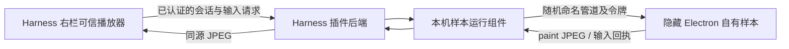

# Harness 右栏离屏样本接入

日期：2026-09-24 · 插件：0.0.10 · 状态：自有样本的 Harness 右栏交互与正常清理实测通过 · [目录](./README.md)

后续进展：0.0.11 增加上传适配 ZIP、下载运行缓存与启动交接，61 项自动测试通过，新包 GUI 待验收，见 [25](./25-offscreen-package-contract.zh-CN.md)。本文保留 0.0.10 固定样本的实测范围。

## 当前交付

已将 [23 的离屏技术通路](./23-offscreen-sidebar-runtime.zh-CN.md) 接入 Harness 插件代码。启用实验配置后，“游戏大厅”增加“开始离屏运行样本”，在同一个右栏内显示实时图像、点击计分、方向键移动、名称输入与结束按钮。

本轮是自有 Canvas 样本的宿主接入，不启动原始桌猫，也不会把上传 EXE 自动改成侧栏构建。作者适配包的上传、下载、启动仍是后续门槛。音频、WebGL、其他引擎、VS Code/Cursor 和独立全程无弹窗观察未因此通过。

## 运行方式

本机 Windows，保留整个项目和已核验的 Electron `44.4.5` 运行时。使用根目录 [start-gamehub-offscreen-test.bat](../start-gamehub-offscreen-test.bat)。它构建并安装当前测试插件，启动 Harness 服务，**不自动打开浏览器，也不自动启动游戏**。需要启动程序或进行界面自动操作时，遵守本次会话已经约定的用户同意范围。

启动后访问控制台打印的登录链接，进入一个会话，在右栏打开“游戏大厅”，确认版本 `0.0.10`，再点击“开始离屏运行样本”。点击游戏画面后用方向键移动；名称框用于提交完整文字；“重置本局”保持进程，“重新开始”结束旧进程并创建新会话。

| 配置 | 值 |
| --- | --- |
| Harness profile | `gamehub-offscreen-check` |
| HTTP 端口 | `3083` |
| 独立文件存储 | `.runtime/m0/gamehub-offscreen-check-storage` |
| 独立游戏 profile 与日志 | `.runtime/offscreen-sidebar/<会话 UUID>/profile` |
| 启用参数 | `GAMEHUB_OFFSCREEN_PROJECT` 指向本项目绝对路径 |
| 普通启动 | `start-gamehub-m0.bat` 仍默认 3081 / gamehub-m0；不自动开启离屏实验 |

3083 配置不共享 3081 的文件存储，避免两个服务同时写入。BAT 显式清除历史可见窗口实验配置。`.tgz` 只包含 Harness 前后端适配器和可信播放器，不包含 Electron、自有样本运行组件、用户游戏或密钥；因此它目前是依赖本地项目的验证包，尚不是交给任意玩家安装的完整产品。

缺少运行时可先执行 [prepare-offscreen-runtime.ps1](../scripts/prepare-offscreen-runtime.ps1)；该脚本只下载、校验和解压。运行前还会对 `electron.exe` 检查固定 SHA-256。仅验证该 EXE 摘要不等于验证整套运行时所有文件或陌生游戏的安全性。

## 链路

没有桌面截屏、窗口改挂、系统键鼠注入或窗口聚焦调用。传入游戏的内容限于点击坐标、四个方向键状态、名称文本、释放与重置。播放器里的 DOM 焦点仅用于让宿主内的画布接收按键，不会调用游戏进程的窗口聚焦 API。

### 接口与隔离

Harness `connection.fetch` 负责操作者认证、Host/Origin 和 Fetch Metadata；新增固定路径：

| 方法 | 路径后缀 `/api/gamehub/` | 用途 |
| --- | --- | --- |
| GET | `offscreen-status` | 是否启用，不启动进程 |
| POST | `offscreen-launch` | 启动固定自有样本，返回不含内部管道凭据的 `launchId` |
| GET | `offscreen-player?launchId=…` | 插件自带播放器 HTML |
| GET | `offscreen-frame?launchId=…&after=…` | 最新 JPEG；无新帧时 204，不将旧图重复统计为新帧 |
| POST | `offscreen-input?launchId=…` | 验证并转发游戏操作，等待实际样本回执 |
| POST | `offscreen-stop?launchId=…` | 撤销会话并等待进程结束 |
| POST | `stop?launchId=…` | 既有大厅统一结束入口也会释放离屏会话 |

新增控制 POST 要求 `X-GameHub-Input: 1`；统一 stop 沿用 `X-GameHub-Client: 1`。输入体上限 2 KiB，限制字段、坐标、文本长度和键名。游戏输入序号由后端生成，页面不能提交任意序号或执行命令。每个运行组件最多 16 个排队输入。

原生图像播放器是插件自己的可信代码，所以 iframe 允许 `allow-scripts allow-same-origin`；HTTP CSP 使用 nonce、同源连接、同源 frame-ancestors，并禁止外部脚本和导航。上传 ZIP 的游戏继续采用不透明源沙箱，不继承该可信播放器权限。

### 生命周期

- 重复启动先撤销旧会话，等待旧进程退出再创建新进程；并发启动返回冲突。
- 失效 `launchId` 不能操作或停止新会话，返回 410。
- 画布失焦、窗口失焦或指针取消时释放方向键；页面隐藏或离开时请求结束。
- Harness 右栏隐藏、切换会话、tab 销毁、插件卸载通过原有大厅生命周期结束会话。
- 即使关闭请求丢失，超过约 20 秒没有播放器活动也会回收；不依赖浏览器一定发送卸载请求。
- 控制管道断开触发游戏退出；运行组件对输入回执超时、进程异常进行停止处理。
- 自有样本保留 5 分钟单次上限。声音尚未接入，游戏进程静音。

普通重启与退出会等待进程清理。如果优雅退出失败，只能尝试终止自己启动的直接进程，并报告清理异常；不得将其记成所有后代进程都已正常回收。完整异常树清理仍须实测。

## 自动检查

`npm test` **49/49 通过**。本轮新增 11 项：默认关闭/缺少运行组件、启动保护、固定样本、CSP 与凭据边界、JPEG 与 204、输入白名单和大小、旧会话撤销、重启等待、启动取消、空闲回收、输入失败清理、统一 stop 路由、被改动运行时拒绝，以及播放器焦点和释放逻辑。部分用一个测试覆盖多个相关断言。

运行组件使用替身完成宿主测试；播放器脚本在受控 DOM 替身中验证事件行为。**这些检查没有启动新的 Electron 或真实浏览器 UI。**[23 的约 10 秒测试](./23-offscreen-sidebar-runtime.zh-CN.md) 证明独立样本的实际离屏输出与交互，但不能替代新增运行组件和 Harness 右栏验收。

已构建并安装 `artifacts/gamehub-harness-plugin-0.0.10.tgz`。构建同时检查宿主客户端和播放器脚本语法。UI 实测时安装包 SHA-256：`9e04c5b77d7ec16237c43537ec2c38ceb25e172c472fe22a618919b9fcf396d4`。该包中的 README 保留打包时的“待界面验收”描述；完成后的验收状态以本文及以下证据为准，本轮不为文档变化替换已验收包。

## 2026-09-24 Harness 界面实测

用户明确同意“只测试该页面”后，通过 Codex 内置浏览器访问本机 `3083` 的 Harness Web 界面。仅操作该页面的游戏大厅；没有启动原版桌猫、操作其他应用或使用系统级键鼠。**游戏 tab 由 Harness 插件注册在 Harness 的右侧功能区**；这不等于验证了 Codex 原生右侧插件接口，也不代替 Harness 其他发行形态验收。

| 项目 | 实际观察 |
| --- | --- |
| 安装与入口 | 独立 profile 显示 `GAMEHUB · 0.0.10`，点击“开始离屏运行样本”后进入播放器 |
| 真实画面 | 640×360 离屏图像持续更新，画面中的动画帧数增长；播放器所示近期一秒帧数为 22—23，属于现场读数，不是完整性能统计 |
| 点击与中文输入 | 点击黄色圆点后得分由 0 变 1；名称由 GameHub 变为“侧栏验收”，都出现在游戏输出图像中 |
| 方向键 | 对游戏画布发送 3 次 ArrowRight 后蓝色光点可见右移；点击“释放操作”成功。本轮没有长按、组合键或量化失焦后漂移测试 |
| 重新开始 | 旧运行会话记录 stop，新会话创建；得分恢复 0、名称恢复 GameHub、动画帧数重新计数 |
| 结束样本 | 画面清空、控件禁用、显示“样本已结束”；按固定运行时 EXE 路径检查进程数为 0 |
| 关闭游戏标签 | 再启动一轮且确认画面连接后，点击 Harness 游戏大厅 tab 的关闭按钮；右栏内容移除，运行时进程数为 0 |

三个会话的生命周期日志均以 `stop: requested` 结束。首轮从 app-ready 到 stop 约 235 秒，后两轮约 31 秒和 18 秒；这是正常使用路径的短测，不是 30 分钟稳定性验收。运行组件只接受 `visible:false / focused:false` 的输出帧，本轮未出现对应校验错误；没有独立 Windows 窗口观察器，**仍不能以此认证“绝无瞬间弹窗”**。

证据保存在 [harness-offscreen-20260924](./evidence/harness-offscreen-20260924/README.md)：

- [点击、中文与方向键后的画面](./evidence/harness-offscreen-20260924/01-input.png)
- [重新开始后的画面](./evidence/harness-offscreen-20260924/02-restarted.png)
- [结束后的画面](./evidence/harness-offscreen-20260924/03-stopped.png)与[进程检查](./evidence/harness-offscreen-20260924/04-processes-after-stop.json)
- [关闭 tab 后的 DOM](./evidence/harness-offscreen-20260924/05-tab-closed.txt)与[进程检查](./evidence/harness-offscreen-20260924/06-processes-after-tab-close.json)
- [三个实际会话的生命周期日志](./evidence/harness-offscreen-20260924/07-lifecycle.json)

截图仅包含获准的 Harness 页面，不包含系统桌面或其他应用。进程检查只覆盖固定 Electron 路径，不是全系统进程审计。结束后保留验收页面与独立 3083 服务，游戏已停止；再次体验需手动打开右栏并启动样本，端口占用期间不要重复启动 BAT。

## 后续门槛

下一步应将固定样本整理为**作者可提交的侧栏适配包格式与 SDK**，先用自有包完成“上传 → 下载 → 校验 → 手动启动 → 右栏游玩 → 清理”，再扩展其他作者、引擎及宿主。运行组件需要独立分发、版本协商和完整性校验；不能依赖玩家电脑有本项目源码路径。

独立 Windows 窗口观察、音频、长按与失焦、隐藏/切换会话、异常退出树清理、30 分钟稳定性、下载后的真实适配 EXE 与 VS Code/Cursor 继续保留为未完成项。旧会话隔离和异常回收有自动测试，但本轮 UI 没有逐项故障注入。普通 EXE 当前仍仅支持下载；上述成功不改变这一边界。
