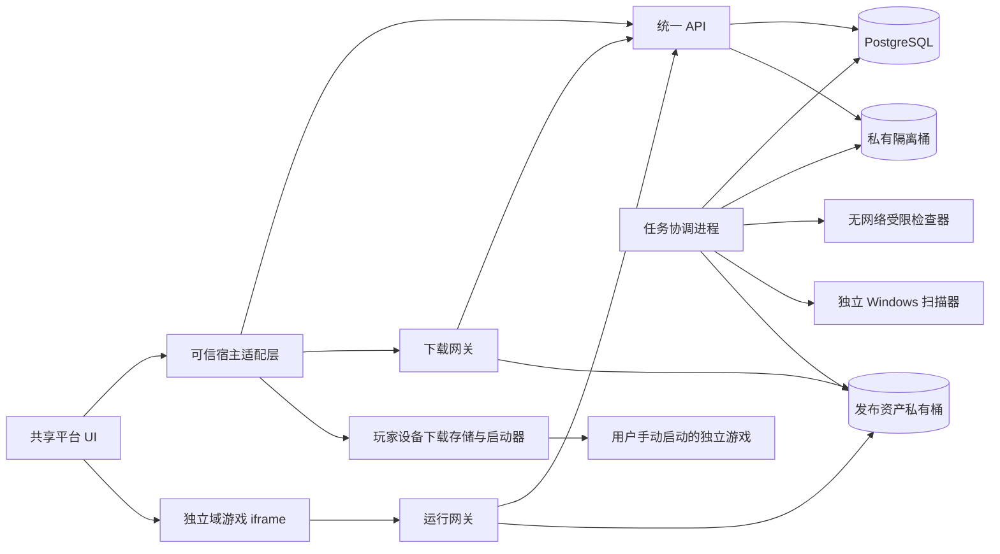
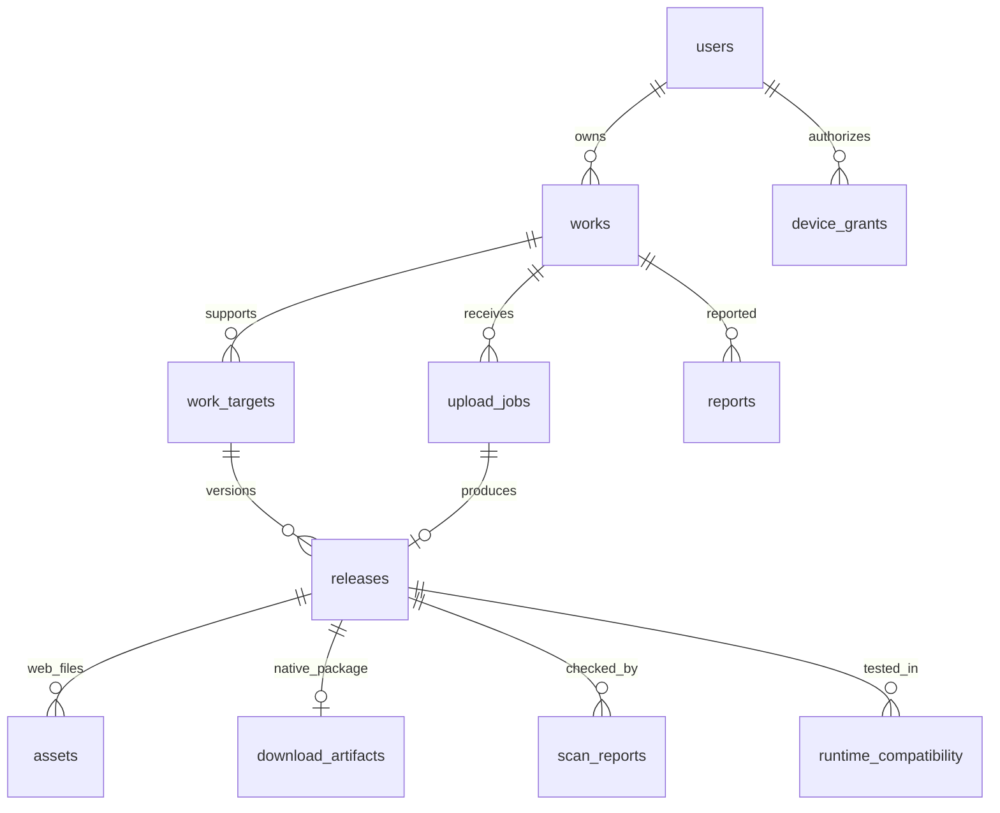

# GameHub 完整平台设计与任务交接

日期：2026-09-24 · 版本：PD-1.1 · 状态：D0 设计已核对定稿，尚未实现完整平台。

接手任务已完成 D0 核对，具体组件树、编号迁移、接口矩阵、状态机、工作包与停止条件见 [28 D0 实施蓝图](./28-platform-d0-implementation-blueprint.zh-CN.md)。本文继续作为产品与总体架构入口；28 是直接开工基线。

工作目录：`E:\CODE\Right`。接手任务：[等待新任务交接](codex://threads/01a0d3bd-4418-7f11-b692-d595261ead73)，与本任务使用同一工作目录。

本文把已经确认的产品方向、分散技术规范、当前原型和下一阶段工作合并为一个入口。本次只整理设计、更新事实记录并交接，不在当前任务实施平台代码、操作界面、运行游戏或部署服务。接手任务先校对完整设计与实施拆解，再按用户要求推进后续工作。

## 1. 用户已经确定的方向

1. 我们运营一个面向 AI 时代小游戏、网页 3D 和创意互动项目的平台。作品由用户上传，我们提供平台和托管服务。
2. 中国大陆公司面向海外市场首发。首版免费，不开发价格、支付、抽佣、订单、结算或购买权益；商业化保留为后续产品阶段。
3. 主要入口是现有编程软件里的插件：先 DeepSeek Harness，再 VS Code 桌面和 Cursor 编辑器。登录、上传、发布、下载管理和网页游玩都在插件内完成，作者网站不是必经步骤。
4. 优先宿主右侧功能区；缺少对应扩展能力时回退内置浏览器。共享服务和界面，分别实现宿主适配，不维护自建 IDE，不分叉 Harness/Codex 客户端。
5. **网页作品在功能区玩；普通 EXE 下载到本机后，可通过平台按钮在独立窗口启动。**这是用户最新接受的体验。
6. Windows 单文件 EXE、便携 ZIP、EXE 安装包均纳入上传和下载设计。安装包打开的是安装器，不等于安装完成或安装后的游戏可启动。
7. 仅经专门验证的作者适配包才可标注“侧栏游玩”。任意 EXE 自动变成侧栏游戏没有实现，也不是完整平台首版的前置条件。

**最新事实**：用户说“我启动错版本了。现在 OK 了，测试能启动”。这是用户对当前启动体验的实测反馈，应记为“用户确认启动成功”；不是本助手新增的一次 GUI 验收，也不能扩展成所有 EXE 都兼容。此前 3081 端口占用截图对应错误入口，用户已自行解决，不再作为当前阻塞问题。

### 需求与文档优先级

用户最新要求 > 本文的整合与明确修订 > [26 普通 EXE 启动](./26-desktop-exe-launch.zh-CN.md) > [18 多宿主](./18-multi-host-client-spec.zh-CN.md)、[19 Windows 包](./19-windows-package-spec.zh-CN.md) > [13](./13-technical-design.zh-CN.md)—[17](./17-deployment-acceptance.zh-CN.md)。01—06 为长期参考，20—26 为阶段性证据。

旧文档中“EXE 仅下载”“不能出现独立窗口”不再限制普通 EXE 的独立窗口入口；后者仍适用于宣称“只在侧栏玩”的能力。本文未复述的精确 HTTP、上传、隔离规则继续采用 14—19，出现冲突应在实现前同步修正文档和契约。

## 2. 完整免费首版的范围

| 角色 | 必须完成的事情 | 本阶段不做 |
| --- | --- | --- |
| 游客/玩家 | 搜索与浏览、详情、网页游玩、Windows 下载管理、合适设备上手动启动已校验单文件 EXE、举报 | 购买、领取免费权益、实时聊天、社区动态、排行榜算法 |
| 作者 | 插件内邮箱登录、创建作品、选择文件、上传、查看处理过程、自动发布或草稿、更新版本、撤下、查看失败原因 | 上传整个源码工作区、平台代构建任意源码、代运行后端服务 |
| 管理员 | 管理投稿权限、处理异常包和举报、暂停作者/作品/版本、审计与基础运行指标 | 财务、结算、复杂组织权限与推荐运营系统 |
| 平台运营者 | 海外部署、对象托管、备份恢复、配额与流量控制、插件分发与兼容记录 | 原生游戏云串流集群、每玩家云机器、代付 AI 调用 |

试运行先采用邀请作者、公开免费体验；合格包自动发布，异常包进入复核。关闭 Windows 公开投稿的门禁可用于先完成开发，但不能把没有扫描能力的版本宣布为 Windows 分发正式交付。

统一的作品类型为 `game / creative / tool`；运行目标与类型分开。一件作品可以同时有 web 和 windows-x64 版本，二者分别更新、撤下，不相互覆盖。

## 3. 前端：完整的平台客户端

### 3.1 信息架构

界面以日常玩家和作者为对象，取代当前 M0 的探针按钮页。用户已明确要求界面随 Agent/宿主实时切换浅色、深色和高对比度主题；主题切换不得刷新任务或重启游戏。视觉要有游戏平台的探索感和作品表现力，同时保持功能清晰、状态准确、文案友好，装饰不得压过上传、下载、发布和错误处理。具体 token、主题接口和视觉原则见 [28](./28-platform-d0-implementation-blueprint.zh-CN.md)。英文默认、中文可切换，文案集中到语言文件。

| 页面/路由 | 布局与关键行为 |
| --- | --- |
| 大厅 `/discover` | 顶部搜索、类型与“网页可玩/Windows 下载”筛选、作品卡片；默认按首次发布时间排序，不伪造热度或销量 |
| 详情 `/works/:id` | 封面、作者、简介、类型、版本、操作说明、包大小与系统要求；网页与 Windows 各自有准确按钮；显示处理后的兼容信息和举报入口 |
| 播放 `/play/:id` | 游戏画面占主要空间；返回、静音、重启、展开、帮助；只对实际获批能力提供全屏/指针锁定；退出释放 frame 和输入状态 |
| 我的作品 `/creator` | 草稿/发布中/已发布/需处理/已撤下；每目标当前版本与上传状态；新建、编辑、上传新版、撤下 |
| 创建/编辑 `/creator/works/:id` | 名称、简介、类型、标签、封面、操作说明；明确自动发布开关和失败时保留旧版的行为 |
| 上传 `/creator/works/:id/upload` | 选择目标和格式、选文件、版本说明、确认上传；真实字节进度与取消，之后显示校验/扫描/复核/发布阶段，不再用文件选择探针充当上传 |
| 下载 `/downloads` | 排队、下载中、暂停、校验、完成、失败；大小/版本/设备/位置、继续/重试/移除/打开位置；有能力时显示独立窗口启动 |
| 最近使用 `/library` | 当前设备的最近网页作品与已下载作品；本地记录，游客也可使用；首版不承诺跨设备同步 |
| 账号与设置 `/settings` | 邮箱验证码、设备授权、退出、主题/语言、存储和客户端诊断；不显示模型 API Key |
| 管理 `/admin` | 管理员专属路由：异常投稿、举报、作者权限、禁用与审计；与玩家界面分开，可复用网站壳 |

每个主要页面都有加载、空列表、网络失败、权限不足、已撤下、可重试错误状态。上传退出页面后，可信宿主内的传输任务可以继续，UI 重开恢复状态；未提交的作者表单只在本机保存草稿，敏感凭据不进入表单存储。

### 3.2 窄侧栏与可访问性

- 320—479 px：单列卡片、短标签导航、详情与编辑纵向展开；480—767 px：紧凑双列；768 px 以上可用目录与详情并排。这是响应式设计目标，需按宿主实际最小尺寸验收。
- 320 px 下无整页横向滚动，长文件名折行或省略并可查看完整名称。下载和上传状态不能被主按钮遮挡。
- 标准按钮/表单、键盘焦点可见、读屏标签、错误关联到字段、状态不只靠颜色。鼠标进入游戏不等于把 IDE 全局快捷键全部交给游戏。
- 游戏窗口按 manifest 的推荐宽高比适配，允许用户展开功能区；不兼容的横屏游戏明确提示尺寸要求，不挤成不可玩的缩略图。
- 文件选择/另存对话框属于宿主操作；常规作者流程不要求手写命令、复制 token 或转到外部作者网站。

### 3.3 操作文案与状态

| 内容 | 主操作 | 准确的结果表达 |
| --- | --- | --- |
| Web | 在侧栏玩 | frame 加载、SDK ready 和用户实际可玩是不同证据；无 SDK 不虚构 ready |
| 未下载单文件 EXE | 下载到本机 | 下载、校验通过后才显示启动入口 |
| 已校验单文件 EXE | 启动（独立窗口） | 先核对版本、文件和设备能力；进程创建成功不直接写“游戏已可玩” |
| 便携 ZIP | 下载 Windows 版 | 首版完整分发；受限解包和入口启动单独交付，缺少能力时提供打开保存位置 |
| 安装器 | 下载 / 打开安装程序 | 用户点击才启动安装器；不自动安装、提权、发现或信任安装后路径 |
| 作者侧栏适配包 | 侧栏运行（已验证时） | 单独实验能力；未验证包只显示相应状态，不冒充通用 EXE |

上传按 `选择 → 上传 → 校验 → 扫描（适用时）→ 发布/草稿/复核` 展示。下载按 `queued → downloading → verifying → completed`，旁路 `paused / cancelled / failed`。不得把 100% 收到字节当成发布或校验完成。

### 3.4 前端代码边界

`platform-client` 是共享 React 18 界面；领域 API 客户端负责请求取消、鉴权状态、错误映射和版本缓存；HostAdapter 负责文件、凭据、传输和本地运行；PlayerCore 单独负责 iframe 生命周期与游戏消息。状态以服务端/可信宿主为准，UI 只管理路由、筛选和未提交表单。

Harness 使用宿主 React，不引入第二份实例；VS Code/Cursor 单独构建 Webview UI。生产 UI 不依赖 M0 的私有测试路径，也不包含扫描器、数据库或模型密钥。

## 4. 系统架构与技术栈

沿用已有工程选择：TypeScript、pnpm workspace、Node 22 兼容基线、Fastify 5 模块化单体、PostgreSQL 16、SQL migration + `pg`、PostgreSQL 任务表、R2 私有对象存储、Cloudflare Worker 运行/下载网关、Caddy。具体补丁、镜像 digest、插件依赖在实施锁定时重新核对并记录，不把文档版本当永久支持承诺。

首版不引入 Redis、Kafka、Kubernetes 或微服务拆分。API 和任务执行分进程，便于限制资源和独立重启；不是把不可信程序放在业务 API 进程中执行。



**三个部署位置必须分清**：云端管理作品与文件；宿主插件管理用户自己的界面、凭据和本机传输；游戏在玩家设备运行。不能把现有 Harness 本地启动 API 原样放到云服务器，然后声称程序在玩家电脑启动。

### 4.1 仓库目标结构

```text
apps/api/                 # auth、catalog、creator、uploads、admin、internal
apps/web/                 # 可选网站与分享、管理入口
apps/validator-worker/    # 租约、解析协调、扫描协调、发布和 GC
apps/runtime-edge/        # 运行/附件网关，域名与响应策略
packages/contracts/      # HTTP、manifest、消息 Schema 和 OpenAPI 源
packages/platform-client/# 共享页面、组件、主题、语言
packages/platform-api-client/
packages/host-contract/
packages/transfer-core/
packages/player-core/
packages/game-sdk/
packages/local-library/  # 本机下载记录、校验、清理与启动策略
extensions/harness/      # 现有官方 bundle 接口适配
extensions/vscode/       # VS Code/Cursor 同源 VSIX，分别验收
deploy/                  # 开发依赖、部署配置、备份和运行手册
tests/                   # 契约、数据库集成、恶意包、宿主验收样本
docs/                    # 设计、决策、真实进度与证据
```

这是目标结构，不表示目录已经实现。先建立共享契约与一条真实业务链路，逐步迁移 M0；不一次删除重写所有已验证入口。

### 4.2 后端模块

| 模块 | 职责与主要依赖 |
| --- | --- |
| Auth | 邮箱挑战、设备授权、令牌轮换与撤销；邮件供应商适配 |
| Catalog | 公开作品、标签、搜索、目标版本、分享详情；只读可分发作品 |
| Creator | 作者权限、作品资料、目标版本、发布意图、撤下；事务和配额 |
| Uploads | 创建任务、预留容量、流式接收、摘要、完成与取消/过期 |
| Validation | ZIP/PE 检查、manifest、资产清单；受限子进程结果，不直接信任作者声明 |
| Scanning | Windows 分发检测、引擎/覆盖范围/签名记录；检测不可用不放行 |
| Publication | 原子切换目标版本、旧任务防覆盖、回滚、版本退休、审计 |
| Delivery | launch/download-info、内部状态读接口；不返回桶凭据或任意本机路径 |
| Moderation | 举报、复核、暂停、权限管理；明确操作理由和审计 |
| Operations | health/ready、结构化日志、租约恢复、GC、备份与配额对账 |

## 5. 数据库：逻辑结构、约束与迁移

所有 ID 用服务端 UUID；时间用 UTC；容量使用非负 bigint；revision/generation 以十进制字符串传给客户端。JSONB 只用于经过 Schema 验证的 manifest、能力和检测详情，不把整个业务塞进无约束 JSON。

### 5.1 必需表

| 表 | 核心字段/关系 |
| --- | --- |
| `users` | display_name、status、role、can_publish、terms_version；暂停账号即时影响令牌和发布 |
| `auth_identities` | user_id、provider、subject；唯一(provider,subject)，邮箱身份仅在验证后建立 |
| `email_challenges` | email_normalized、code_hmac、expires_at、attempts、consumed_at、resend_after |
| `device_grants` | user_id、device_label、client_kind、scopes、authenticated_at、expires_at、revoked_at |
| `access_tokens` | token_hash 唯一、grant_id、expires_at、revoked_at |
| `refresh_tokens` | token_hash 唯一、grant_id、family_id、generation、used_at、replaced_by、expires_at、revoked_at；族/代唯一 |
| `creator_usage` | user_id 主键、work_count、stored_bytes、reserved_bytes、active_uploads；配额预留锁行 |
| `works` | owner_user_id、title、description、kind、state、visibility、revision、first_published_at、cover_asset_id；增加受限长度的操作说明字段 |
| `work_targets` | 主键(work_id,target_key)、current_release_id、revision、publish_generation、state |
| `upload_jobs` | owner、work、target、package_type、声明/实际大小与 hash、object_key、状态、auto_publish、publish_generation、publication_outcome、预留容量、超时与错误码 |
| `upload_grants` | token_hash、owner、upload_id、declared_bytes、sha256、expires_at、consumed_at、revoked_at；仅授权该任务内容流 |
| `releases` | work_id、target_key、upload_job_id 唯一、label、package_type、os/arch、entry_path、requirements、验证状态、分发状态、manifest、获批能力、包/清单 hash、retire_after |
| `assets` | 主键(release_id,path)、object_key 唯一、sha256、size_bytes、mime；对应网页不可变资源 |
| `download_artifacts` | release_id 唯一、object_key、size_bytes、sha256、file_name、content_type；对应不可变原始 Windows 包 |
| `scan_reports` | release_id、artifact_sha256、status、engine、rules_version、scanned_at、coverage、signature_result、error_code；保留历史检测记录 |
| `runtime_compatibility` | release_id/hash、host/version、runtime_component_version、os、test_result、evidence；与扫描分开，不能由作者自行写认证结果 |
| `jobs` | kind、target_id、state、attempt、available_at、lease_until、lease_token、last_error_code；唯一(kind,target_id) |
| `idempotency_keys` | 主键(actor_id,operation,key)、request_hash、result_status/json、expires_at；不存验证码或明文令牌 |
| `reports` | work_id、release_id 可空、category、description、处理状态、短期限流标识 |
| `audit_logs` | actor、action、target、request_id、受限摘要、created_at；业务账号只追加 |
| `media_assets`（补足封面） | owner_user_id、用途、处理状态、输出 object_key/hash/MIME/宽高/大小；原图私有，发布页只用重编码结果 |
| `tags` / `work_tags`（补足发现页） | 受控标签 slug/名称；作品关联复合主键和数量上限，不开放任意 HTML |

可选网站启用 Cookie 登录时再添加 `auth_sessions`；启用 GitHub OAuth 时再添加 `oauth_attempts`。首版不创建支付、购买、结算、云存档或游客启动会话表。最近游玩与本机下载记录归本地设备，不为它们强制玩家注册。



### 5.2 一致性规则

- `releases UNIQUE(work_id,target_key,id)`，目标当前版本通过三列复合外键指向同作品同目标版本。资产身份不可变，更新创建新 release。
- 新上传的自动发布意图递增该目标 `publish_generation`；worker 只有在意图仍匹配时可发布。旧任务晚完成不覆盖新意图，最新上传失败也不自动发布旧任务。
- 发布事务同时检查作者/作品/目标状态、验证与扫描、资产完整性、配额和租约，再切换当前版本、写审计。失败更新保持旧版可用。
- 整体撤下/禁用在事务中递增全部目标意图，禁止在途任务复活作品；目标单独撤下不影响其他目标。
- 元数据写入使用 Work ETag；目标发布使用 Target ETag。缺少 If-Match 返回 428，过期返回 412。
- 领域变更和幂等结果同事务提交，保留 24 小时；同 key 不同请求返回 409。认证类含秘密的响应不进普通幂等结果缓存。
- 任务短事务 `SKIP LOCKED` 领取，租约 30 秒、10 秒续租，提交结果核对令牌；格式错误不重试，短暂基础设施错误按既有上限退避重试。
- quota 使用预留/结算/释放三步；失败和过期任务释放一次，定时对账可发现偏差。对象先写临时命名空间，提交后成为被引用资产，孤儿由 GC 回收。

### 5.3 索引、搜索与迁移

公开作品建立 `(first_published_at DESC,id DESC)` 部分索引，作者作品建立 `(owner_user_id,created_at DESC)`；任务状态/可执行时间、过期租约、上传 owner/state、token_hash、资产路径均建立对应索引。搜索先用 PostgreSQL 的参数化查询与受限关键词；英文全文检索采用索引实现，中文先提供基本匹配并标明能力，不引入搜索集群。

迁移按身份与作品 → 多目标/上传/任务 → 资产/分发/扫描 → 管理/媒体/标签顺序拆分，记录 schema 版本；全新数据库与升级路径都要测试。开发 seed 只用我们有权分发的样本和测试身份，生产不会自动创建默认密码管理员。数据修改采用扩展、迁移、清理三个阶段，不能靠“删库重建”升级现有环境。

## 6. API 与认证契约

`/v1`、JSON camelCase、DB snake_case；成功 `{data}`，错误 `{error:{code,message,requestId,retryable,details}}`；分页默认 20、最大 50、签名游标。默认 JSON 64 KiB，拒绝未知写字段，不能由客户端指定 owner、审核结论、对象键或启动绝对路径。完整基础字段参考 14、18、19。

| 接口组 | 路由/用途 |
| --- | --- |
| 认证 | POST `/auth/email/challenges`、`/auth/email/verify`、`/auth/refresh`、`/auth/device/logout`；GET `/me` |
| 公开目录 | GET `/works`、`/works/:id`、`/works/:id/launch`；GET `/tags`；搜索参数与 cursor 一起校验 |
| 作者 | GET/POST `/creator/works`；GET/PATCH `/creator/works/:id`；目标 `/targets/:key/publish`、`/withdraw`；作品整体 `/withdraw` |
| 上传 | POST `/creator/works/:id/uploads`；POST `/creator/uploads/:id/grant`；PUT `.../content`；POST `.../complete`；GET 任务状态；取消使用受状态约束的操作 |
| 封面 | 作者创建媒体上传任务、上传受限图片、轮询处理状态、将已处理且属于自己的 mediaId 关联作品；不接受任意远程 URL 抓图 |
| Windows | GET `/works/:id/releases/:releaseId/download-info`、`/download`；后者可由独立下载域提供 |
| 举报/管理 | POST `/reports`；管理复核、作品/版本禁用、作者投稿权限和举报处理；所有管理写操作有审计 |
| 内部状态 | `/internal/v1/...`，独立服务身份只读发布允许状态；不开放客户端 CORS，不复用管理员 token |

邮箱验证码登录全程在插件内完成。access token 15 分钟，refresh 最长 30 天并单次轮换；验证码用 HMAC，随机 token 只存哈希；限制 IP/邮箱/设备发送与验证尝试，避免泄露邮箱是否注册。多窗口刷新使用可信宿主级互斥，重放已用 refresh 撤销授权族。

VS Code/Cursor 用 SecretStorage；Harness 用已验证的凭据接口或内存会话。Harness 文件型凭据不能宣称和系统钥匙串等价。token 不进入游戏 iframe、localStorage、仓库、日志或启动 URL。网页 Cookie 认证与插件 Bearer 认证分别处理，歧义混合请求拒绝；网站写操作另校验 CSRF/Origin。

UI 与 Host 的业务消息需要 schema、请求 ID 和有限方法；游戏与播放器只使用独立游戏消息通道。游戏不能通过伪造 postMessage 调用上传、下载、启动器或宿主文件 API。

## 7. 上传、检查与发布

流程：作者创建 Work/Target → 建上传任务与预留容量 → 流式接收隔离对象 → 核对实际字节/hash → complete 入队 → 受限验证/扫描 → 写不可变资产 → 原子发布或保留草稿 → 客户端显示结果。

首版选择明确“上传”按钮，选文件后显示名称、大小、目标与版本，避免用户再次遇到“不知道选完文件后做什么”。上传完成自动进入检查；是否检查后公开由 autoPublish 决定。作者可看到精确错误、重新选包和重试路径。

| 限额 | 初始策略，实施时服务端和 UI 共用配置 |
| --- | --- |
| Web ZIP | 压缩 100 MiB、展开 300 MiB、5,000 文件、路径深度 16 |
| Windows 包 | 原包 500 MiB；便携 ZIP 展开 1 GiB、10,000 文件；扫描器能力更低时取更低值 |
| 作者存储 | 5 GiB，含原包、版本资产、在途预留和待清理对象；试运行可按账号下调 |
| 上传并发 | 全局 2、每作者 1；Windows 大包全局 1；检查单并发起步 |
| 网页解析 | 无网络、无业务凭据、非 root、512 MiB、1 CPU、120 秒、任务专属写目录 |

ZIP 防路径逃逸、UNC、链接、重复/折叠冲突、解压炸弹、加密未知内容；Web 分支不接受可执行文件。包须包含有效入口和闭合资源清单。Windows 分支保存原始分发字节，扫描结论绑定同一 hash，不替作者重签名。

扫描接口输出 engine/rulesVersion/coverage/signature/error。扫描失败、超时、覆盖不足不得冒充 clean；复核也不能用任意人工点选绕过明确的阻断策略。首轮技术探针必须选择实际可部署且许可适用的扫描器，用单 EXE、便携 ZIP、安装器验证覆盖；本设计没有假定某个扫描引擎已经接通。

封面走独立小文件限额与图像重编码任务，拒绝原始 SVG/HTML 直接成为平台同源内容；生成固定尺寸缩略图、移除不必要元信息，只有已处理图片可公开。首版封面可选，处理失败不必阻塞合法游戏包本身。

## 8. 网页游玩、3D 与运行隔离

业务域、媒体域、作品运行域、下载域职责分离，域名示例见 13；作品使用不同于平台账号域的可注册域名，每 release 一个 origin。R2 桶不公开，私有草稿没有可绕过的直链。

生产 iframe 采用 16 的独立来源与 `allow-scripts allow-same-origin` 策略，以支持同版本模块、资源读取和 SDK 精确 origin；这与当前本地 opaque-origin 实验不同，迁移后必须重新验收。不能在平台同源下照搬这组 sandbox 权限。

只开放清单内资源；CSP 默认禁止第三方连接、子 frame、Worker、表单、弹窗与顶层导航；不提供宿主文件、模型 token、摄像头等权限。pointer lock/fullscreen 必须按获批能力、用户操作和宿主真实策略开启。不得仅凭 CSP 声称用户代码绝对无网络能力。

先明确支持 Canvas、WebGL2 和经测试的单线程 WASM。自带静态资源、无需服务端的轻量 3D 是首版样本要求；多线程 WASM、SharedArrayBuffer、任意 Unity/Godot 导出、Worker、预压缩 br/gz 包、外部多人服务和云存档另立兼容策略，不能宣称所有网页引擎都已支持。

PlayerCore 状态至少包含 idle/loading/running/hidden/error/disposed。无 SDK 游戏隐藏时销毁，重新打开可能从头开始；配合 SDK 的游戏才可协商暂停/恢复。停止时关闭消息端口、移除 frame、释放按键和计时器；旧 frame 的消息不能影响新局。首版不承诺跨版本存档，更新前在详情说明这一点。

运行和下载网关每次 GET/HEAD/Range 都先过状态门禁，再查内容缓存。允许状态缓存最多 30 秒，过期后查不到新状态则拒绝；撤下后拒绝新读取目标为 60 秒内，需实测。已加载或已下载内容不能召回，不能宣传撤下会远程删除用户副本。

## 9. 本地下载与 EXE 启动

可信宿主取得 download-info 后校验固定平台来源，流式写入自己的随机 `.part` 文件。续传核对 ETag、Content-Range、总字节；200 响应或身份变化必须重建，不能追加完整包。完成后验证整包 SHA-256，再原子改名，不覆盖用户已有文件。

本地记录建议先沿用可迁移的版本化 JSON，而非引入未经验证的 native 数据库依赖：可信进程单写者、逐任务原子替换、同存储根互斥、崩溃恢复与 schemaVersion 必须具备。若这些语义无法可靠满足，接手任务写 ADR 后选择 SQLite 实现；不能继续使用无锁的多进程共享 JSON。进度高频值可在内存，持久化关键状态和字节检查点。

记录字段：downloadId、work/release/artifact 身份、hash/size、target/packageType、状态、已接收字节、ETag、临时/最终文件句柄、目标设备、更新时间、lastError。实际绝对路径仅在宿主可信层保存，UI 使用不透明句柄和可读位置说明，不上报云端。

启动能力新增 `canLaunchDesktop`，与 `canPlayNativeInPanel` 分开。接口如 `desktop.prepare(releaseId)`、`desktop.launch(downloadId, requestId)`；客户端不能传任意命令、URL、脚本、路径或附加参数。启动前校验缓存与发布状态；网络失败时首版不新发起平台启动，用户已有文件仍不受平台远程控制。

采用现有 launcher 的 shell:false、明确用户点击、摘要复核、环境变量隔离与请求去重。GUI EXE 有当前用户权限，平台 PE 检查和扫描不是原生沙箱。不得自动提权、移除来源标记、静默安装、失败后自动再启动；服务重启不自动恢复运行。

单文件原包应保留经过规范化的原文件名，避免 M0 固定 `game.exe` 影响兼容。便携 ZIP 的启动器扩展要保留 DLL/资源树，并校验相对入口、受限解包和完整资源身份；未完成时照常提供下载，不显示可直接玩。安装器只提供明确打开安装程序的操作，安装完成追踪、卸载和安装后运行路径后置。

下载移除分“删除平台下载文件”和“只移除记录”；已导出的用户文件不自动删除。启动过的游戏可能将存档写在同目录，清理不得递归抹去未知文件或伪装成卸载。平台关闭不杀独立游戏，入口进程退出只能说明该进程退出；不能据此推断其所有子进程已结束。

## 10. 多宿主适配与分发

| 宿主 | 实施路径 | 必须核实的边界 |
| --- | --- | --- |
| Harness 本机 | 官方 bundle、sidebarRightTabs/slot、可信 Host 服务 | 使用宿主 React/认证；存储与游戏进程位于 Host 设备 |
| Harness 远程 | 同 UI、浏览器所选文件流、明确保存设备 | 禁止把远程服务器启动伪称本机启动；未配对本地能力时隐藏 desktop launch |
| VS Code 桌面 | WebviewView + View Container、本地 UI 扩展、SecretStorage、文件对话框 | 首次指导用户移动到右侧；Remote/WSL 时确定扩展和执行位置，不能在远程机器误启动 |
| Cursor 编辑器 | 同源 VSIX，独立记录安装/传输/消息/启动测试 | 不能仅以 VS Code 通过推定 Cursor 通过；Agents Window 不在已确认支持范围 |
| 内置浏览器 | 复用网页平台 UI，浏览器能力检测 | 可选上传与网页游玩；没有可信本机组件不能提供普通 EXE 启动 |
| Codex 原生功能区 | 保留为宿主能力观察项 | 目前未证实公开第三方常驻原生区注册接口；不因浏览器在右侧而声称已实现原生插件区 |

`getCapabilities()` 返回宿主/版本、surface、文件与运行设备、选择文件/管理下载/持久凭据/Web/native panel/desktop launch 等能力及不可用原因。HostAdapter 仅暴露业务方法，不开放通用 fetchAnyUrl/readAnyPath/runShell。

Harness tgz 和 VSIX 独立打包，说明支持的宿主构建、协议版本和最低能力；更新沿宿主正式安装机制，不静默替换用户 IDE。API 先兼容旧插件再发布新客户端，重大契约变更显式版本化。

## 11. 部署与运维

开发先提供一键启动依赖与应用的说明：PostgreSQL、S3 兼容本地存储适配、测试邮件收件箱、API/worker/本地运行网关。测试邮件不发到真实用户，扫描替身只能用于标明的单元测试，不能让生产配置依赖 mock clean。没有云凭据也能完成本地真实数据库和上传发布链路。

试运行沿用海外 2 vCPU / 4 GB / 80 GB Linux 业务机：Caddy/API/PostgreSQL 加受限协调进程，解析任务单并发；R2/Worker 分发，Windows 扫描使用另行测定资源。数据库只内网开放，公开仅 HTTPS；上传入口不经过未经核验的大文件代理限制。内存/磁盘/并发通过实际负载测试调整。

开发、测试、生产隔离数据库、桶、邮件和凭据。CI 使用锁文件构建，执行契约/数据库/上传/隔离测试，生成 OpenAPI、容器与插件制品、依赖清单和摘要。发布先备份和兼容迁移，再 API/网关、后插件；回滚不能丢失新旧资产引用。

免费试运行恢复目标 RPO 24 小时、RTO 4 小时，须演练；每日加密数据库备份保留 7 日与 4 周副本，已发布对象和清单另存独立备份。恢复先暂停公开分发/GC，核实备份之后的禁用信息，再恢复经过确认的作品。

监控至少覆盖 API 错误/延迟、队列等待、租约过期、失败分类、存储与磁盘、流量成本、网关 404/410/503、邮件投递和扫描可用率。日志只记录 requestId 与必要对象 ID，不记录 token、游戏输入或完整用户包内容。

此前 30—40 USD/月只属于低用量网页方案的历史估算；本文不重新报价，不把它当含 Windows 扫描、邮件和大文件流量的总价。域名、海外主机、邮箱服务、R2 账号和扫描器商用许可在上线准备时收集，不阻塞本地设计与开发。

## 12. 当前代码与证据：接手前必须知道

| 项目 | 已有内容 | 不能推断的结论 |
| --- | --- | --- |
| Harness 0.0.12 | 上传/文件列表/下载、本地 Web ZIP、单 EXE 受控下载与手动独立窗口启动；73 项自动测试通过；用户最新确认启动成功 | 不是账号、云端投稿和数据库平台；没有证明所有 EXE 兼容 |
| 0.0.10 固定离屏样本 | 曾获用户许可，在 3083 Harness 页面实测点击、文字、方向键、重启和退出 | 不代表任意 EXE 或任意上传包可在侧栏运行 |
| 0.0.11 作者适配包 | 上传/下载/校验/运行交接代码与自动测试 | 新上传样本包真实渲染仍待验收 |
| 本地网页 ZIP | 2D/WebGL2 多文件、模块/JSON/图片和最小 WASM 已有实测 | 生产域隔离、所有引擎、完整远程多用户场景仍待测 |
| VS Code PoC | 初始扩展和双入口探索 | 完整登录、传输、凭据、播放器与 Cursor 兼容尚未验收 |
| 桌猫原始素材 | 用户 `E:\GAME\桌猫.exe`；曾用于本地探针 | 私有样本不得打入平台、插件、seed 或公开演示包 |

关键路径：

- `extensions/harness/src/client.cjs`：当前 UI 与宿主注册，迁移成共享客户端的 Harness 入口。
- `extensions/harness/src/transfer-service.mjs`：现有本地路由、JSON 文件记录和资源服务；保留验证成果，不作为云端 API/数据库替代品。
- `extensions/harness/src/desktop-launcher.mjs`：普通 EXE 管理缓存与启动约束，可抽取到可信本机模块。
- 根目录 `tests/desktop-launcher.test.cjs`、`tests/*.test.cjs`：当前回归测试；`extensions/harness/tests` 不存在。进程测试主要使用替身，不执行未知原生程序。
- `scripts/build-harness.mjs`、`scripts/start-harness-m0.mjs`、`package.json`：现有构建、安装和启动流程。
- `poc/offscreen-package/`、`poc/offscreen/`：可选实验路线；`poc/deskcat-fixture` 为私有测试素材，不能进入发布制品。
- `E:\DEEPSEEKHARNESS`：本地宿主源码，不属于需要重写的游戏平台代码。已核查基线为 0.1.7-alpha.1 / `c36a83ff6bb95e3f82cf79f9be7c724270a8aa61`；Node 本机 22.23.2，pnpm 可用其 `node_modules\.bin\pnpm.cmd`。

当前命令：`npm test`、`npm run build:harness`、`npm run pack:harness`。最新制品 `artifacts/gamehub-harness-plugin-0.0.12.tgz`，48,398 bytes、20 个文件，SHA-256 `ce767d1520e4b5d344ba8a550678b442563b91c270ca4ccd70eb1e68c3cfc2e1`。本次文档交接没有重新构建或重跑测试，以上来自已保存记录。

启动入口分别为：默认 `start-gamehub-m0.bat` / 3081；固定离屏 `start-gamehub-offscreen-test.bat` / 3083；作者包 `start-gamehub-package-test.bat` / 3084；**普通 EXE `start-gamehub-desktop-test.bat` / 3085**。`start-gamehub-native-test.bat` 是不满足侧栏要求的历史可见窗口捕获入口，不能当成新产品入口。

多个测试服务可能仍在运行，进程/端口信息会变化。接手时只读检查，不为了启动新页面就终止用户服务；不得两服务共用同一 profile/storage。此前没有 Git 仓库，不假定可 reset/clean，也不要把用户已有文件当可删除的生成物。

## 13. 实施阶段与交付标准

### D0：完整设计定稿（接手任务的直接任务）

先以本文和 13—19 为基线完成设计核对，给出页面/组件结构、数据库迁移清单、接口与状态定义、宿主适配方案、部署拓扑、实施拆解及风险清单。把选择与默认假设写清楚；发现真实技术矛盾就写 ADR 修订，不重新询问用户已明确的免费、海外、宿主和 EXE 体验。

设计交付不是再做一页展示大厅，也不是继续只研究 EXE。应让前端、后端、数据库和三个宿主的工作能够按同一契约推进。当前任务已整理本文，接手任务负责核对、补充细节并向用户反馈；后续代码阶段在接手任务继续进行。

### M1：Harness 上的真实网页发布闭环

1. 建工作区、contracts、迁移、开发依赖、测试样本，保留现有回归入口。
2. 完成邮箱授权、作者权限、作品/目标/版本与上传任务 API；用真实 PostgreSQL。
3. 流式对象存储、受限验证、后台任务、发布事务、独立运行网关形成闭环。
4. 共享 UI 的大厅、详情、账号、上传、我的作品与播放器接入 Harness。
5. 两个独立客户端上下文验收：A 创建并上传自己的 Web ZIP，B 从公共目录打开并实际交互；更新不破坏旧版，撤下按规定阻断新读取。

M1 不使用 UI 写死目录或把本机上传列表称为云平台。暂未通过 Windows 扫描不能阻塞独立的网页闭环，但最终首版仍须完成 M2。

### M2：Windows 分发、下载库与独立启动

完成三类 Windows 包的数据与扫描路径、原包分发、Range 续传、本机下载库、手动单文件 EXE 启动、明确安装器入口。迁移 0.0.12 启动能力时保持隔离、hash、幂等、保存设备、未知状态不重启等规则。便携包多文件启动作为明确子任务验收，不能只取 ZIP 里一个 EXE。

### M3：VS Code 与 Cursor 完整客户端

共享 UI 接同一后端，分别完成实际安装、账号/文件/下载/播放器/本机启动能力验证、窄栏与移动右侧引导。跨宿主验证 A 在 Harness 发布、B 在 VS Code 游玩/下载、A 在 Cursor 更新。未测试的 Remote/Agents Window 不标支持。

### M4：可试运行部署与运营闭环

补齐管理复核/举报/禁用、备份恢复演练、资源限制、故障注入、构建制品与安装文档；在受限作者范围试运行，再开放公众投稿。公开部署、购买资源、账户注册和插件商店发布需要真实配置与对应用户授权，不能凭本地通过自动宣称已上线。

### 后续独立路线

作者侧栏适配 SDK、便携包更完整的生命周期、安装后游戏管理、云存档、排行榜/社交、付费抽佣、多平台包与更多 Agent 适配。通用 EXE 侧栏运行不作为 M1—M4 的必要关卡。

## 14. 必须有证据的验收

| 类别 | 验收内容 |
| --- | --- |
| 页面与流程 | 320 px 窄栏；Agent/宿主浅色、深色、高对比度实时切换且不重置任务/游戏；空态/失败态、可用上传按钮、字节进度与后台状态区分；作者无需离开宿主去另一个网站完成发布 |
| 多用户 | A 作者发布，匿名 B 发现/游玩/下载；其他作者无法读取私有任务或修改作品 |
| 数据库 | 空库迁移/升级、并发配额、幂等重放、发布意图逆序完成、worker 崩溃/租约过期、更新失败旧版可用 |
| 上传隔离 | 恶意 ZIP、超限、损坏、断流、伪 hash、路径冲突、扫描失败、无网络检查器实效 |
| 分发 | 草稿无公开入口、绕过桶失败、撤下缓存门禁、API 不可用 fail closed、Range/If-Range/HEAD 正确 |
| Web | 2D、轻量 WebGL2 3D、模块与资源、声音、键鼠、尺寸、隐藏/关闭清理；只收到 load 事件不算全部通过 |
| Windows | 三类原包下载与 hash、续传、磁盘不足、取消、版本撤销、同名目标；用户点击才运行，文件修改后拒绝，重启不自动运行 |
| 宿主 | Harness/VS Code/Cursor 分别记录版本、安装方式、设备位置、完整操作与结果；不以一宿主替代三者 |
| 运维 | 清洁环境部署、备份对象+数据库恢复、资源不足降载、日志脱敏、插件/API 升级回滚 |

测试分层：纯逻辑测试、真实 PostgreSQL/S3 适配集成测试、一次性隔离环境端到端、实际宿主人工验收。扫描 mock 与 spawn 替身只证明相应控制逻辑；每份结果写明未覆盖项。0.0.12 的 73/73 是历史原型基线，不是完整平台的测试总数或验收结果。

## 15. 接手任务的操作边界和交付方式

用户曾明确反对未经询问接管电脑。后续**打开/操作界面、运行真实游戏、桌面采集、系统键鼠或切前台，必须先单独取得具体范围的同意**。此前对 3083 页面短测的同意不能泛化到新页面、别的应用或任意 EXE。常规文档、代码读写、CLI 单元测试和构建可以在已授权范围内继续。

接手任务请按以下顺序处理：

1. 阅读本文，再定向读取 13—19；当前实现细节看 21、24、25、26。不要从几十轮对话重新猜产品方向。
2. 只读检查工作区，核实已有源码和构建记录；用户已确认启动成功，不再优先修复旧截图中的端口问题。
3. 完成 D0 设计核对，补足必要契约/页面设计/实施清单，并清楚区分“已有实现、设计待实现、实验能力”。需要的设计文档继续保存到本目录。
4. 向用户说明当前设计交付与建议先实施的 M1 真实业务闭环；在本任务中承接后续前后端和数据库工作，勿把用户再转回原任务。
5. 开始后续实施时按阶段完成可运行链路与必要测试，保留证据与安装说明。缺少上线凭据时继续独立的本地工作，只把实际受阻的部署步骤列出。

本交接不包含任何秘密、账户凭据或购买/发布承诺；不要求接手任务新建任务、迁移工作区或改造宿主源码。
